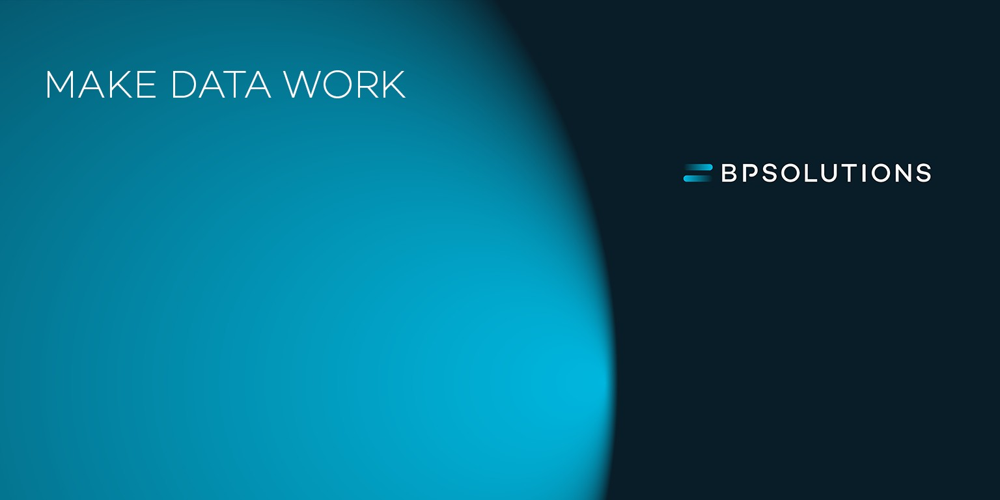
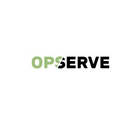

# Voorwoord

- Korte introductie van mezelf (Benjamin Shawki)
- Afstudeeropdracht bij BPSOLUTIONS (Rijswijk)
- 5 minuten presentatie; vragen zijn welkom

<!--  -->
<!--  -->
<!--  -->
<!--  -->

---

# Context BPSOLUTIONS

- IT-dienstverlener: Cloud, Managed Services, Data & AI, Security
- Portal (Spring Boot + Vue.js) beheerd door Luminis / Opserve
- Behoefte:
  - Eenvoudiger software- & server-updates in combinatie met SLAs
  - Verbeterde rapportage (portal i.p.v. PDF)
  - Logmanagement en opschoning voor technische backlog

---

# Doelen & Opdracht

**Opdracht**  
- Optimaliseren van de portal voor automatische rapportages en logbeheer  
- Werken aan workflow-verbeteringen (SLA, planning, CI/CD)

**Waarom?**  
- Centraal overzicht rapportages (geen losse PDF-mails)  
- Meer efficiëntie voor engineers (minder handmatig werk)  
- Beter beheer van historische data & compliance

---

# B-Competenties: Software Analyseren

- **Requirementsanalyse**: Knelpunten opsporen in huidige portal (rapportage, logs)  
- **Migratie- en integratievraagstukken**: Hoe van e-mail + PDF’s naar online dashboard?  
- **Risicoanalyse**: Performantie, beveiliging en beheersbaarheid van logbestanden

---

# B-Competenties: Software Ontwerpen

- **Architectuur**: Uitbreiding binnen bestaande Spring Boot + Vue.js-structuur  
- **Teststrategie**: Definiëren van testscenario’s (rapportages, logopschoning, edge cases)  
- **Prototyping**: Proof-of-concept voor geautomatiseerde rapportages en archivering

---

# B-Competenties: Software Realiseren

- **Implementatie**: Nieuwe portal-functionaliteiten (rapportages, logarchivering)  
- **Opschoningsmechanisme**: Scheduler/service voor verwijderen of archiveren van oude logs  
- **Test & Release**: Geautomatiseerde tests, CI/CD (build, test, deployment)

---

# Planning & Deliverables

**Planning (Feb – Jul 2025)**  
- Analyse & PoC (Weeks 1-6)  
- Implementatie & Testen (Weeks 7-14)  
- Documentatie & Afronding (Weeks 15-20)

**Deliverables**  
- Werkende softwarecomponenten + CI/CD pipeline  
- Technische documentatie & handleiding  
- Afstudeerverslag & Demo

---

# Vragen?

- Bedankt voor jullie aandacht!
- Vragen of opmerkingen?
