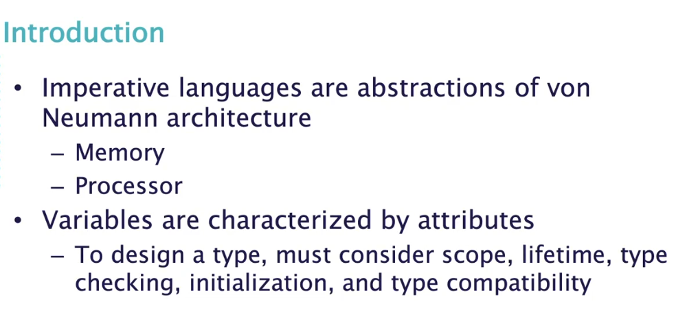
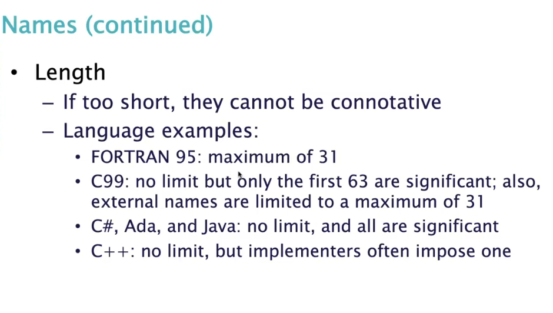
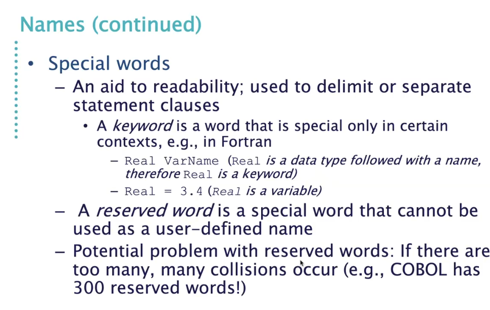
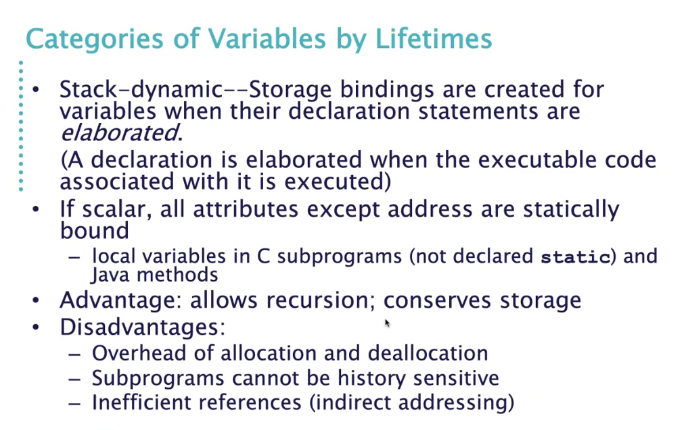
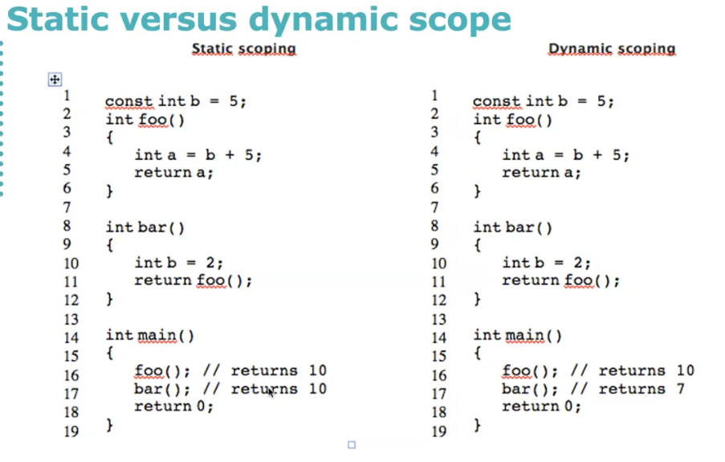
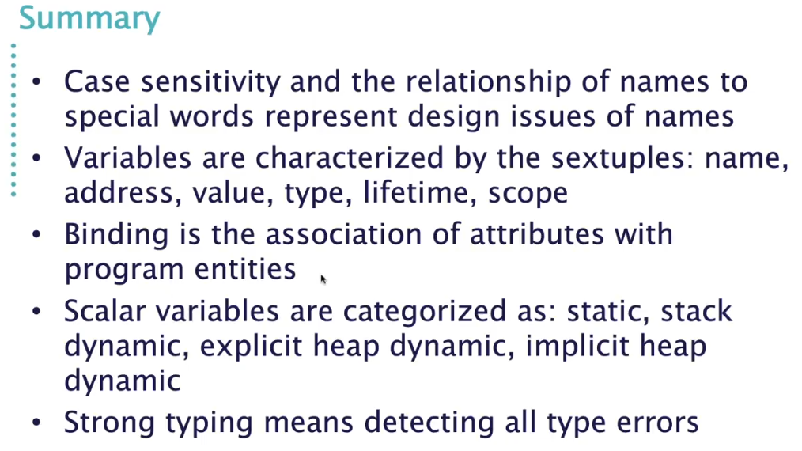
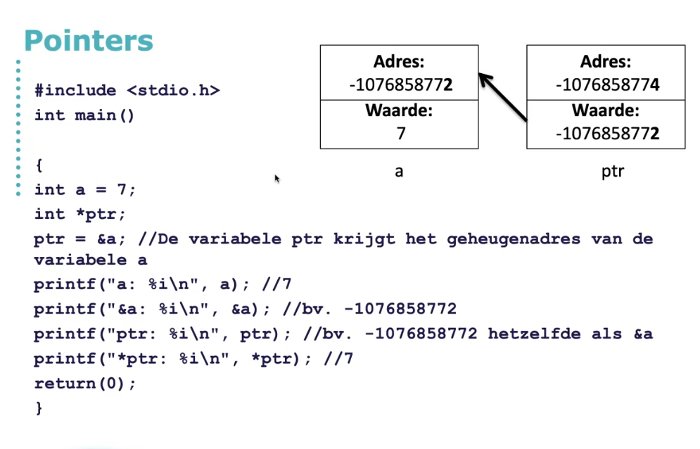
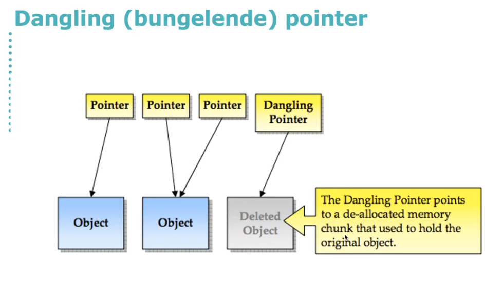
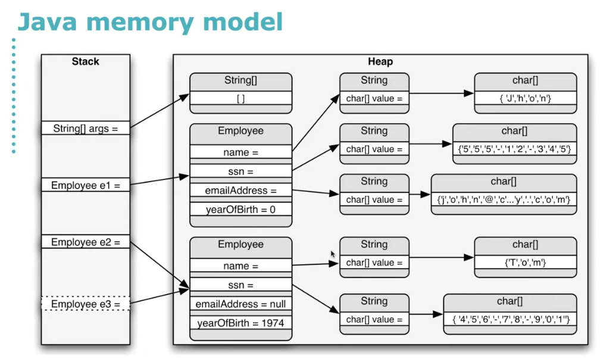
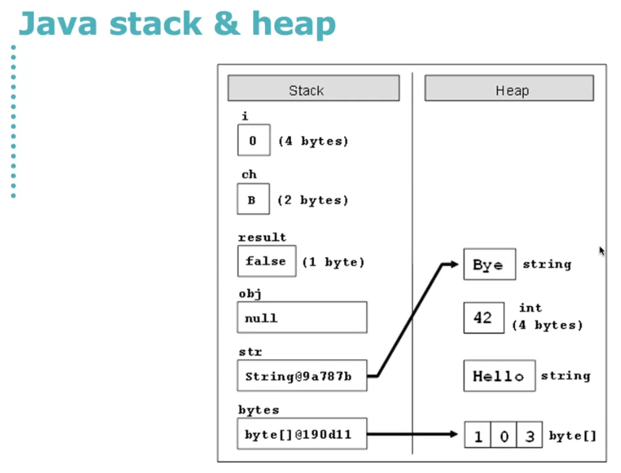

# Names Binding and Scope

Gebaseerd op de von Neumann architectuur, is een computer een machine die bestaat uit een centrale verwerkingseenheid (CPU), geheugen en invoer/uitvoer apparaten.
De CPU is het hart van de computer en voert de instructies uit die in het geheugen zijn opgeslagen.
De CPU bestaat uit een reeks registers die worden gebruikt om gegevens en instructies op te slaan.
De CPU leest de instructies uit het geheugen, decodeert ze en voert ze uit.
De CPU communiceert met het geheugen en de invoer/uitvoer apparaten via een systeembus.

How does a variable 

# Variables
A variable is an abstraction of a memory cell or a collection of memory cells that can be accessed by a name.
Variables can be characterized by the following properties:
- A name
- An address
- A value
- A type
- A lifetime
- A scope

## Variable Attributes
- **Name**: not all variables have names, the compiler can generate names for temporary variables
- **Address**: the memory address where the variable is stored
- **Type**: determines the ranges of values of variables and the set of operations that can be applied to values of that type
- **Value**: the contents of the memory cell
    - **L-value**: the address of a memory cell
    - **R-value**: the value stored in a memory cell
- **Abstract memory cell**: the physical cell or collection of cells that can be accessed by the variable

# Primitive types
- **Integer**: a whole number
- **boolean**: a true or false value
- **float**: a floating point number
- **char**: a single character
- **string**: a sequence of characters

# Language Specific Complex types

# The Concept of Binding
A binding is an association between an entity and an attribute.

There are four types of binding:
- **Name binding**: the association between a name and the entity it represents
- **Attribute binding**: the association between an attribute and an entity
- **Type binding**: the association between a type and an entity
- **Value binding**: the association between a value and an entity

## Binding Time
Binding time is the time at which a binding is created.

- **Language design time**: bind operator symbols to operations
- **Language implementation time**: bind language constructs to a representation
- **Compile time**: bind variable names to memory cells
- **Load time**: bind library routines to the program (static)
- **Runtime**: bind non-static variables to memory cells

## Static and Dynamic Binding
- **Static binding**: the binding is created before the program is executed
- **Dynamic binding**: the binding is created during the execution of the program

## Type Binding
- **Explicit type binding**: the type of a variable is explicitly declared
- **Implicit type binding**: the type of a variable is inferred from the value assigned to it

### Type inference
Type inference is the automatic deduction of the type of an expression in a programming language.

## Variable Attributes
### Storage bindings & lifetime
- **Allocation:** getting a cell from some pool of available cells
- **Deallocation:** returning the cell to the pool

### Lifetime
The liftime of a variable is the time during which the variable exists in memory.

The following are the **Categories of Variables by their Lifetimes**:

#### Static variables
Static variables are allocated when the program starts and remains bound to the same memory cell throughout execution.
- Advantages: efficiency (direct addressing), history-sensitive subprogram support
- Disadvantages: lack of flexibility, no recursion

#### Stack-dynamic variables
Storage bindings are created for variables when their declaration statements are elaborated.

#### Explicit heap-dynamic
Allocated and deallocated by explicit directives.
- Advantage: provides dynamic storage management

#### Implicit heap-dynamic
Storage bindings are created by assignment statements.
- Advantage: flexibility (generic code)

# Scope
The scope of a variable is the range of statements in which the variable can be referenced.
The local variables of a subprogram are only visible within the subprogram.
The non-local variables are visible in the unit but not declared in the unit.
The global variables are visible throughout the program.

Scopes are also called Blocks. A block is a method of creating static scopes inside program units.

## Static Scope
The most programming languages use static scope (By far.).

### Search process
Search declarations from the innermost scope to the outermost scope until the declaration is found.

Enclosing static scopes (to a specific scope) are called the static ancestors of that scope; the nearest static ancestor is the immediate static ancestor and is also called the static parent.

### Shadowing
Variables can be hidden from the outer scope by declaring a variable with the same name in an inner scope.

### Static versus dynamic scope

## Referencing Environments
The referencing environment of a statement is the collection of all names that are visible in the statement.
In a static-scoped language, it is the local variables and the non-local variables that are visible in the statement.

A subprogram is active if its execution has begun but has not yet terminated.
In a dynamic-scoped language, the referencing environment is the local variables plus all visible variables in all active subprograms.

A good practice is to keep the referencing environment as small as possible. This is called the principle of locality; it is easier to understand and maintain code with a small referencing environment.

## Named constants
A named constant is a variable that is bound to a value only when it is bound to storage. The binding of values to named constants can be either static ( called manifest constants) or dynamic (called variables).

## Scope Summary

## Datatypes

# Pointers

## Dangling pointers

## Java memory model

## Java stack & heap

