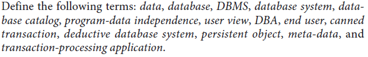
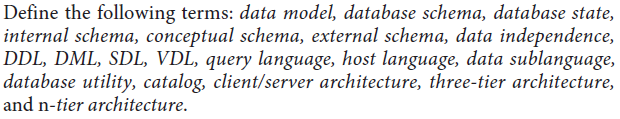

data, database, DBMS, database system, database
catalog, program-data independence, user view, DBA, end user, canned
transaction, deductive database system, persistent object, meta-data, and
transaction-processing application.

data model, database schema, database state,
internal schema, conceptual schema, external schema, data independence,
DDL, DML, SDL, VDL, query language, host language, data sublanguage,
database utility, catalog, client/server architecture, three-tier architecture,
and n-tier architecture.