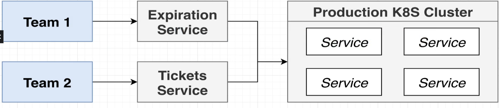
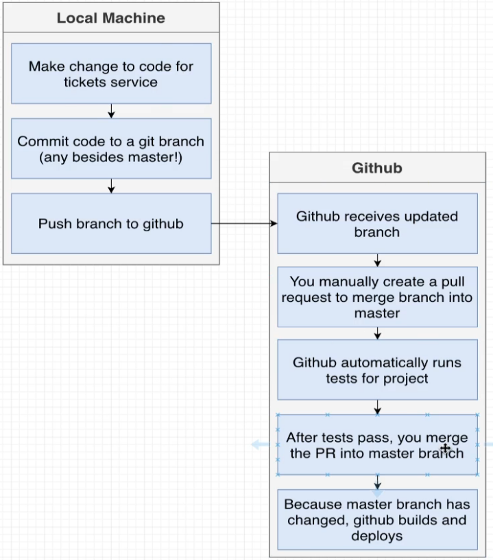
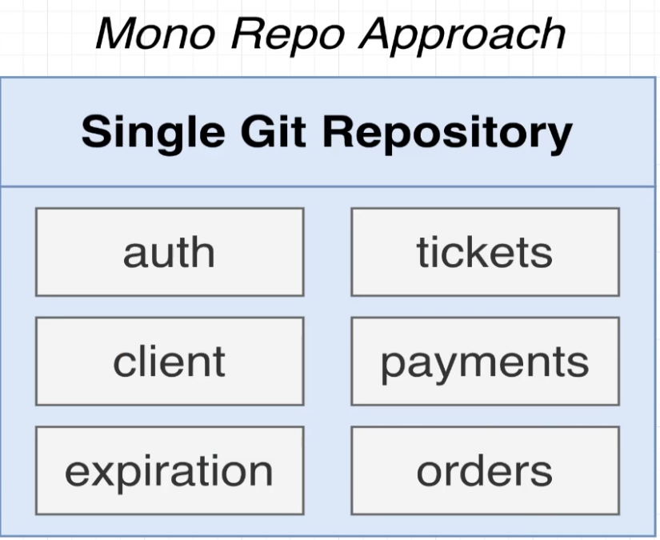
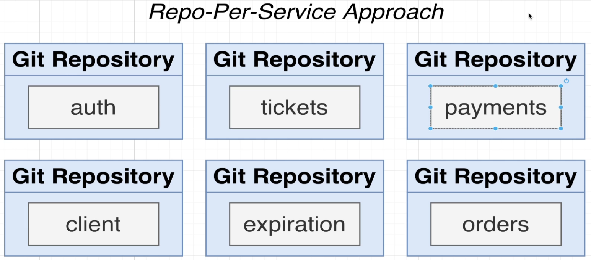
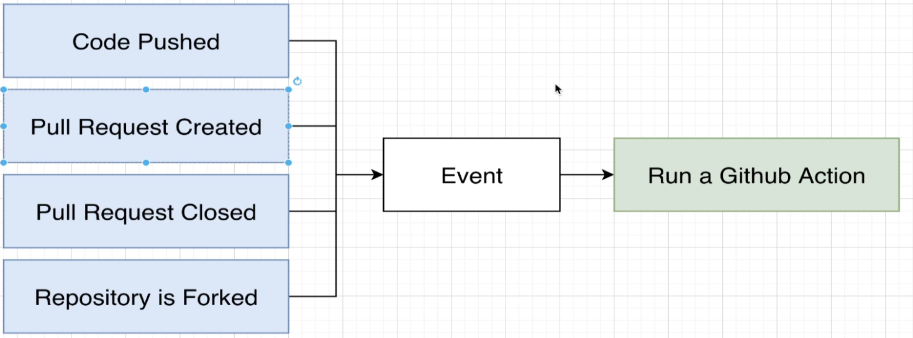
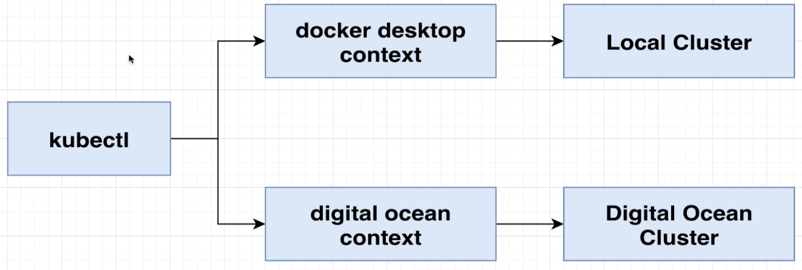
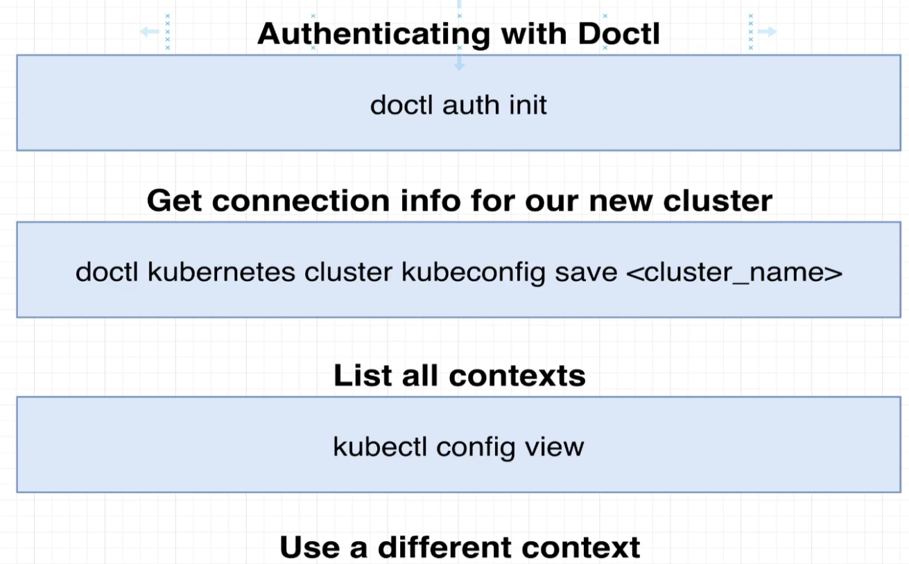
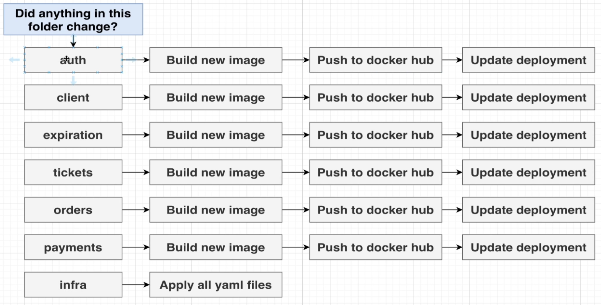
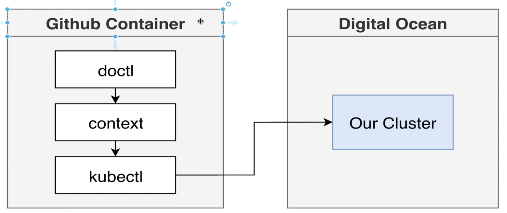
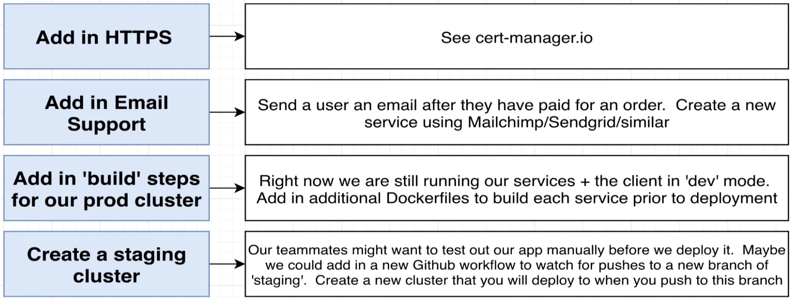

If any pods are crashing inspec them via
kubectl describe pod PODNAME
kubectl log PODNAME
kubectl config view
kubuectl config use-context

kubectl apply -f https://raw.githubusercontent.com/kubernetes/ingress-nginx/controller-v1.3.1/deploy/static/provider/do/deploy.yaml

