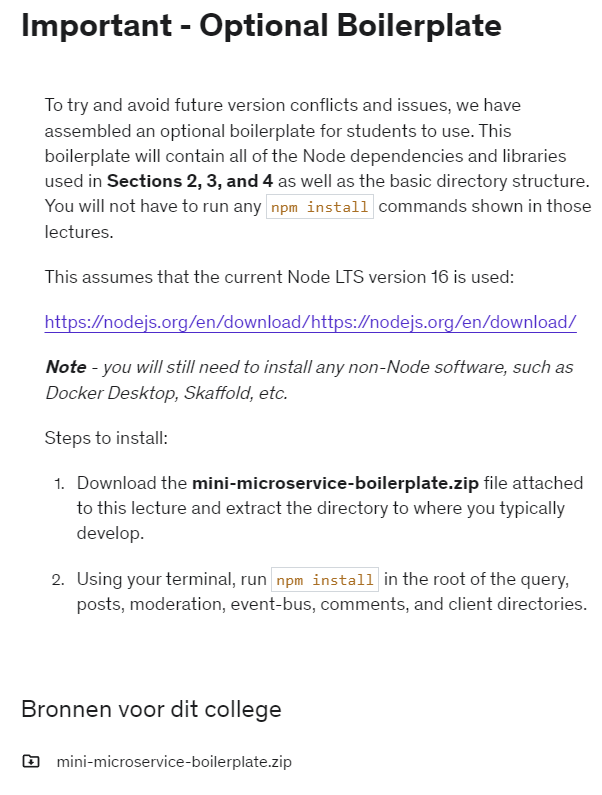
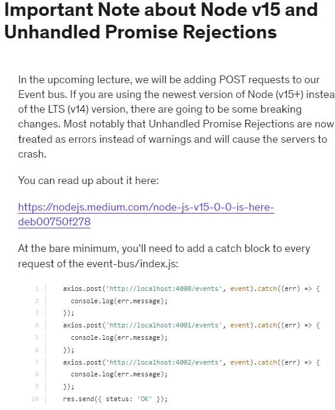

# Microservices 30-08-22

Event Bus

C:\Users\benja\OneDrive\Code\Projects\IKFRAM\Downloads\mini-microservice-boilerplate.zip

There will be a better Template Later 
Do not use this one.

What services should we create?
At the start I created one separate service for each resource in the app

