# First note
Kubernetes is a tool for running a bunch of different containers

We give it some configuration to describe how we want our containers to run and interact with eachother
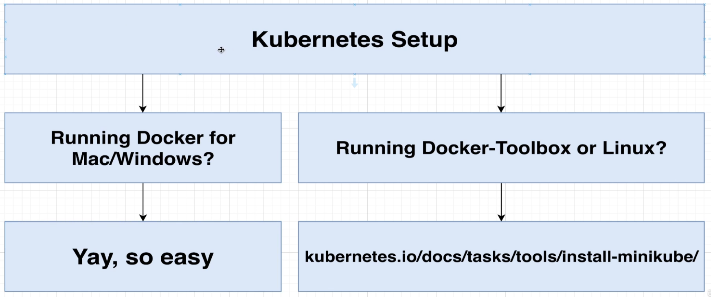

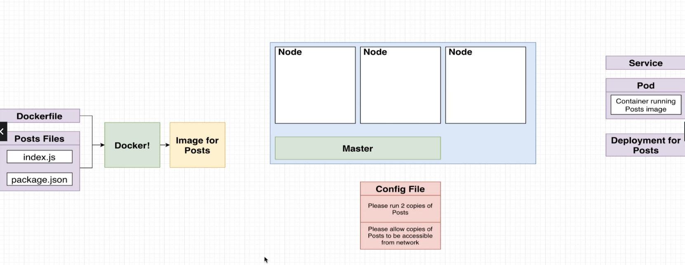
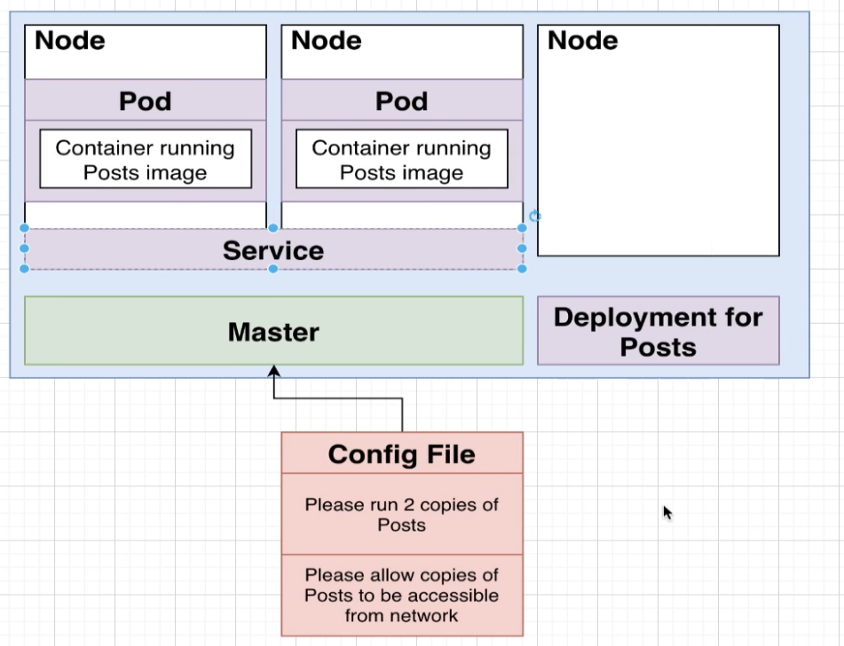
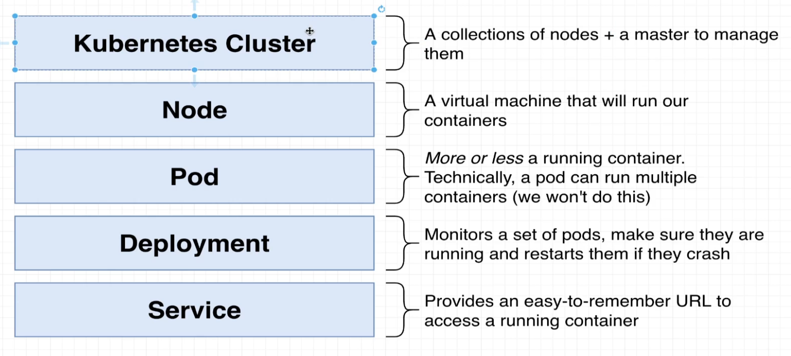
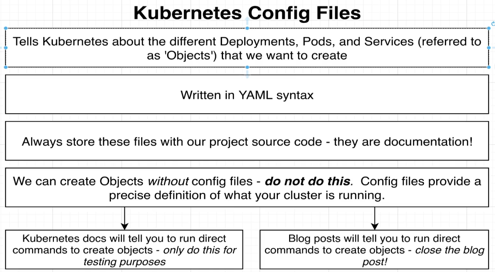
```apiVersion: v1
kind: Pod
metadata:
  name: posts
spec:
  containers:
    - name: posts
      image: bluejund/posts:0.0.1
```
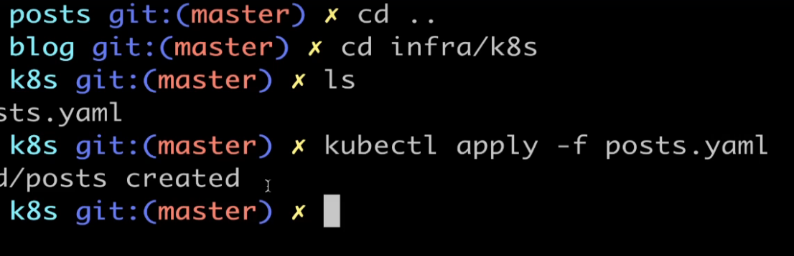
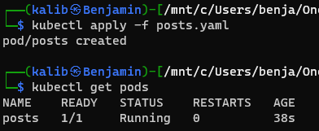
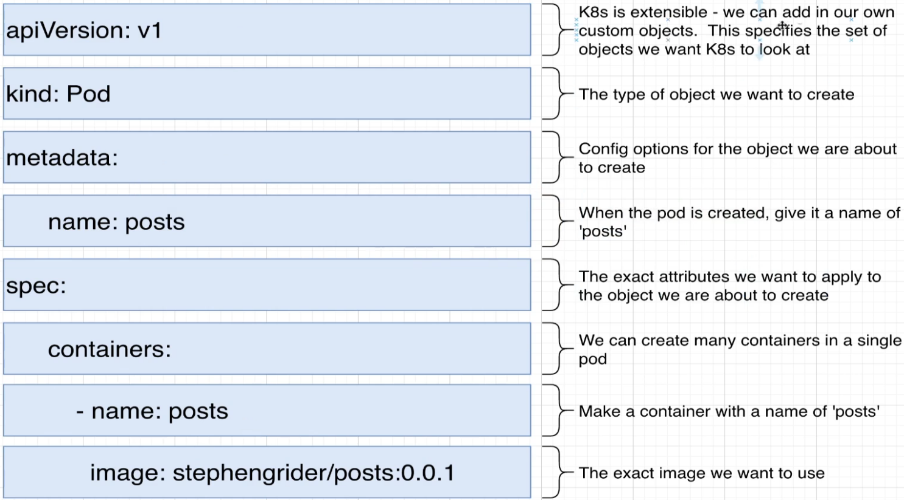
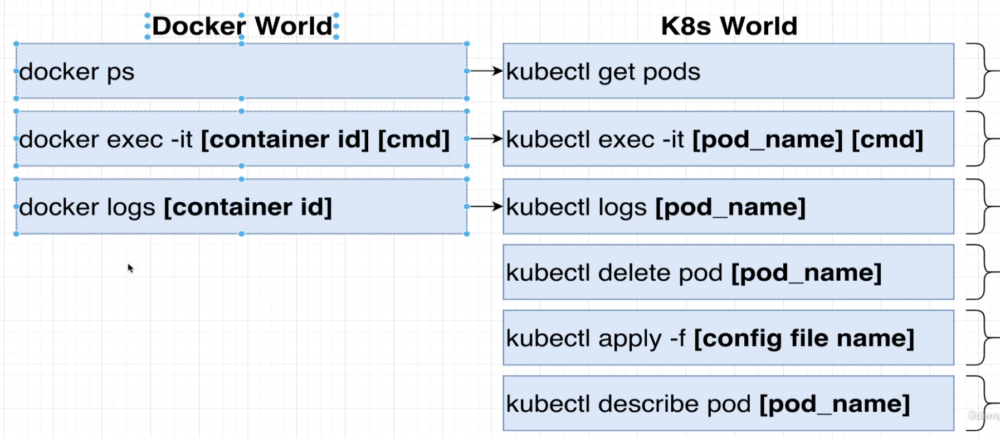
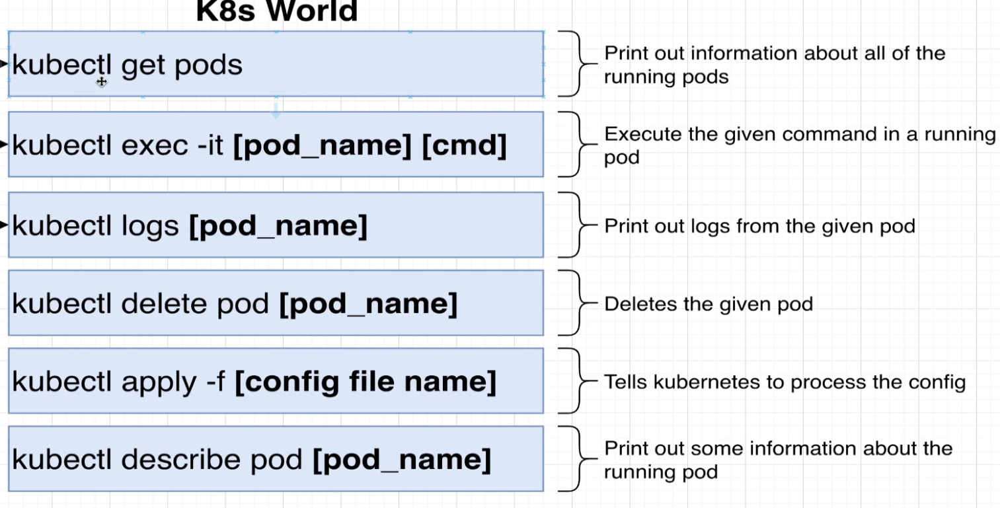
Deployment has a set of pods

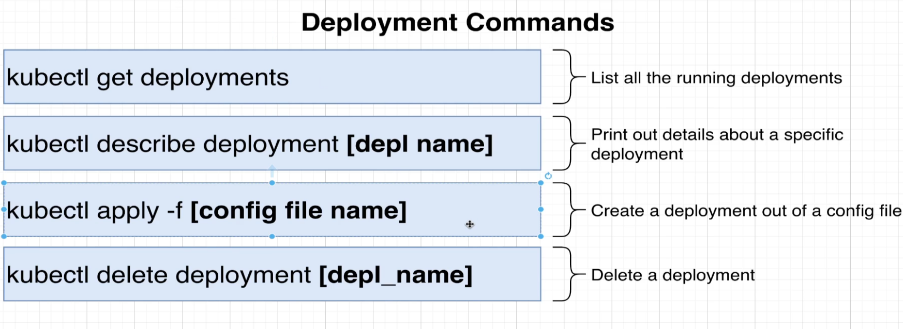
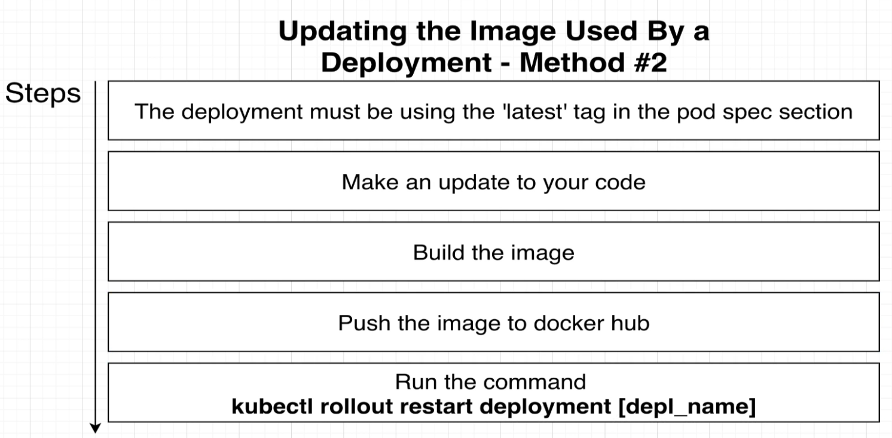
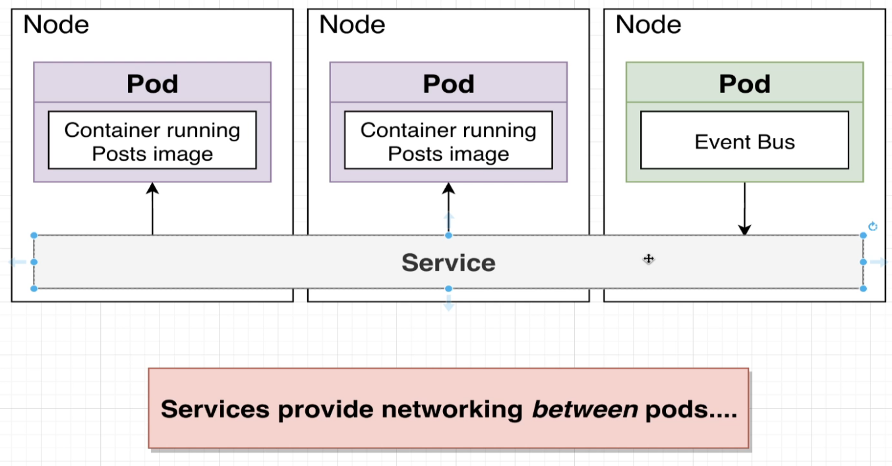
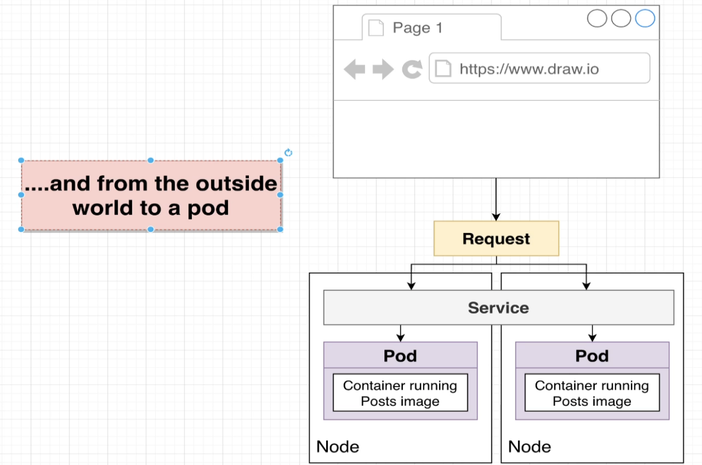
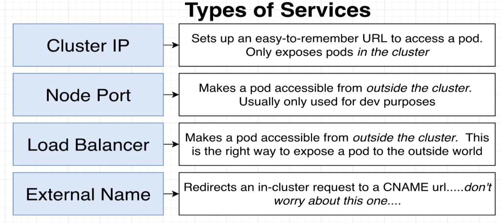

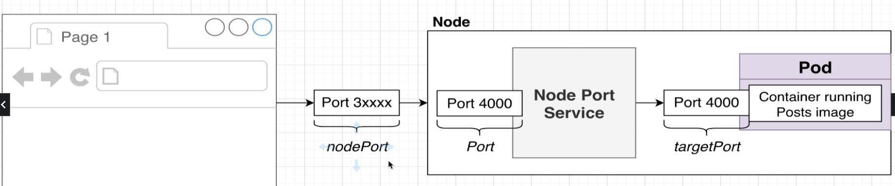
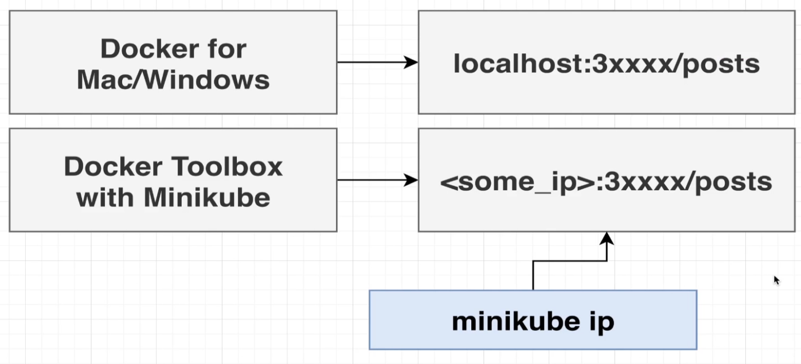
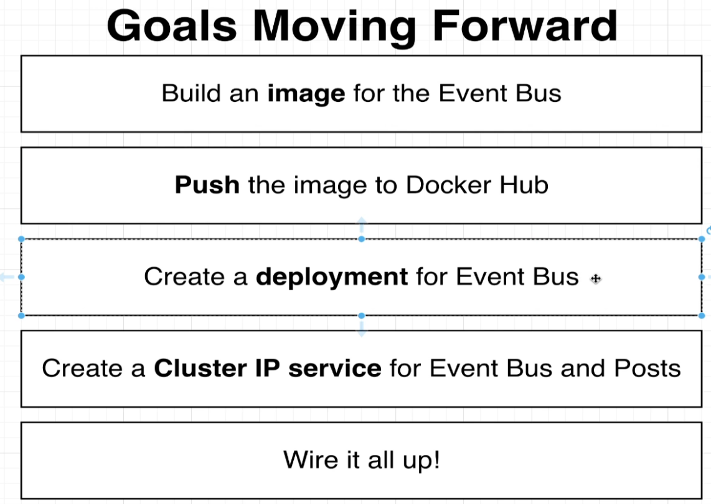
#Deployment
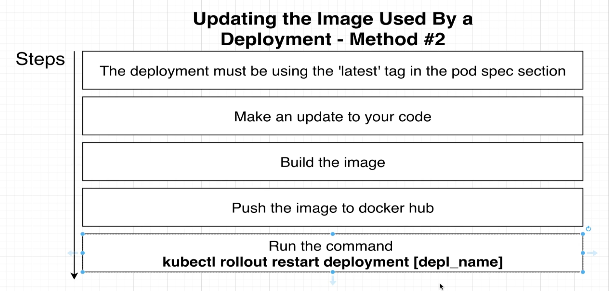


