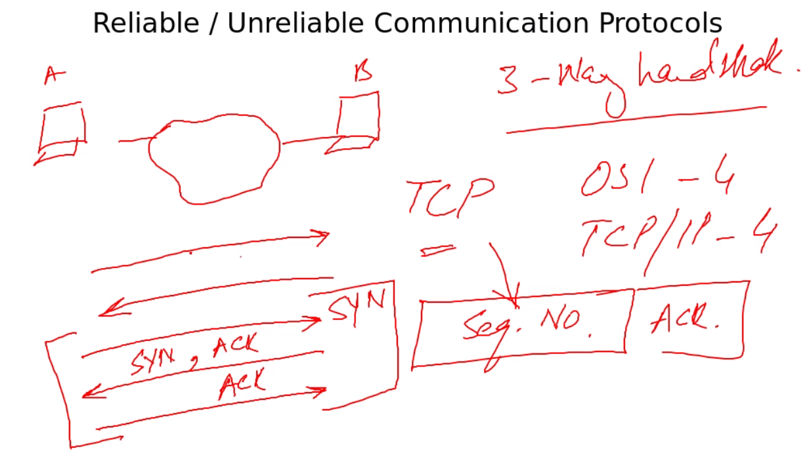

`TCP`

3-way handshake

osi - 4
tcp/ip - 4

sequence number, ack | `UDP` does not have seq, ack

`UDP` is mainly used for multicast 
VOIP

port 20, 21 for `FTP`

22 `ssh`

23 `telnet`

25 `smtp`

53 `dns` tcp/udp

443 `https`

110 `pop3`

161, 162 `snmp`

0-1024 also know as `well known ports`

`more /etc/services`