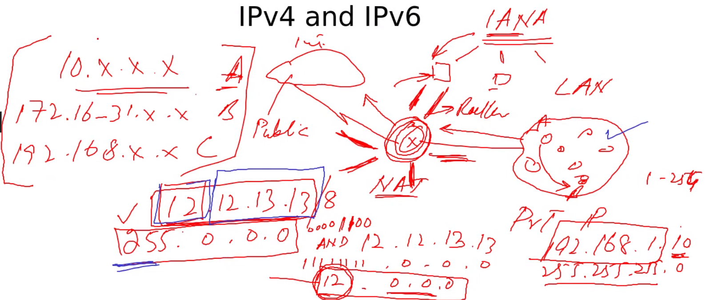

ipv4 hav classes A- E

A 0-127

B 128-191

C 192-223

D 224-239 used for multicasting

E 240-255 experimental purposes

> Private ip addresses
> 
> `10.x.x.x` A
> 
> `127.16-31.x.x` B
> 
> `192.168.x.x` C
> 
> Why do we need private ip addresses?
> 
> 
> 
> At the gateway `NAT` Network access translation transfers private ip's into public ones
> 
> Netmask default 
> 
> A 255.0.0.0 or ipaddr/8
> 
> B 255.255.0.0 or /16
> 
> C /24
>
> 
> the /24 notation is CIDR
> 
> 

