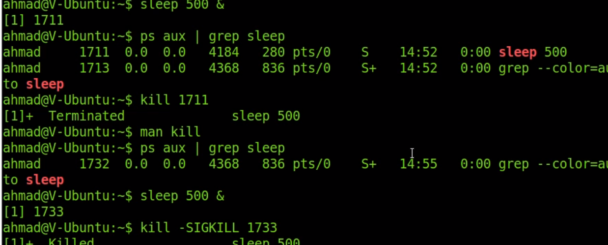

`1 sighup` stops the procces, rereads the config file and starts te process

`2 sigint` ctrl + c

`15 sigterm` terminates proces with cleanup process

`9 sigkill` use as last resort and only after sigterm fails

`pgrep` add process name to find process id

example

`pgrep sleep | xargs kill`

find the process id of sleep and pipe the arguments with xarg to koll