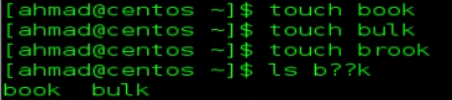

```pwd = present working directory
ls = listing
cd = change directory
-l = long
history
history -c
.bash_history
```

``touch book`` create a file named book

``cd aaa; ls`` combinding commands exapmle

``cd aaa && ls`` only execute ls if aaa is true

``cp -R`` -R is recursive wich means that it copies all folders and files 

``rm -r`` -r is recursive same as -R in cp

``rm -rf`` recursive and forced

``rm *.doc`` * wildcard

``uname -a`` some dist info



one of the most dangerous commands :) ``rm -rf *``

---

