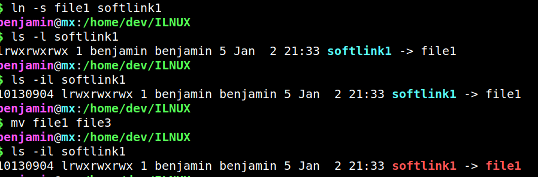

**1) Soft Links**
>  Soft and Hard File linking
>
> file `abc`
>
> `xyz` is a logical link towards `abc`
>
>`xyz` contains nothing but the pointer pointn=ing to the `abc` file

**2) Hard Links**
> inode is a database that hold information about the file but not of its contents
>
> For hard inks both pointers point to the same entry in the inode table. A requirement is that both of the files should be on the same disk. Otherwise the inode table entry might differ.
> 
> For every 100 GB of data 1 GB is dedicated to the inode tables

**3) Commands**
`state`

```shell
$ touch file1
$ touch file2
$ ls
1  2  ddffile  error  file  file1  file2  first  outputofls  testa
$ ls -il file*
10130795 -rw-r--r-- 1 benjamin benjamin 0 Jan  2 21:18 file
10130895 -rw-r--r-- 1 benjamin benjamin 0 Jan  2 21:19 file1
10130896 -rw-r--r-- 1 benjamin benjamin 0 Jan  2 21:20 file2
$ ln file1 linked1
$ ls -il linked1
10130895 -rw-r--r-- 2 benjamin benjamin 0 Jan  2 21:19 linked1
$ nano linked1
$ cat file1
some data in here
```

`-s` for softlinking

```shell
ln -s file1 softlink1
benjamin@mx:/home/dev/ILNUX
$ ls -l softlink1
lrwxrwxrwx 1 benjamin benjamin 5 Jan  2 21:33 softlink1 -> file1
benjamin@mx:/home/dev/ILNUX
$ ls -il softlink1
10130904 lrwxrwxrwx 1 benjamin benjamin 5 Jan  2 21:33 softlink1 -> file1
benjamin@mx:/home/dev/ILNUX
$ mv file1 file3
benjamin@mx:/home/dev/ILNUX
$ ls -il softlink1
10130904 lrwxrwxrwx 1 benjamin benjamin 5 Jan  2 21:33 softlink1 -> file1
```



```shell
$ nano nano file1 
$ ls -l file1
-rw-r--r-- 2 benjamin benjamin 559 Jan  2 21:39 file1
$ ls -il softlink1
10130904 lrwxrwxrwx 1 benjamin benjamin 5 Jan  2 21:33 softlink1 -> file1
$ ls -l linked1
-rw-r--r-- 2 benjamin benjamin 559 Jan  2 21:39 linked1
```