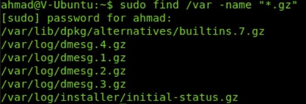

Finding Files in Linux

> ---
> 
> **Finding Files in Linux**
> 
> ---
> 
> **1) `which`**
> 
> Wich is used to find binary or executable files.
> 
> Works only on environment variables set up in the `$PATH`
> 
> --- 
> 
> **2) `whereis`**
> 
> `whereis`, is the same as  `which` but in addition it shows manual files.
> 
> Handy tool to find the manuals of your binary files
>
> --- 
>
> **3) `find`**
> 
> `find` is used on most systems
> 
> `-maxdepth 1` only shows files within a single directory
> 
> `-name`
>
> 
> 
> `-user` files owned by user
> 
> ```shell
> $ sudo find /var -size +1M -size -5M | xargs ls -l
> ```
> 
> --- 
>
> **4) `locate`**
> 
> same as find but works with a database
> 
> `locate -S`
> 
> `nano /etc/updatedb.conf`
>
> --- 
>
> 