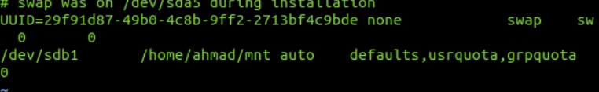
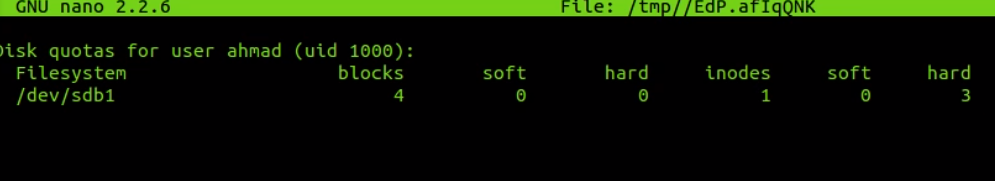
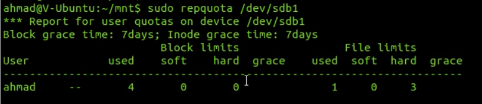

Disk Quotas can be managed over users and over groups

soft an hard limit

max files you can create
hard limit is the max. after the soft limit has been hit a grace period will start (defautl 7 days) after 7 days the limit will become equal to the data
 
ie soft limit 10 hard limit 20 after 7 days with 17

`sudo apt install quota`

`sudo nano /etc/fstab`

`sudo quotaoff /dev/dsdb1`

`sudo quotacheck -cug /dev/sdb1`

`sudo quotaon /dev/sdb1`

`sudo repquota /dev/sdb1`

`sudo edquota -u benjamin`

setting the hard limit to 3

`sudo repquota /dev/sdb1`

shows 1 used

`sudo edquota -t 14 -u benjamin /dev/sdb1`

just using `sudo edquota -t` edits quota for all drives