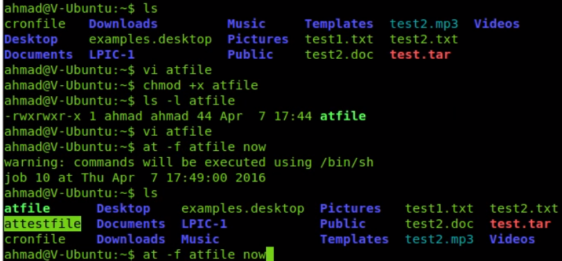

`crm` jobs

>`at time date -f filename` for one time tasks in a shell script
>
> time: `noon`, `midnight` `10 am 01 jan`
>
> `atq` to list jobs
> 
> `atrm 8` remove job nr 8
> 
> `nano /usr/share/doc/at/timespec` for more info

>`anacron`
> 
> anacron tasks are usually for systems that run 24x7
> 
> normal cron jobs don't have a recovery mechanism
> 
> anacron checks its logs if tasks have not been executed that shouldve been executed and executes those unexecuted tasks
> 
> anacron should be added to startup
> 
> `/etc/anacrontab`
> 
> anacron tasks should have a different delay to prevent system overload
> 
> `ls /var/spool/anacron`

`crontab -e` new cron stored in `/var/spool/cron/crontabs/`

`-r` remove

`-l` list

`cat /etc/crontab`

`/etc/cron.allow` & `/etc/cron.deny` 


2 different kind of tasks

>**User scheduled tasks**
> 
> 
>

>**System scheduled tasks**
> 
>
> 
> 

**Time structure**

`abcde`

a minutes

b hours

c day of month

d mont of the year

e day of the week

if a field should be blank use *

the command should be its absolute path



```shell
# Each task to run has to be defined through a single line
# indicating with different fields when the task will be run
# and what command to run for the task
# 
# To define the time you can provide concrete values for
# minute (m), hour (h), day of month (dom), month (mon),
# and day of week (dow) or use '*' in these fields (for 'any').
# 
# Notice that tasks will be started based on the cron's system
# daemon's notion of time and timezones.
# 
# Output of the crontab jobs (including errors) is sent through
# email to the user the crontab file belongs to (unless redirected).
# 
# For example, you can run a backup of all your user accounts
# at 5 a.m every week with:
# 0 5 * * 1 tar -zcf /var/backups/home.tgz /home/
# 
# For more information see the manual pages of crontab(5) and cron(8)
# 
# m h  dom mon dow   command
```
