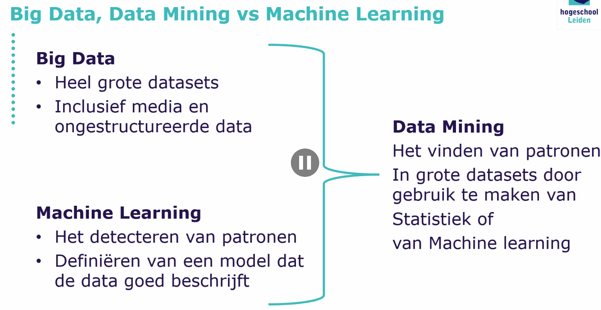
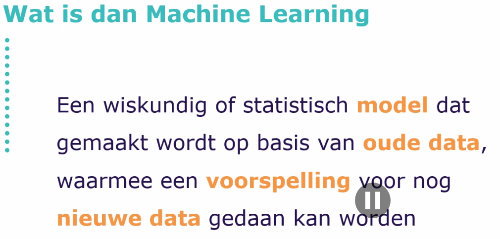
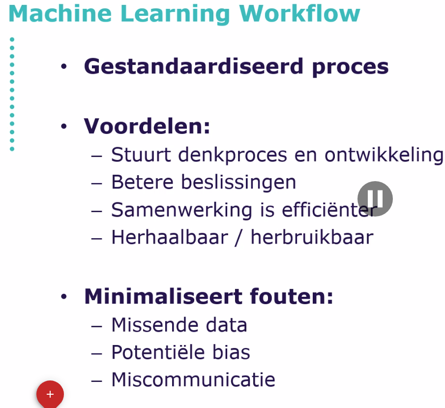
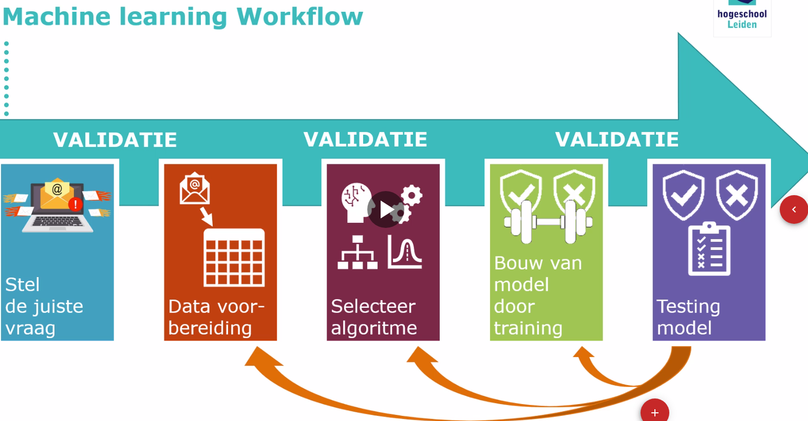
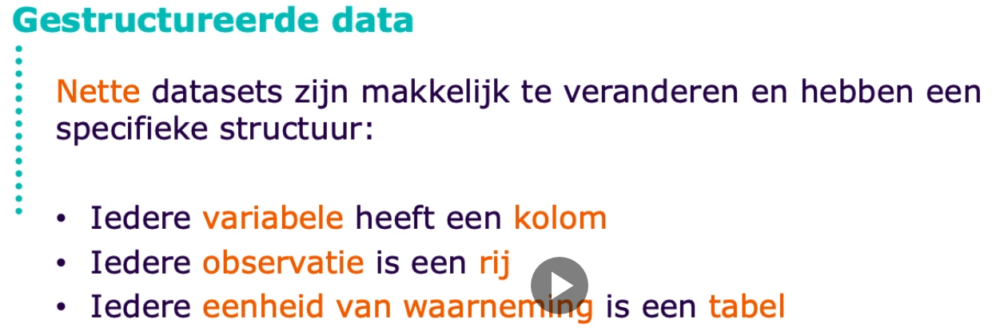
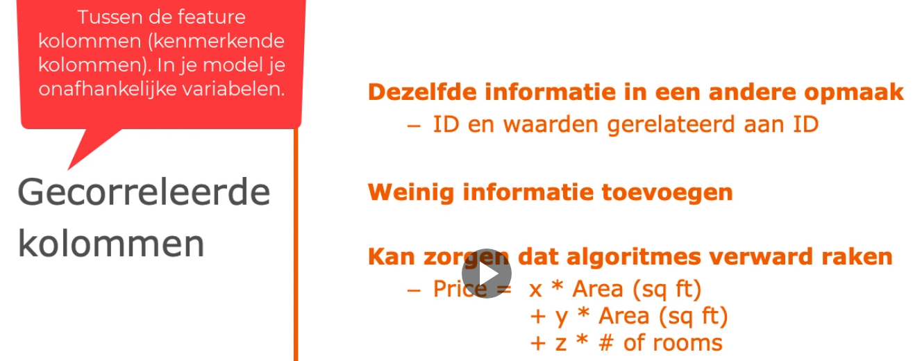
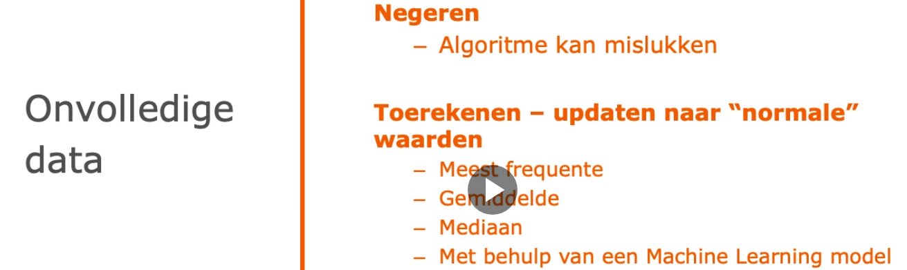

Data regels

    1. Hoe dichter je data ligt bij de voorspelling, hoe beter
    2. Data zal zelden de juiste opmaak hebben
    3. Nauwkeurig zeldzame gebeurtenissen voorspellen is moelijk
    4. Houdt bij hoe je de data hebt gemanipuleerd

Dat verwijdern, organiseren, 

