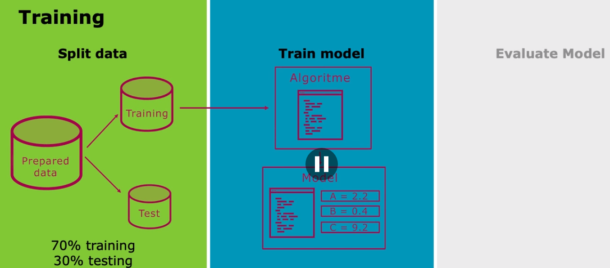
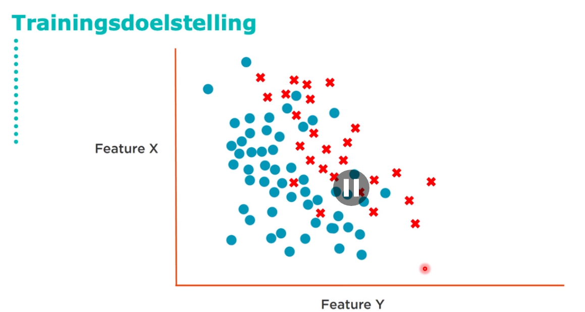
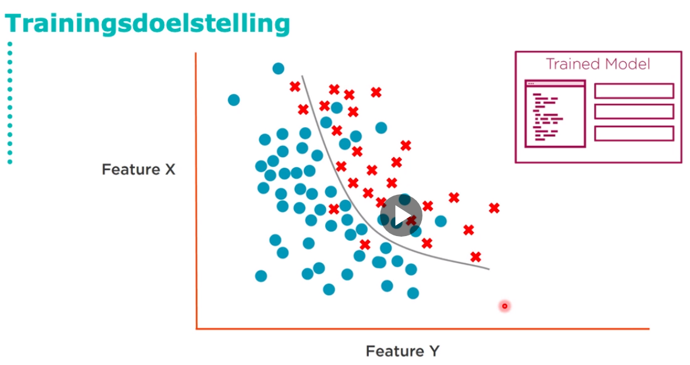
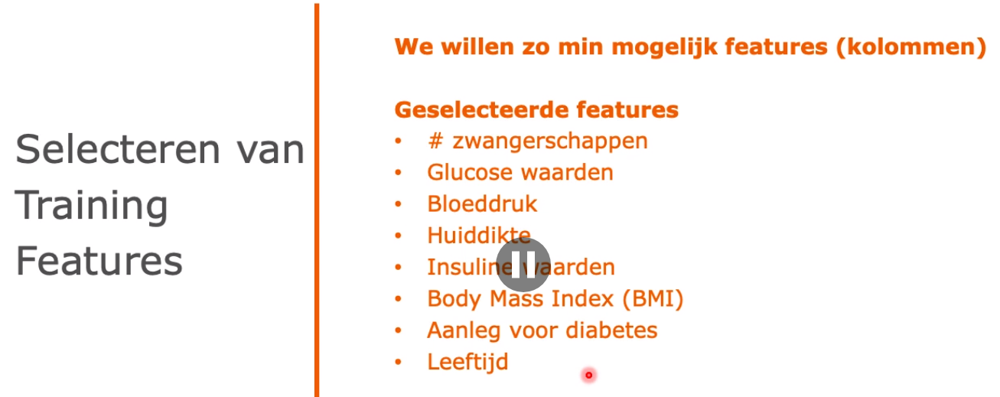
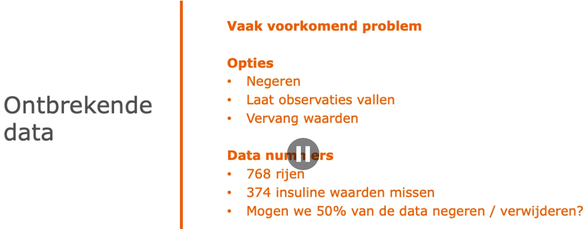
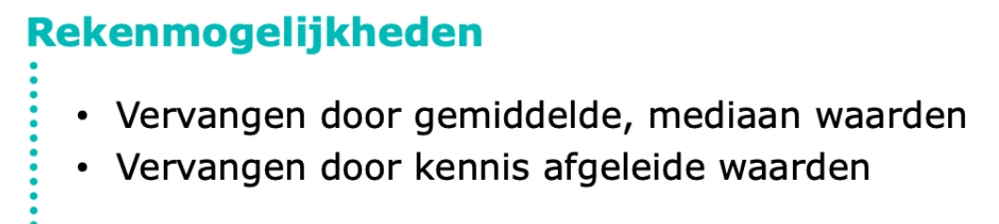

Hertrainen waneerde data verandert

soms wordt 80% 20% gebruikt

Ziekte ontwikkelen op basis van onderzoeks resultaten

afwijking tussen de test data en de voorspelde waarde, probeer het verschil zo klein mogelijk te maken. Dit is je doel!

Welke colommen heb ik echt nodig?

wat doe je met de missing values?

Wat kun je negeren, of invullen?

Of vragen aan een specialist wat voor waarde je hier in zou moeten vullen

