# WC 2
08/09/22

Aanpak domeinbeschrijving
PVA - Hoe start je een domeinbeschrijving
Wat zijn problemen waar je tegen op kunt lopen en hoe los je dit op?

Beschrijving maken van de werkelijkheid waarbij we op een een lijn zitten met de stakeholders.

Zelfstandige naawoorden (entiteiten) verzamelen van stakeholders/colega's 

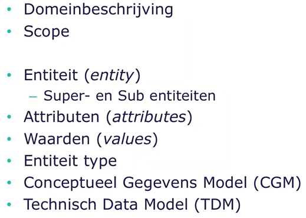
Domeinbeschrijving - beschrijft de opdracht
Scope - Geeft de grenzen aan
Entity - objecten
    Super- en Sub entiteit
attributen 
waarden 
entiteit type - eigenschap

Conceptueel Gegevens Model (CGM)
Technisch Data Model (TDM)

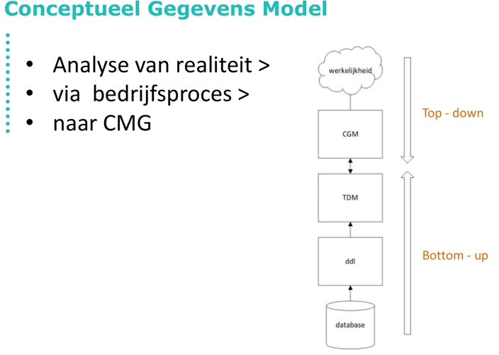

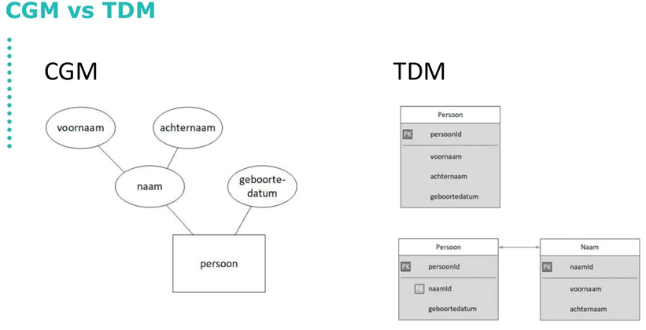

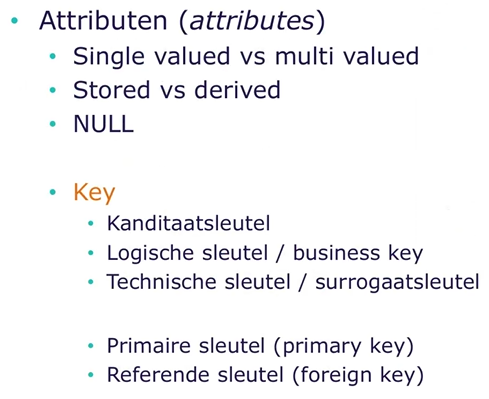

ETL (NIET VOOR IPRAMOD)

Verschil tussen Logische sleuten en een Technische sleutel
Technische sleutel, systeemsleutel uniek gegenereerd
Logische sleutel sleutel die wordt vanuit de buisness samengesteld

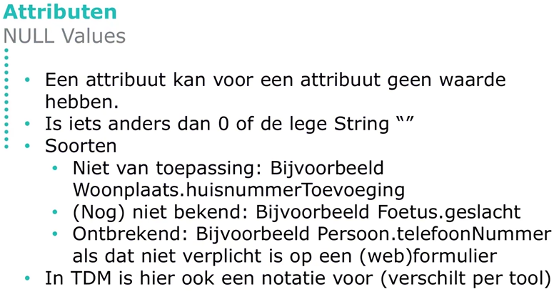

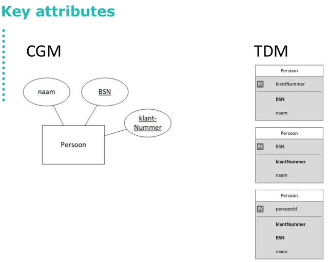

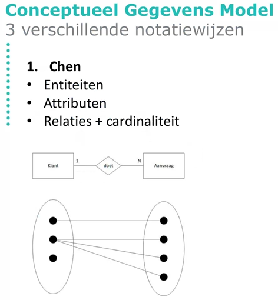

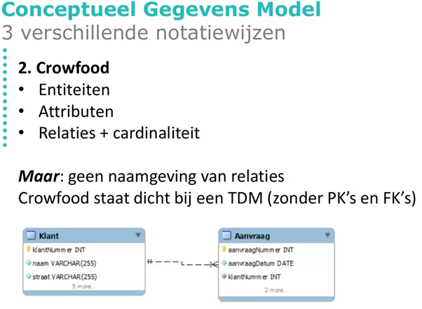

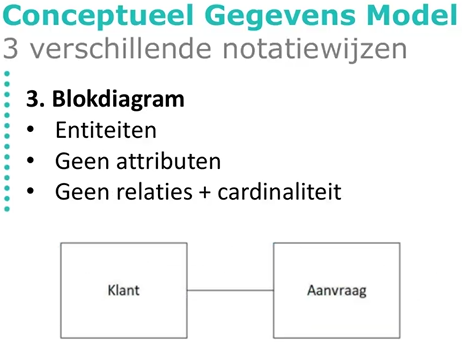

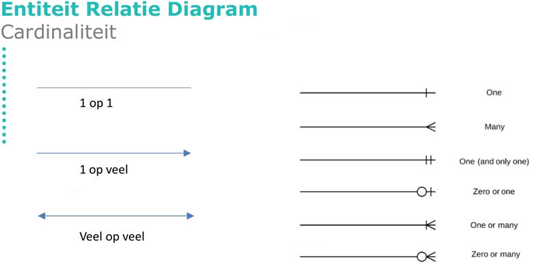

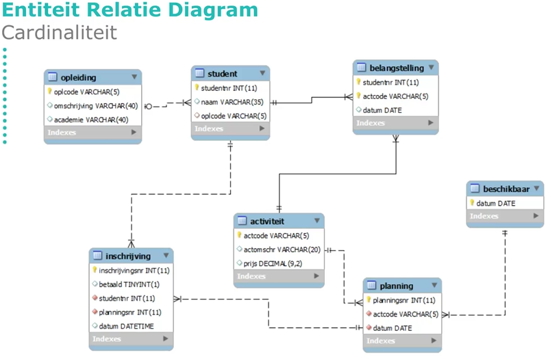

 