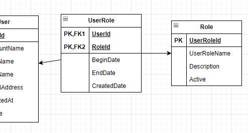
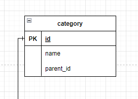
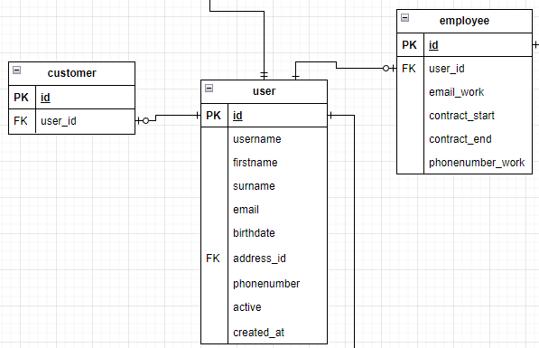
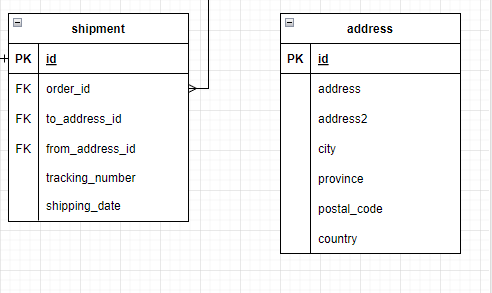
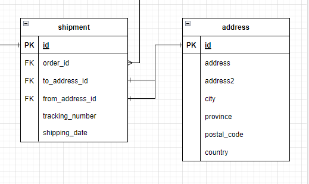
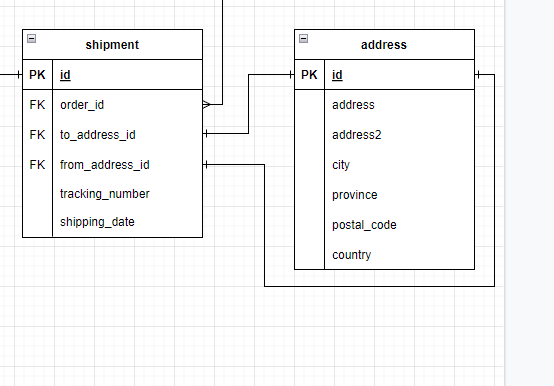

Moet UserRole nog een id hebben? deze wordt dan de PK
 
 
<h4>Voorbeeld: kleding/broeken</h4>
id: 1, name: kleding, parent_id: NULL
 
id:2, name: broeken, parent_id: 1
 
 
Is deze manier van nested catogory mapping goed?
 

 
 

<h4>Klopt deze crow feet notation?</h4>
users zijn gesplit in employee en customer. 
 

 
 

 
toen ik de address tabel toevoegde kwam ik erachter dat ik meerdere foreign keys heb die naar dezelfde tabel verwijzen. 
Ik snap dat dit mogelijk is maar is dit een goed idee?

Een optie is om nogeen aantal tabellen toe te voegen met leveranciers of iets van "shipment_info"
Mijn initiele gedachte was dat Griixs (de webshop) deze zelf verzend vanuit hun kantoor. Wat dus ook kan  is een office tabel toevoegen. 

of

