OWASP
Authenticatie is het bevestigen van een gebruiker
Authenticatie
Is het bevestigen van wie of wat je bent
Authorizatie is het geven of krijgen van rechten

OWASP
Open web application security project

<h3>10 Server Side Request Forgery (SSRF)</h3>
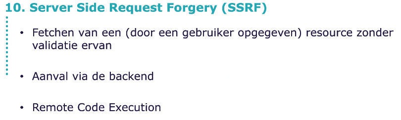
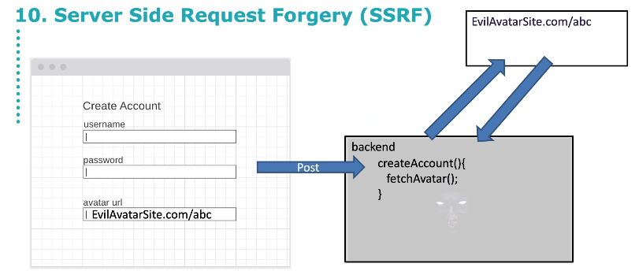

<h3>9 Security Logging and Monitoring Failures</h3>
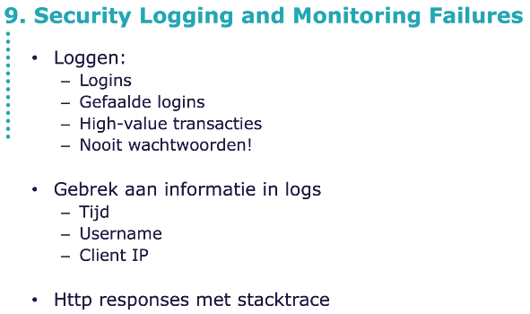

<h3>8 Software and data integrity Failures</h3>
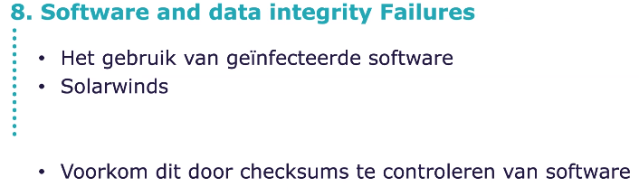

<h3>7 Identification and Authentication Failures</h3>
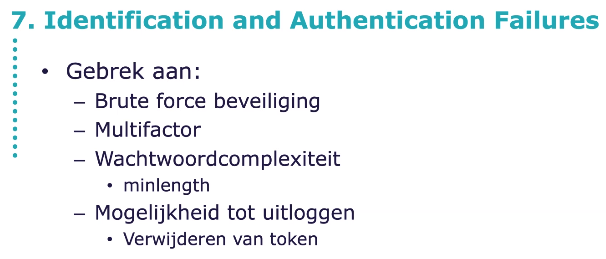
voor brute force bijvoorbeeld maak een set timeout van 100 ms

<h3>6 Vulnerable and Outdated components</h3>
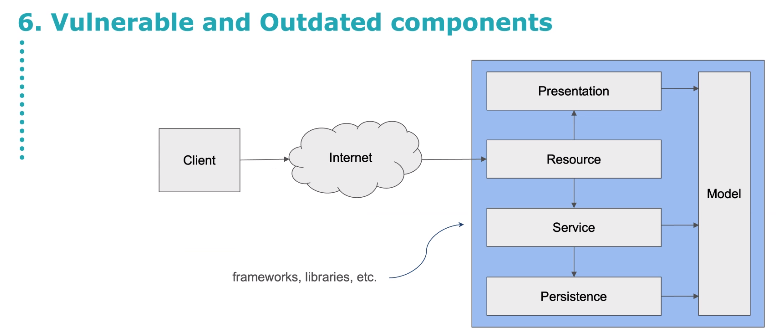
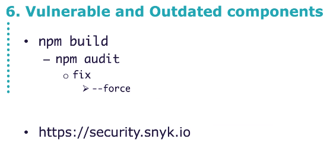

<h3>5 Security Misconfiguration</h3>
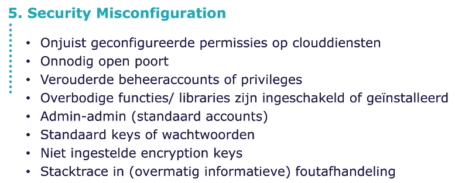

<h3>4 Insecure Design</h3>
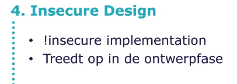

<h3>3 Injection</h3>
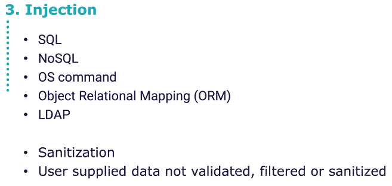
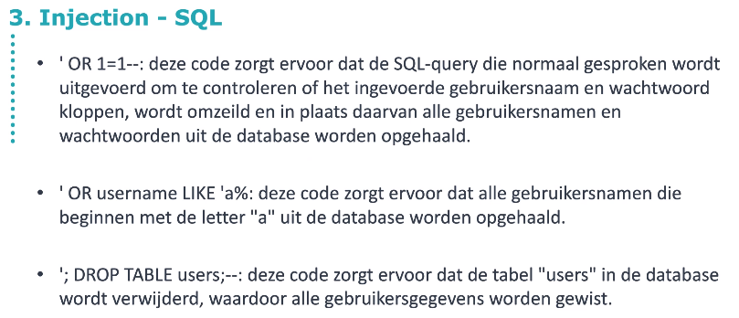
Prepared Statements

JPA in springboot

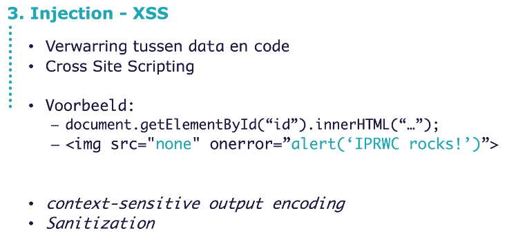
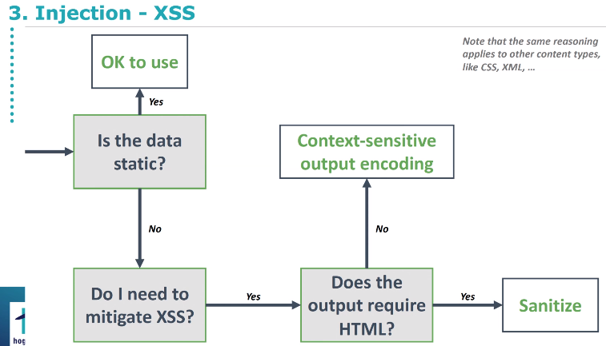
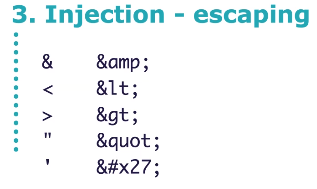
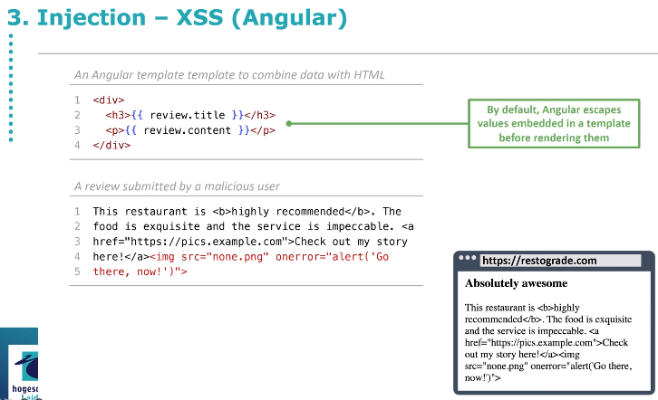

<h3>2 Cryptographic Failures</h3>
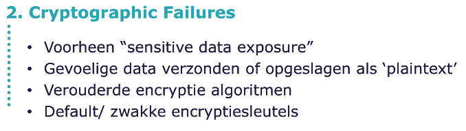

<h3>1 Broken Access Control</h3>
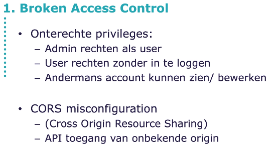
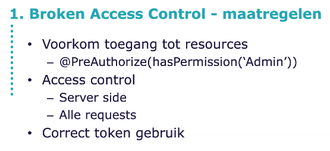

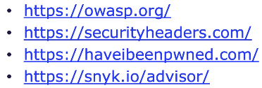

https://owasp.org/
https://securityheaders.com/
https://haveibeenpwned.com/
https://snyk.io/advisor

