# Functional programming
Functional programming is a programming paradigm that treats computation as the evaluation of mathematical functions and avoids changing-state and mutable data. It is a declarative type of programming style. The output value of a function depends only on the arguments that are passed to the function, so calling a function with the same value for an argument always produces the same result. This is in contrast to imperative programming, which changes state with statements that can be executed in any order.

Functional programming is declarative.

## Languages (some of)
- Haskell
- Scala
- Erlang

## Deterministic
Functional programming is deterministic. Given the same input, the function will always return the same output.

## Total and Partial functions
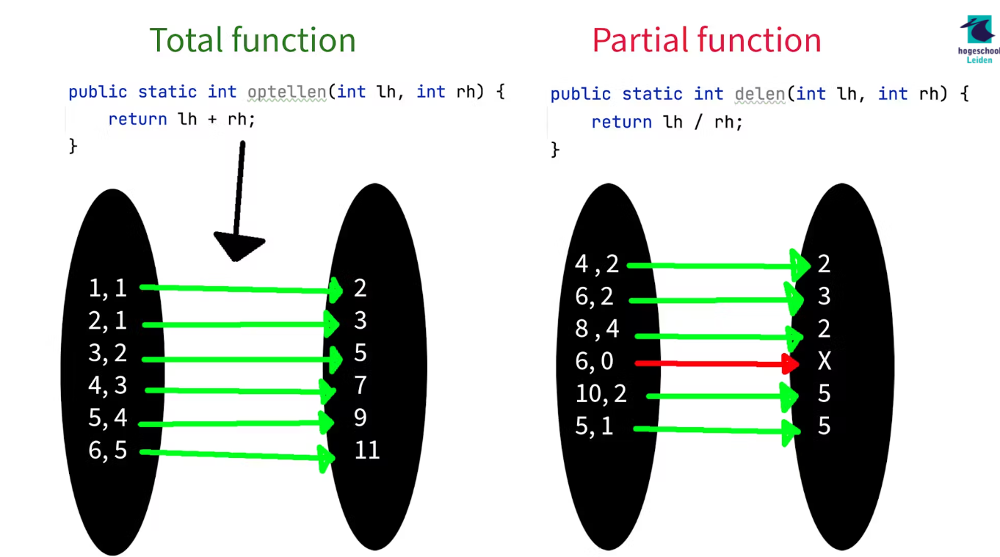

## Scalazzi regels
Referential transparent 

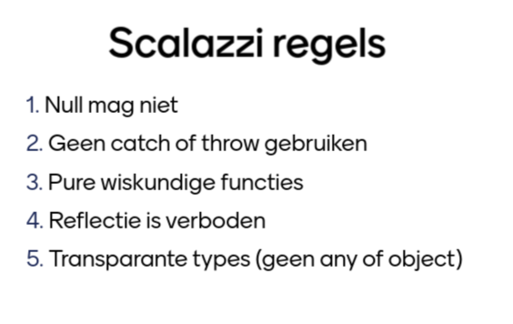

## Voorbeelden
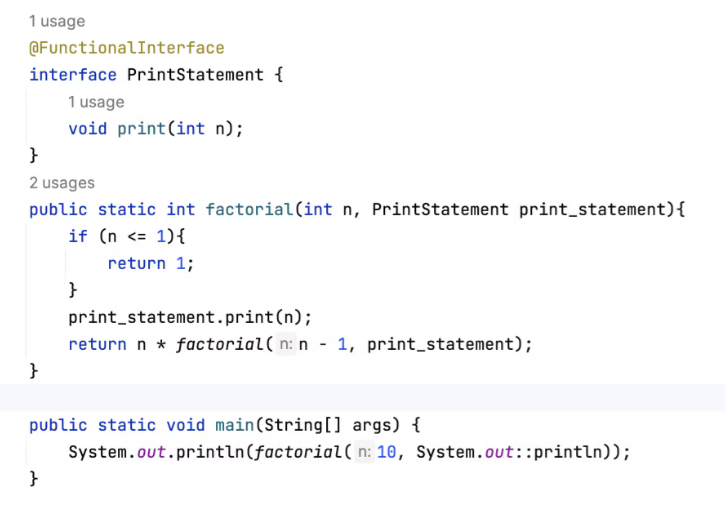

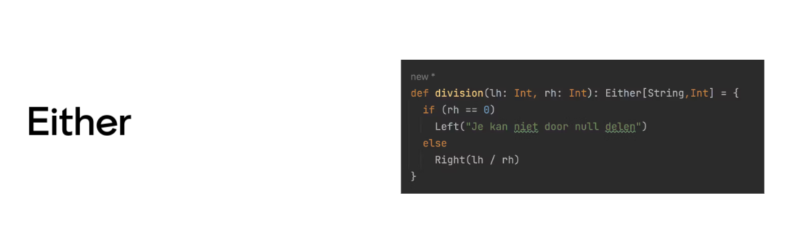

## Referential transparency
Referential transparency is a property of functions that guarantees that the function will always return the same output for the same input. This means that the function does not have any side effects and does not depend on any external state.

## Functor
### map function
The map function is a higher-order function that takes a function and a functor and applies the function to each element of the functor, returning a new functor with the transformed elements.

## Imutability

Loops can be replaced by recursion 
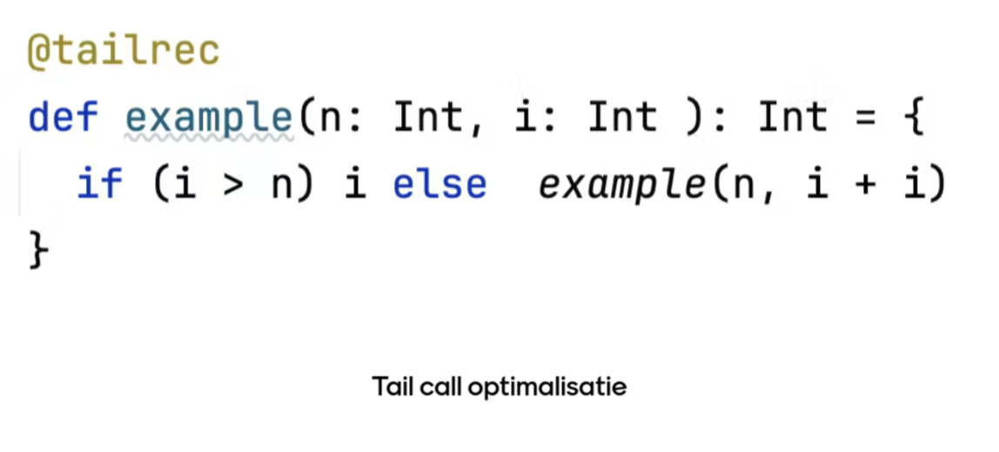

## Product type
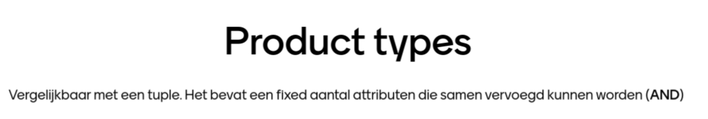
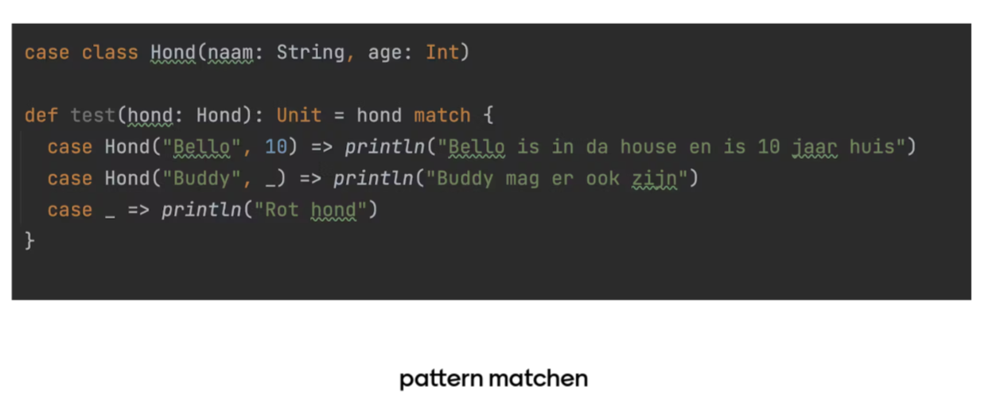

## Sum type
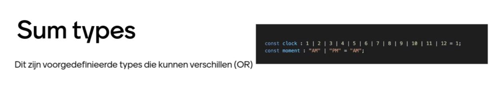

## Pattern matching
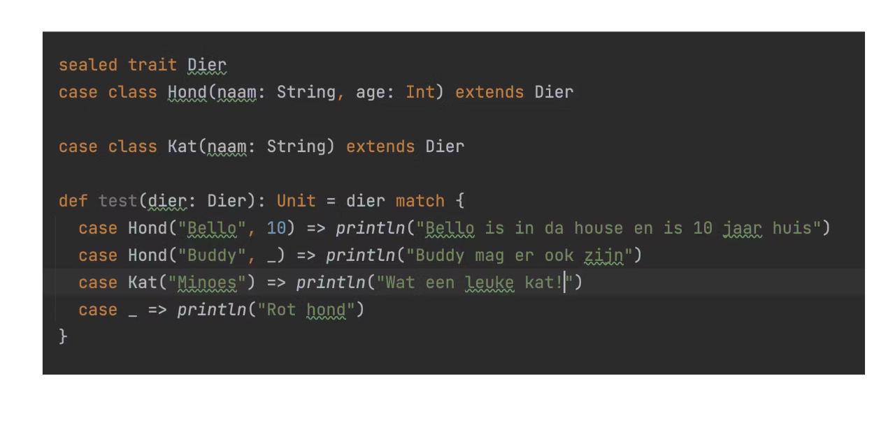

## Summary
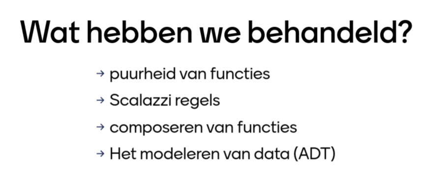
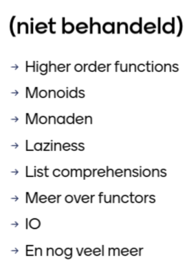

