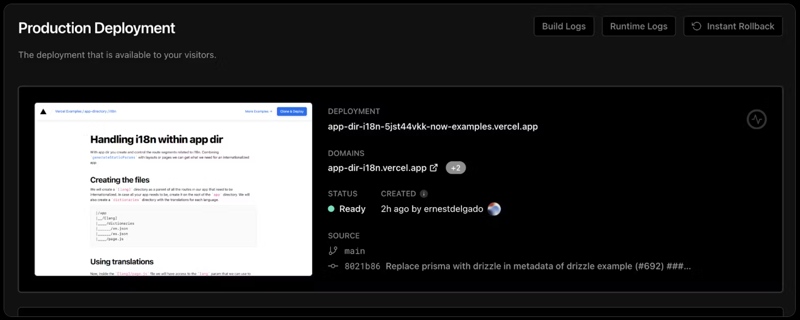
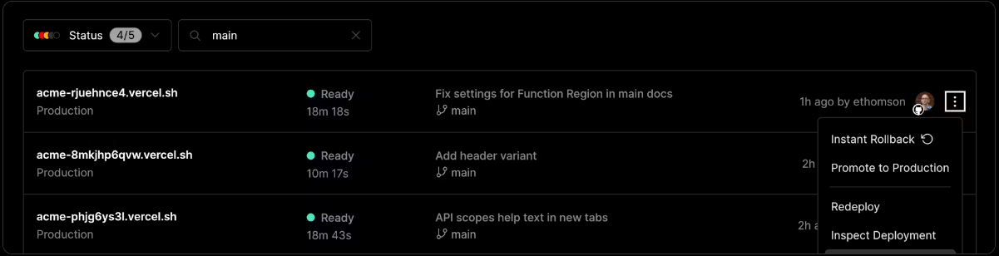
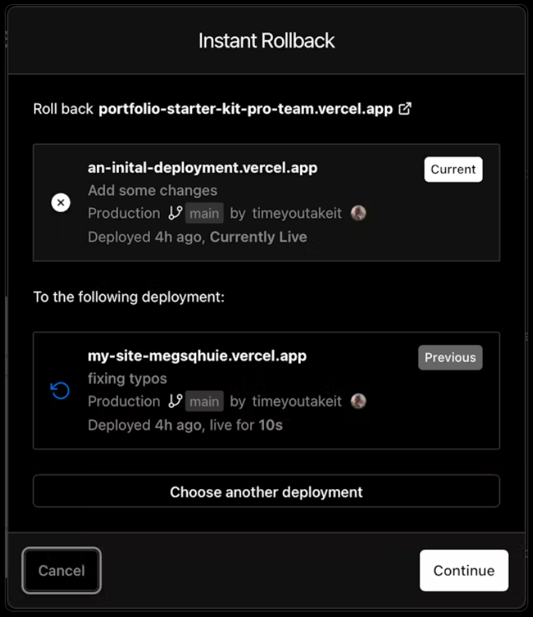
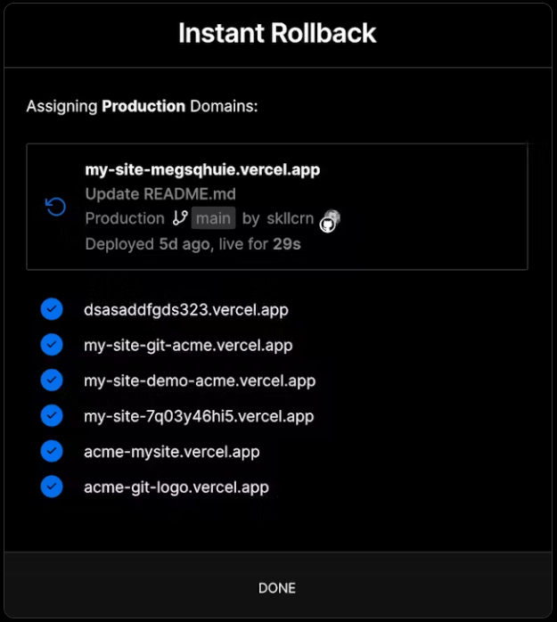
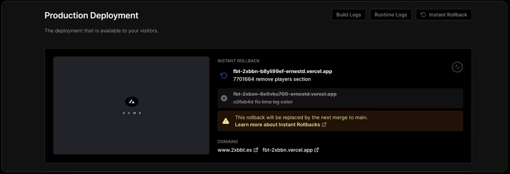

\includepdf[pages=-]{./voorblad.pdf}

\begin{center}
\Huge Instant Rollback Feature met Docker, Traefik, en GitLab CI/CD
\end{center}

\vfill

\begin{center}
\huge Adviesrapport en artikel voor Hemiron
\end{center}

\begin{center}
\LARGE Benjamin Shawki
\end{center}

\begin{center}
\Large Februari - Augustus 2024
\end{center}

\vfill

\begin{center}
Versie 1.0 definitief - 3 April 2024
\end{center}

\vfill

\begin{center}
\Huge Abstract
\end{center}

\begingroup
Hemiron heeft diepgaande artikelen nodig voor de klanten die de diensten van Hemiron gebruiken. 
De documentatie en ondersteuningsmiddelen zijn anno februari 2024 schaars en de klanten die gebruik maken van de services die Hemiron aanbiedt moeten naar externe bronnen kijken voor het ontwikkelen van hun applicaties.
Dit onderzoek is gericht op het ontwikkelen van een directe terugdraai functie en het schrijven van een artikel voor Hemiron.

Gebruikers hebben behoefte aan 99.9% uptime van hun kritische bedrijfsapplicaties.
Een belangrijk onderdeel is het vermogen om snel terug te kunnen keren naar een eerdere, stabiele versie van hun website in het geval van een storing of een kritieke fout.
Dit is in dit onderzoek gerealiseerd door het ontwikkelen van instant rollback feature. De grondpilaren zijn deployment immutability, unieke subdomeinen gekoppeld aan een deployment met behulp van wildcard DNS, een geautomatiseerd rollback proces, en 0 downtime.

Dit wordt bereikt door gebruik te maken van [Docker](https://docs.docker.com/) [ [@docker] ](#sec:ref), een containerisatie technologie, [Traefik](https://doc.traefik.io/traefik/) [ [@traefik] ](#sec:ref), een reverse proxy en load balancer, en [GitLab CI/CD](https://docs.gitlab.com/ee/topics/build_your_application.html) [ [@gitlab-ci] ](#sec:ref), een geautomatiseerde deployment pipeline.

Na afloop van dit onderzoek, gepaard met het bijbehorende [artikel](#sec:artikel), beschikken klanten over een uitgebreid plan voor het ontwikkelen en inzetten van een functie voor een instant rollback feature binnen de Virtuele Private Server die door Hemiron wordt geleverd.
\endgroup

\newpage

\tableofcontents

\newpage

# Inleiding
<!-- TODO wie is hemiron, meer context schetsen, waarom is 99,9% van belang, aanleiding is niet duidelijk --> 
<!-- Op het moment van instant rollback featrue benoemen waarom en wat het is -->
In het huidige digitale tijdperk is de ononderbroken beschikbaarheid van online diensten cruciaal voor het succes van bedrijven. Hemiron, als aanbieder van hosting- en deploymentdiensten, heeft de noodzaak om de infrastructuren van hun klanten weerbaar te maken tegen onvoorziene softwarefouten. Dit streven wordt aangedreven door de behoefte aan een uptime van 99.9% voor bedrijfskritische applicaties, een standaard die klanten van Hemiron verwachten.

Het hart van dit onderzoek ligt bij het ontwikkelen van een 'instant rollback' functie, aangevuld met een diepgaand artikel om dit proces voor Hemiron's klanten te documenteren. Het doel is om een informatieve bron te bieden die klanten in staat stelt de rollback-functie effectief binnen hun eigen systemen toe te passen. Dit wordt bereikt door het samenstellen van handleidingen en best practices, wat de community van Hemiron ten goede komt.

Dit onderzoek is geïnspireerd door de instant rollback feature van [Vercel](https://vercel.com/docs/deployments/instant-rollback) [ [@vercel-docs-instant-rollback] ](#sec:ref). Vercel is een hostingplatform, en de welke Next.js applicaties host.
React is weer een populaire JavaScript library voor het bouwen van gebruikersinterfaces.

React framework voor het bouwen van webapplicaties.
Vercel's instant rollback feature stelt klanten in staat slechts met een paar klikken terug te keren naar
een vorige, versie van hun applicatie.

Het platform biedt een krachtige rollback functie die klanten in staat stelt om snel terug te keren naar een vorige, stabiele versie van hun applicatie in geval van een storing of een kritieke fout.
wordt in dit onderzoekt dit initiatief het gebruik van geavanceerde technologieën en principes, waaronder Docker, Traefik, GitLab CI/CD, deployment immutability, wildcard DNS, en geautomatiseerde rollback processen. Deze elementen zijn cruciaal voor het waarborgen van de systeembetrouwbaarheid en het minimaliseren van downtime, waardoor Hemiron's klanten kunnen profiteren van:

- Docker:
: Maakt containerisatie van applicaties mogelijk voor een gestroomlijnde uitvoering in elke omgeving.

- Traefik:
: Fungeert als een moderne HTTP reverse proxy en load balancer.

- GitLab CI/CD:
: Biedt een platform voor continue integratie en levering, waardoor ontwikkelaars snel en veilig code updates kunnen uitrollen

- Deployment Immutability:
: Garandeert de onveranderlijkheid van uitgerolde versies, wat resulteert in een hogere stabiliteit en betrouwbaarheid.

- Wildcard DNS:
: Maakt het gebruik van meerdere subdomeinen op dezelfde IP-adressen mogelijk, essentieel voor het beheren van verschillende applicatieversies.

- Rollback Proces:
: Biedt een methodologie om snel terug te keren naar een eerdere, stabiele versie van de software bij eventuele fouten.

De integratie van deze technologieën stelt Hemiron in staat hun klanten niet alleen geavanceerde functies zoals deployment immutability en het gebruik van unieke subdomeinen aan te bieden, maar draagt ook bij aan het verbeteren van de operationele continuïteit door downtime te minimaliseren.

# Onderzoeksvragen
De kern van dit onderzoek luidt als volgt:

_Hoe kan Hemiron een hedendaagse 'instant rollback feature' beschikbaar maken die, bij softwarefouten, klanten onmiddellijk laat terugschakelen naar een voorgaande, stabiele softwareversie met minimale onderbreking, waarbij de gebruikerservaring behouden blijft, in lijn met de kritische eis van onafgebroken beschikbaarheid van hun bedrijfskritieke applicaties?_

De volgende vragen zijn essentieel voor het beantwoorden van de hoofdvraag:

- Wat zijn de kerncomponenten van Vercel's instant rollback feature en hoe dragen deze bij aan de stabiliteit en betrouwbaarheid van webapplicaties?
- Hoe kan immutability van deployments worden toegepast en op welke wijze ondersteunt dit het rollback proces?
- Op welke manier kunnen unieke URL's bijdragen aan een effectieve en efficiënte rollback procedure?
- Hoe kunnen automatisering en CI/CD integratie het rollback proces versnellen en vereenvoudigen?

# Methodologie & Uitvoering
Dit onderzoek zal primair gebruikmaken van een kwalitatieve benadering om inzicht en praktische kennis te verkrijgen over de ontwikkeling en integratie van een effectieve instant rollback feature. 
Door een casestudie van een soortgelijke functie die Vercel biedt, en door het afnemen van een expertinterview, zijn de beste praktijken verzameld, de complexe technische implementatie onderzocht, en de operationele nuances verkend.

## Case study Vercel
Door de werking van Vercel's rollback systeem te bestuderen, kunnen we inzicht krijgen in de technische en operationele aspecten van een instant rollback feature.

Een rollback kan via 2 manieren worden geïnitieerd:

- Via de webinterface
- Via de CLI

### Webinterface

In het Vercel platform wordt een krachtige en intuïtieve interface geboden om de beschikbaarheid van applicaties te beheren en de optie voor een 'Instant Rollback' te faciliteren [ [@vercel-docs-instant-rollback] ](#sec:ref). Dit proces wordt duidelijk gevisualiseerd in de gebruikersinterface, 

[@fig:vercel-production-deployment] toont de huidige productie deployment, hier is de rollback knop vergrendeld omdat we immers al op de productie deployment zitten.

{#fig:vercel-production-deployment height=40%}

[@fig:vercel-deployment-tab] toont een lijst van beschikbare deployments, elk gekoppeld aan een unieke URL. Deze lijst is toegankelijk en stelt gebruikers in staat om snel de huidige status van verschillende versies te bekijken en te beheren. Het is een centrale hub voor deployment activiteiten, van waaruit verdere acties kunnen worden ondernomen.

{#fig:vercel-deployment-tab height=40%}

[@fig:vercel-rollback] wordt weergegeven in een dialoogvenster, waar gebruikers de gewenste deployment kunnen selecteren om naar terug te draaien.

{#fig:vercel-rollback height=40%}

Na het selecteren van een deployment voor rollback wordt er gevraagd voor een bevestiging waarna de bevestigings details weergegeven worden te zien in [@fig:vercel-rollback-confirmation].

{#fig:vercel-rollback-confirmation height=40%}

[@fig:vercel-new-production] toont de nieuwe productie deployment na een rollback. De deployment is nu gewijzigd naar de geselecteerde versie en de applicatie is teruggekeerd naar een stabiele staat.

{#fig:vercel-new-production height=40%}

### CLI

Vercel biedt ook een [command line interface (CLI)](https://vercel.com/docs/cli/rollback) [ [@vercel-cli-rollback] ](#sec:ref) die ontwikkelaars in staat stelt om rollbacks uit te voeren via de terminal. 
Gebruikers dienen in te loggen in de CLI en vervolgens kunnen er commando's worden uitgevoerd om rollbacks te initiëren.

Het commando `vercel rollback` haalt de status op van lopende rollbacks.

`vercel rollback [deployment-id or url]` is het commando dat gebruikt wordt om een rollback uit te voeren. Het commando accepteert een deployment ID of URL als argument en draait de huidige productie deployment terug naar de geselecteerde versie.

## Interview
Het semi-gestructureerde interview is uitgevoerd met Ron Arts, docent aan de Hogeschool leiden en een expert in het werkveld.

De [voorbereiding](#sec:voorbereiding) en het bijbehorende [transcript](#sec:transcript) zijn te vinden in bijlage [@sec:interview]  [Interview](#sec:interview).

# Resultaten
Het onderzoek heeft geleid tot een artikel met een drietal belangrijke documenten die de klanten van Hemiron in staat stellen om een instant rollback feature te implementeren. De documenten zijn:

- docker-compose.prod.yml
- .gitlab-ci.yml
- scripts/make-sha-root-domain.sh

Deze documenten bevatten de configuratiebestanden en scripts die nodig zijn om de instant rollback feature te implementeren. In het [Artikel](#sec:artikel) staat een uitgebreide uitleg over de inhoud van deze documenten en hoe ze gebruikt kunnen worden om de instant rollback feature te realiseren.

Verder is er een proof of concept gemaakt waarin de instant rollback feature is geïmplementeerd. Dit proof of concept is gebaseerd op de configuratiebestanden en scripts die in dit onderzoek zijn ontwikkeld. Het proof of concept is succesvol getest en demonstreert de werking van de instant rollback feature.

Het bestand `make-sha-root-domain.sh` is een script dat het mogelijk maakt om de instant rollback feature te activeren. Het script neemt twee argumenten: de commit SHA van de versie waarnaar moet worden teruggekeerd en het root domein van de applicatie.
Het script past de routing regels aan in het `docker-compose.prod.yml` bestand, zodat het verkeer wordt omgeleid naar de container met de opgegeven commit SHA. 

Dit script kan met de hand op de server worden uitgevoerd om een rollback uit te voeren.
Het kan ook worden geïntegreerd in een CI/CD pipeline om automatische rollbacks te activeren op basis van bepaalde voorwaarden, zoals het falen van tests of monitoring alerts, of gebruikers kunnen een eigen implementatie maken waardoor het script kunnen activeren via een webhook, api call, frontend interface, een eigen CLI, of een andere methode.

De hulpbronnen [@http-to-https] en [@traefik-example] zijn gebruikt als referentie voor de configuratie van Traefik en de implementatie van HTTP naar HTTPS omleidingen en www-trimming.

## Artikel {#sec:artikel}
Dit artikel is bedoeld om Hemiron klanten te informeren over de voordelen en implementatie van een instant rollback feature binnen hun infrastructuur. Het artikel is ook te vinden in de bijlage als Markdown-bestand zodat deze direct geconverteerd kan worden naar HTML of PDF met behulp van een Markdown-converter, zoals Pandoc, zodat deze op de website van Hemiron geplaatst kan worden.
<!-- TODO: Voeg link toe naar bijlage met Markdown artikel. -->

---

# Implementing Instant Rollback with Docker, Traefik, and GitLab CI/CD{- .unnumbered}
## Overview{- .unnumbered}
This section presents a comprehensive guide on setting up an instant rollback feature using [Docker](https://docs.docker.com/) for containerization, [Traefik](https://doc.traefik.io/traefik/) as a reverse proxy and load balancer, and [GitLab CI/CD](https://docs.gitlab.com/ee/topics/build_your_application.html) for continuous integration and deployment.
The goal is to ensure minimal downtime and maintain data integrity when rolling back to a previous, stable version of software in the event of a failure.

## Docker Configuration{- .unnumbered} 
The docker-compose.prod.yml file defines the Docker services, including the Traefik reverse proxy and the placeholder for the frontend application. Traefik is configured to automatically generate and renew SSL certificates using Let's Encrypt, ensuring secure connections. The setup outlines how each service is containerized, emphasizing the Traefik configuration for secure routing and SSL termination.

Additionally, the configuration introduces automatic HTTP to HTTPS redirections, ensuring all traffic to your applications is securely encrypted. Furthermore, the configuration incorporates www trimming, redirecting requests from `www.example.com` to `example.com`, streamlining user access and simplifying domain management.

### docker-compose.prod.yml{- .unnumbered}
~~~~~yml
version: '3.9'

services:
  traefik:
    image: traefik:v3.0
    ports:
      - 80:80
      - 443:443
    volumes:
      - /var/run/docker.sock:/var/run/docker.sock
      - ./letsencrypt:/letsencrypt
    command:
      - --api.insecure=true
      - --api.dashboard=true
      - --providers.docker=true
      - --providers.docker.exposedByDefault=false
      - --entrypoints.web.address=:80
      - --entrypoints.web.http.redirections.entrypoint.to=websecure
      - --entryPoints.web.http.redirections.entrypoint.scheme=https
      - --entrypoints.websecure.address=:443
      - --entrypoints.websecure.asDefault=true
      - --certificatesresolvers.letsencrypt.acme.tlschallenge=true
      # Todo: Replace with your email
      - --certificatesresolvers.letsencrypt.acme.email=mail@example.com
      - --certificatesresolvers.letsencrypt.acme.storage=/letsencrypt/acme.json

    labels:
      - traefik.enable=true
      - traefik.http.routers.traefik.rule=Host(`traefik.${ROOT_DOMAIN}`)
      - traefik.http.routers.traefik.service=api@internal
      - traefik.http.routers.traefik.entrypoints=websecure
      - traefik.http.routers.traefik.tls.certresolver=letsencrypt
      - traefik.http.middlewares.redirect-to-https.redirectscheme.scheme=https
      - traefik.http.routers.http-catchall.rule=HostRegexp(`{host:.+}`)
      - traefik.http.routers.http-catchall.entrypoints=web
      - traefik.http.routers.http-catchall.middlewares=redirect-to-https
    restart: unless-stopped

  # Todo: Add your database configuration as needed.
  # db:
  #   image: postgres:14
  #   volumes:
  #     - postgres_data:/var/lib/postgresql/data
  #   environment:
  #     POSTGRES_DB: ${POSTGRES_DB}
  #     POSTGRES_USER: ${POSTGRES_USER}
  #     POSTGRES_PASSWORD: ${POSTGRES_PASSWORD}
  #   ports:
  #     - "5433:5432"

  # Todo: Add your backend configuration as needed.
  # backend:
  #   image: ${IMAGE_BACKEND}
  # Todo: Add your Dockerfile path, context, and environment variables, volumes, and ports as needed.
  # depends_on:
  #   - db

  frontend-placeholder:
    image: ${CI_REGISTRY_IMAGE}/$CI_COMMIT_REF_NAME/frontend:${CI_COMMIT_SHORT_SHA}
    # Todo: Add your frontend configuration as needed.

    labels:
    - traefik.enable=true
    - traefik.http.routers.frontend-${CI_COMMIT_SHORT_SHA}.rule=${TRAEFIK_ROUTER_RULE}
    - traefik.http.routers.frontend-${CI_COMMIT_SHORT_SHA}.entrypoints=websecure
    - traefik.http.routers.frontend-${CI_COMMIT_SHORT_SHA}.tls.certresolver=letsencrypt
    - traefik.http.services.frontend-${CI_COMMIT_SHORT_SHA}.loadbalancer.server.port=80
    - traefik.http.middlewares.strip-www.redirectregex.regex=^https://www\.(.+)
    - traefik.http.middlewares.strip-www.redirectregex.replacement=https://$${1}
    - traefik.http.routers.frontend-${CI_COMMIT_SHORT_SHA}.middlewares=strip-www
    depends_on:
      - traefik

volumes:
  letsencrypt:
    name: letsencrypt
  # postgres_data:
~~~~~

_Key Components:_

- Traefik Service: 
: Acts as the entry point for all incoming requests, directing traffic to the appropriate container based on the request's host. It also handles SSL certificates automatically.
- Frontend Service Placeholder:
: A template for deploying the frontend application. It's tagged with a unique commit SHA to allow for instant rollbacks by switching traffic to a container tagged with the desired version.
- **Automatic HTTPS Redirection**:
: The configuration employs Traefik's middleware to redirect all HTTP traffic to HTTPS, safeguarding data in transit.
- **WWW Trimming**:
: Utilizing Traefik's redirectregex middleware, the setup automatically handles requests to `www.` subdomains by redirecting them to the non-www version of the URL, enhancing SEO and user experience.

## GitLab CI/CD Pipeline{- .unnumbered}
The .gitlab-ci.yml file demonstrates the continuous integration and deployment process. It includes stages for building the Docker images and deploying them to the production environment. The deployment stage dynamically updates the docker-compose.prod.yml file to reflect the current commit SHA, facilitating versioning and rollback.

### .gitlab-ci.yml{- .unnumbered}
~~~~~yml
# CI/CD Pipeline Configuration example for a containerized application with Docker, Traefik, and GitLab CI/CD.

stages:
  # - analyze
  - build
  - deploy

# Default settings for Docker, applied globally unless specifically overridden.
default:
  image: docker:24.0.5
  services:
    - docker:24.0.5-dind

# Global variables defining Docker configurations and image naming conventions.
variables:
  # Docker environment settings.
  DOCKER_DRIVER: overlay2
  DOCKER_TLS_CERTDIR: "/certs"

  # Naming for Docker images, facilitating version control and latest builds.
  IMAGE_FRONTEND: $CI_REGISTRY_IMAGE/$CI_COMMIT_REF_NAME/frontend:$CI_COMMIT_SHORT_SHA
  # IMAGE_BACKEND: $CI_REGISTRY_IMAGE/$CI_COMMIT_REF_NAME/backend:$CI_COMMIT_SHORT_SHA
  # IMAGE_E2E_TEST: $CI_REGISTRY_IMAGE/$CI_COMMIT_REF_NAME/e2e-test:$CI_COMMIT_SHA

  # Secure login to Docker registry.
  DOCKER_LOGIN: echo $CI_REGISTRY_PASSWORD | docker login -u $CI_REGISTRY_USER --password-stdin $CI_REGISTRY

  # Todo: Replace with your root domain.
  ROOT_DOMAIN: example.com

# Depending on the pipleline, you might want an analyze stage to validate the code quality and syntax for both frontend and backend, and unit tests here.

# Analyze stage:

# Build stage: Creates Docker images for frontend, backend, and E2E testing.

# Commands for building and pushing Docker images included.
build-frontend:
  stage: build
  before_script:
  - sh -c "$DOCKER_LOGIN"
  script:
    - docker compose -f docker-compose.prod.yml build frontend-placeholder
    - docker push $IMAGE_FRONTEND
  only:
    - main

# Example of building a backend with docker compose.
# build-backend:
#   stage: build
#   before_script:
#   - sh -c "$DOCKER_LOGIN"
#   script:
#     - docker compose -f docker-compose.prod.yml build backend
#     - docker push $IMAGE_BACKEND
#   only:
#     - main

deploy:
  stage: deploy
  image: alpine:3.14
  before_script:
    - apk add gettext openssh-client
  script:
    - export SERVICE_NAME="frontend-${CI_COMMIT_SHORT_SHA}"
    - export TRAEFIK_ROUTER_RULE="Host(\`${CI_COMMIT_SHORT_SHA}.${ROOT_DOMAIN}\`) || Host(\`${ROOT_DOMAIN}\`)"

    - sed -i "s|frontend-placeholder|${SERVICE_NAME}|g" docker-compose.prod.yml
    - sed -i "s|\${CI_COMMIT_SHORT_SHA}|${CI_COMMIT_SHORT_SHA}|g" docker-compose.prod.yml
    - sed -i "s|\${ROOT_DOMAIN}|${ROOT_DOMAIN}|g" docker-compose.prod.yml
    - sed -i "s|\${CI_REGISTRY_IMAGE}|${CI_REGISTRY_IMAGE}|g" docker-compose.prod.yml

    - envsubst < docker-compose.prod.yml > docker-compose.prod.subst.yml
    - eval $(ssh-agent)
    - echo "$ID_RSA" | tr -d '\r' | ssh-add -
    - mkdir -p ~/.ssh
    - chmod 700 ~/.ssh
    - touch ~/.ssh/known_hosts
    - chmod 600 ~/.ssh/known_hosts
    - ssh-keyscan -H $SERVER_IP >> ~/.ssh/known_hosts
    - scp docker-compose.prod.subst.yml $SERVER_USER@$SERVER_IP:/home/deployer/${CI_COMMIT_SHORT_SHA}-docker-compose.prod.yml
    - ssh $SERVER_USER@$SERVER_IP "
        cd /home/$SERVER_USER;

        docker compose -f ${CI_COMMIT_SHORT_SHA}-docker-compose.prod.yml up -d;

        ./make-sha-root-domain.sh '${CI_COMMIT_SHORT_SHA}' '$ROOT_DOMAIN';
      "

# Todo: add end to end tests after the deployment and trigger a rollback to the previous sha if the tests fail
~~~~~

_Pipeline Stages:_

- Build:
: Compiles the application and packages it into Docker images, tagging each with the commit SHA for version tracking.
- Deploy:
: Updates the deployment configuration with the new version and applies it to the production environment. It employs environment variables to adjust service names and routing rules dynamically, ensuring each deployment is accessible via a unique URL.

## Automated Rollback Script{- .unnumbered }
The scripts/make-sha-root-domain.sh script facilitates the instant rollback process. By specifying the commit SHA of the version to rollback to, this script adjusts the Traefik routing rules to direct traffic to the container associated with that SHA. This mechanism allows for immediate switchovers without downtime.

### scripts/make-sha-root-domain.sh{- .unnumbered}
~~~~~sh 
#!/usr/bin/env bash

# Ensures the script is called with exactly two arguments.
if [ "$#" -ne 2 ]; then
    echo "Usage: $0 <short_sha_of_service> <root_domain>"
    exit 1
fi

TARGET_SHA=$1
ROOT_DOMAIN=$2
DEPLOYMENT_DIR="$HOME/"

# Updates the routing rule for a given service SHA.
update_routing_rule() {
    local sha=$1
    local file="${DEPLOYMENT_DIR}${sha}-docker-compose.prod.yml"
    local add_root_domain=$2

    # Check if the Docker Compose file exists.
    if [ ! -f "$file" ]; then
        echo "File not found: $file"
        return
    fi

    # Determine the new rule based on whether to add or remove the root domain.
    local new_rule="Host(\`${sha}.${ROOT_DOMAIN}\`)"
    if [ "$add_root_domain" == "true" ]; then
        new_rule+=" || Host(\`${ROOT_DOMAIN}\`) || Host(\`www.${ROOT_DOMAIN}\`)"
    fi

    # Update the routing rule using yq.
    yq e -i "(.services.\"frontend-$sha\".labels.[] | select(test(\"traefik.http.routers.frontend-$sha.rule=\"))) = \"traefik.http.routers.frontend-$sha.rule=$new_rule\"" "$file"
}

# Redeploys the Docker Compose service by its SHA.
redeploy_service() {
    local sha=$1
    local file="${DEPLOYMENT_DIR}${sha}-docker-compose.prod.yml"
    docker compose -f "$file" up -d "frontend-$sha"
}

# Update the target service to include the root domain.
update_routing_rule "$TARGET_SHA" "true"
redeploy_service "$TARGET_SHA"

# Iterate over all running frontend services except the target.
docker ps --filter "name=${USER}-frontend-" --format "{{.Names}}" | grep -Eo 'frontend-[0-9a-f]+' | grep -v "frontend-$TARGET_SHA" | while read -r service; do
    sha=$(echo "$service" | cut -d'-' -f2)
    # Skip if the Docker Compose file for the SHA does not exist.
    if [ ! -f "${DEPLOYMENT_DIR}${sha}-docker-compose.prod.yml" ]; then
        continue
    fi
    # Update routing to remove the root domain, if present.
    update_routing_rule "$sha" "false"
    # Redeploy the service to apply the change.
    redeploy_service "$sha"
done

echo "Completed root domain update and redeployment."
~~~~~

_Script Features:_

- Flexible Rollback Triggering:
: Enables quick reversion to any previously deployed version by modifying Traefik's routing rules.
- No Downtime:
: Traffic rerouting happens instantaneously, maintaining user access to the application without interruptions.

## Integration and Testing{- .unnumbered}
The integration of Docker, Traefik, and GitLab CI/CD creates a robust environment for deploying and managing applications with the flexibility to rollback instantly. Testing this setup involves deploying multiple versions of an application, then triggering rollbacks to ensure the system reacts as expected.

_Testing Considerations:_

- Automated Testing:
: Implement automated tests within the CI/CD pipeline to validate each deployment before it goes live. This ensures only stable versions are deployed to production.
- Rollback Scenarios:
: Simulate various failure scenarios to test the rollback mechanism's effectiveness, including immediate rollbacks after deployment and reverting to versions several deployments past.

## Prerequisites{- .unnumbered}
Before diving into the implementation of the instant rollback feature, it's crucial to ensure that the Virtual Private Server (VPS) is properly configured with the necessary tools and software. This section outlines the requirements and provides guidance on preparing the system for deployment.

It's also important to ensure your DNS settings are correctly configured to support the instant rollback feature and HTTPS redirections. Specifically, a wildcard DNS record (e.g., `*.example.com`) should be in place to allow for the dynamic handling of subdomains through Traefik, facilitating seamless transitions between different application versions.

In short you'll need to have a DNS record like `*.example.com` pointing to the VPS IP address, this will allow you to access the deployments using subdomains like `commit-sha.example.com`. 
This is an example of a simple setup:

| Type | Hostname | Value |
|---------------- | --------------- | --------------- |
| A | example.com | 12.345.67.890 |
| A | *.example.com | 12.345.67.890 |
| CNAME | www.example.com | example.com |

### Essential Tools and Software{- .unnumbered}
- Docker:
: Docker must be installed both on the VPS and the local development machine. Docker facilitates the creation, deployment, and management of containerized applications, making it easier to manage dependencies and streamline the deployment process.

- Docker Compose:
: Docker Compose is required for managing multi-container Docker applications. By using a YAML file to configure the application’s services, you can create and start all the services with a single command. Ensure that Docker Compose is available on the VPS to deploy the services defined in the docker-compose.prod.yml file.

- yq:
: yq is a lightweight and portable command-line YAML processor. The scripts/make-sha-root-domain.sh script uses yq to update the Docker Compose configuration dynamically. Make sure to install yq on the VPS where deployments are executed.

- SSH Access:
: Secure Shell (SSH) access to the VPS is required for executing commands remotely and transferring files, such as the updated Docker Compose file during deployment. Ensure that SSH keys are set up for secure and passwordless access to the VPS.

- GitLab Runner:
: If GitLab CI/CD is used for automation, a GitLab Runner must be installed and configured either on the VPS or on a dedicated CI/CD server. The Runner executes the jobs defined in the .gitlab-ci.yml file.

### Preparing the Environment{- .unnumbered}
1. Install Docker and Docker Compose:
: Follow the official Docker documentation to install Docker and Docker Compose on your VPS and local development machine.

1. Install yq:
: yq can be installed via package managers like apt for Debian/Ubuntu. Refer to the yq GitHub repository for detailed installation instructions.

1. Configure SSH Access:
: Set up SSH keys for the user account on the VPS that will be used for deployments. Add the public key to the ~/.ssh/authorized_keys file for passwordless access.

1. Set Up GitLab Runner:
: Install GitLab Runner according to the instructions provided in the GitLab documentation. Register the Runner with your GitLab project to execute the CI/CD pipeline jobs.

### Verifying the Setup{- .unnumbered}
Before proceeding with the deployment, verify that all required tools are correctly installed and configured:

- Run the following to check the installations.
    - `docker version`
    - `docker compose version`
    - `yq --version`
- Test SSH access to the VPS without entering a password.
- Check the GitLab Runner status to ensure it is ready to execute pipeline jobs.

With these prerequisites in place, you're well-prepared to implement the instant rollback feature using Docker, Traefik, and GitLab CI/CD. This foundation ensures a smooth and efficient deployment process, minimizing downtime and enhancing the overall reliability of the system.

## What's Next?{- .unnumbered}
The instant rollback feature is a powerful tool for maintaining application stability and ensuring a seamless user experience. By combining Docker, Traefik, and GitLab CI/CD, you've established a deployment pipeline that supports rapid rollbacks to previous versions, reducing the impact of failures and errors.

To further enhance the rollback process, consider implementing a monitoring system that triggers rollbacks automatically based on predefined conditions, setting up alerts for critical events, provide a user-friendly interface for managing deployments, and developing a custom CLI for executing rollback commands.

Implementing an instant rollback feature enhances operational reliability and user satisfaction by ensuring that applications can quickly revert to a stable state in the event of a failure. This setup not only minimizes downtime but also provides a scalable and secure deployment pipeline suitable for modern web applications.

---

\newpage
# Conclusie
Dit onderzoek heeft bewezen dat met de juiste tools en de juiste benadering, het mogelijk is om een geavanceerde instant rollback feature op te zetten die Hemiron's klanten de zekerheid biedt die ze nodig hebben in een tijdperk waarin online beschikbaarheid essentieel is.

## Hoe kan Hemiron een hedendaagse 'instant rollback feature' beschikbaar maken die, bij softwarefouten, klanten onmiddellijk laat terugschakelen naar een voorgaande, stabiele softwareversie met minimale onderbreking, waarbij de gebruikerservaring behouden blijft, in lijn met de kritische eis van onafgebroken beschikbaarheid van hun bedrijfskritieke applicaties?{- .unnumbered .unlisted}

De hoofdvraag is beantwoord door een reeks technische componenten en procedures te implementeren die een directe terugkeer naar een stabiele applicatieversie mogelijk maken. Met Docker werd containerisatie toegepast, Traefik fungeerde als reverse proxy en load balancer, en GitLab CI/CD zorgde voor een automatische deployment pipeline. De essentiële combinatie van deze technologieën maakt het voor Hemiron mogelijk om een solide en gebruiksvriendelijke instant rollback feature te bieden aan hun klanten.

### Wat zijn de kerncomponenten van Vercel's instant rollback feature en hoe dragen deze bij aan de stabiliteit en betrouwbaarheid van webapplicaties?{- .unnumbered .unlisted}

De kerncomponenten bestaan uit immutable deployments, automatisering van rollbacks via CI/CD en unieke URL's per deployment. Dit levert een directe en betrouwbare manier om rollbacks uit te voeren en draagt bij aan de veerkracht van het systeem.

### Hoe kan immutability van deployments worden toegepast en op welke wijze ondersteunt dit het rollback proces?{- .unnumbered .unlisted}

Immutability wordt bereikt door containerisatie met Docker, waarbij elke deployment een uniek tag krijgt. Dit verzekert dat elke versie ongewijzigd blijft en biedt een betrouwbaar rollback punt.

### Op welke manier kunnen unieke URL's bijdragen aan een effectieve en efficiënte rollback procedure?{- .unnumbered .unlisted}

Door het gebruik van unieke subdomeinen voor elke deployment, mogelijk gemaakt door Traefik en wildcard DNS-records, kunnen gebruikers en systemen onmiddellijk schakelen tussen verschillende applicatieversies.

### Hoe kunnen automatisering en CI/CD integratie het rollback proces versnellen en vereenvoudigen?{- .unnumbered .unlisted}

GitLab CI/CD automatiseert de uitrol en het beheer van applicaties. Door rollback scripts te integreren in de CI/CD pipeline, kunnen rollbacks geautomatiseerd en met minimale menselijke interventie uitgevoerd worden.
De bevindingen uit de case study van Vercel, het expertinterview en de resultaten van het proof of concept bevestigen de werkbaarheid van deze aanpak. Het ontwikkelde systeem draagt bij aan het doel van Hemiron om een hogere beschikbaarheid en betrouwbaarheid van applicaties voor hun klanten te waarborgen.

### Tot slot{- .unnumbered .unlisted}
Verder is het van belang dat de gedocumenteerde best practices actief worden gedeeld met Hemiron's klanten. Dit zal hen in staat stellen de instant rollback feature te begrijpen, te implementeren en te integreren binnen hun eigen infrastructuur.

Als vervolgstappen voor voor gebruikers wordt aanbevolen om:

- Een gebruikersvriendelijke interface te ontwikkelen voor het beheer van rollbacks.
- Continue monitoring en automatische triggermechanismen in te stellen voor het activeren van rollbacks.
- Een gedetailleerd testplan op te stellen rekening houdend met de rollback feature.

Dit onderzoek en het bijbehorende artikel bieden een stevig fundament voor Hemiron en hun klanten om de uitdagingen van het modern digitale landschap aan te gaan en verzekeren een hoge mate van operationele continuïteit voor hun kritische bedrijfsapplicaties.

\newpage
# Referenties {#sec:ref}

\newpage
# Bijlagen

## Interview {#sec:interview}

### Voorbereiding {#sec:voorbereiding}

---

\LARGE Interviewstructuur
\normalsize

**Introductie**

- **Context**: Doel van het interview, belang van rollback features.
- **Opname toestemming**: Privacy, toestemming.

**Hoofdgedeelte**

Achtergrond en Ervaring

- **Rollback functie ervaring**: Specifieke voorbeelden, duur van de ervaring.
- **Projectcontext**: Type projecten, rol binnen het project.

Technische Diepgang

- **Methodologieën**: Voorkeuren, redenering, implementatie uitdagingen.
- **Tooling**: Specifieke tools of frameworks gebruikt.

Best Practices en Aanbevelingen

- **Implementatiegids**: Stappen, overwegingen.
- **Hemiron-specifiek**: Aanpassingen, organisatorische context. 

---

\LARGE Topic lijst
\normalsize

Deployment

- **Immutable Deployments**: Voordelen, implementatie tips.
- **Snapshot-Beheer**: Strategieën, tools.
- **Versiegeschiedenis**: Belang, beheer.
- **Unieke URL's**: Implementatie, voordelen, subdomein.

Deployment Identificatie

- **Versie-Toegankelijkheid**: Methoden, best practices.
- **Omgevingen**: Scheiding, doel (prod vs staging/dev/test).
- **Environment Variabelen**: Beheer, veiligheid.
- **Instant Rollback Procedure**: Stappen, voorbereiding.

Rollback Commando's (CLI)

- **Triggers**: Wanneer, waarom.
- **Automatisering/Scripts**: Voorbeelden, effectiviteit.
- **CI/CD Integratie**: Best practices, uitdagingen.

Pipeline Configuratie

- **Automatische Rollbacks**: Wanneer, hoe.
- **Monitoring/Alerts**: Systemen, responsstrategieën.
- **Technische Uitdagingen**: Veelvoorkomend, oplossingen.

Gebruikersinterface

- **Dashboard Functionaliteit**: Noodzakelijke features, ontwerp overwegingen.
- **Gebruikerservaring**: Tijdens rollbacks, verbeterpunten.

Infrastructuur Compatibiliteit

- **Operationele Vereisten**: Specifieke behoeften, aanpassingen.
- **Beveiligingsimplicaties**: Overwegingen, maatregelen.
- **Best Practices**: Algemeen, specifiek voor rollback features.

---

### Transcript {#sec:transcript}

Het volledige transcript van het interview is te vinden in het bijgevoegde `transcript.docx` bestand.

## Artikel Markdown

Het artikel is te vinden in de bijgevoegde bestanden in `artikel/artikel-in-markdown.md`.

Ook zijn de bestanden zoals beschreven in het [artikel](#sec:artikel) bijgevoegd aan dit document in `artikel/code/`.

## Prototype Code
De volledige code het prototype is te vinden op [GitLab](https://gitlab.com/BenjaminShawkiOrg/pintandpillage-containerized). Voor toegang kunt u contact opnemen met benjaminshawki@gmail.com.

Ook is de code voor het prototype bijgevoegd in `prototype/` 

## Logboek

2024-03-19
: Opzet document, merge met voorstel, bronnenonderzoek.

2024-03-20
: Initiële interviewstructuur en topiclijst opgesteld.

2024-03-21
: Interviewstructuur en topiclijst verfijnd. Interview gedaan met expert.
: Antwoord gekregen over de vraag hoe ik mijn theoretisch kader verwerk in de rest van het adviesrapport.
: Transcriptie van het interview.

2024-03-26
: Doorontwikkelen van de Docker configuratie en GitLab CI/CD pipeline.

2024-03-27
: Begin van de implementatie van Traefik en Let's Encrypt SSL configuraties.
: Eerste pogingen tot deployment scripts getest en verfijnd.

2024-03-28
: Verfijning van Traefik configuratie om HTTP verkeer te leiden naar HTTPS.
: Experimenten met Traefik's dashboard en wildcard subdomeinen.
: Debugging van de GitLab CI/CD pipeline en aanpassing van de deploy scripts.

2024-03-29
: Test van nieuwe deployment script voor het automatisch updaten van containers.

2024-03-30
: Verbetering van de SSL-configuratie voor frontend placeholders.
: Implementatie van Let's Encrypt auto SSL in Traefik.
: Opzet artikel

2024-04-01
: Refactor van de bash scripts voor betere omgevingscompatibiliteit.
: Verwijdering van overtollige netwerkconfiguraties en herstructurering voor betere redirects.
: Verfijnen verslag

2024-04-02
: Laatste aanpassingen en refinements aan de bash scripts voor een gestroomlijnde deployment.
: Verfijnen verslag

2024-04-03
: Afronding verslag
