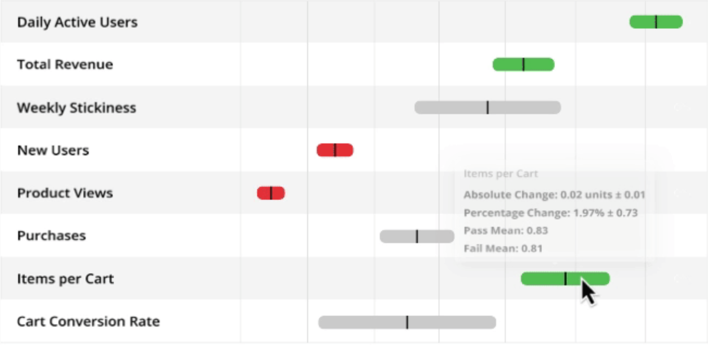

### Categorized A/B Testing Ideas for plnts.com

1. **Product Listings and Display**:
    - Test: Different layouts (grid view vs. list view) or product image sizes.
    - Metrics:
        - Click-through rate
        - Product views
        - Time spent on product pages
        - Add-to-cart rate

2. **Product Descriptions**:
    - Test: Different description lengths, formats, or user reviews vs. professional descriptions.
    - Metrics:
        - Time spent on product page
        - Add-to-cart rate
        - Conversion rate

3. **Call-to-Action (CTA) Buttons**:
    - Test: Different button colors, sizes, text (e.g., "Buy Now" vs. "Add to Cart").
    - Metrics:
        - Click-through rate of the CTA
        - Conversion rate

4. **Pricing and Promotions**:
    - Test: Different pricing strategies or promotional offers (e.g., "20% off" vs. "Buy One Get One Free").
    - Metrics:
        - Conversion rate
        - Average order value
        - Total sales

5. **Checkout Process**:
    - Test: Single-page vs. multi-step checkout or different checkout page designs.
    - Metrics:
        - Cart abandonment rate
        - Conversion rate

6. **Landing Pages**:
    - Test: Different designs, images, headlines, or content structures.
    - Metrics:
        - Bounce rate
        - Time spent on page
        - Conversion rate

7. **Navigation and Menu**:
    - Test: Different menu structures or navigation layouts.
    - Metrics:
        - Bounce rate
        - Time spent on site
        - Pages viewed per session

8. **Search Functionality**:
    - Test: Search bar placement, predictive search suggestions, or filter options.
    - Metrics:
        - Use of search functionality
        - Conversion rate from search results
        - User satisfaction with search results

9. **Email Sign-Up Prompts**:
    - Test: Pop-up vs. embedded sign-up forms or different incentives for signing up (e.g., discount codes vs. care guides).
    - Metrics:
        - Email sign-up rate
        - Bounce rate
        - Subsequent open and click rates of emails

10. **Product Recommendations**:
    - Test: Algorithmic recommendations vs. curated ones.
    - Metrics:
        - Click-through rate on recommended products
        - Average order value
        - Conversion rate

11. **Mobile vs. Desktop Experience**:
    - Test: Different mobile layouts or features.
    - Metrics:
        - Mobile conversion rate
        - Bounce rate
        - Average session duration

12. **Testimonials and User Feedback**:
    - Test: Exploring various positions and formats for reviews, ratings, or user testimonials.
    - Metrics:
        - Trust metrics
        - Conversion rate
        - Time spent on pages with testimonials

13. **Content and Blog**:
    - Test: Different content formats (e.g., videos, articles, infographics) or different topics.
    - Metrics:
        - Engagement metrics like time spent on page
        - Shares (For the future, currently not a feature)
        - Comments (For the future, currently not a feature)
        - Return visits

### Unique Metrics from A/B Testing Ideas for plnts.com:

1. **Click-through rate (CTR)**:
    - **Description**: The percentage of people who clicked on an element (like an ad, link, or button) out of the total who viewed it. It's a primary measure of user engagement and the effectiveness of calls-to-action.

2. **Product page views**:
    - **Description**: The number of times a product page is viewed. It helps understand product interest.

3. **Add-to-cart rate**:
    - **Description**: The percentage of visitors who add a product to the cart after viewing it. It's an initial step towards conversion.

4. **Conversion rate**:
    - **Description**: The percentage of visitors who take a desired action, typically making a purchase. It indicates the effectiveness of the site in persuading visitors to become customers.

5. **Average order value (AOV)**:
    - **Description**: The average amount of money each customer spends per transaction. It helps understand purchasing behavior.

6. **Total sales**:
    - **Description**: The complete number of sales made within a specific time frame.

7. **Bounce rate**:
    - **Description**: The percentage of visitors who navigate away from the site after viewing only one page. A high bounce rate can indicate irrelevant content or poor user experience.

8. **Pages per session**:
    - **Description**: Average number of pages viewed during a single session. It helps measure user engagement.

9. **Search usage rate**:
    - **Description**: The percentage of visitors who use the site's search function. A higher rate can indicate navigation problems or users looking for specific products.

10. **Cart abandonment rate**:
    - **Description**: The percentage of shoppers who add items to their cart but do not complete the purchase. It helps identify potential issues in the checkout process.

11. **Email sign-up rate**:
    - **Description**: The percentage of visitors who subscribe to the email list. Higher rates can indicate effective incentives or interest in staying connected.

12. **Email open and click rates**:
    - **Description**: Respectively, the percentage of recipients who open an email and the percentage of those who click on a link within it. These rates measure the effectiveness of email campaigns.

13. **Time on testimonial pages**:
    - **Description**: Average duration users spend on pages containing testimonials or reviews. It can indicate the influence of social proof on buying decisions.

14. **Page engagement (duration, return visits)**:
    - **Description**: Measures like time spent on a page and the frequency of return visits. They help gauge the effectiveness and relevance of content to users.

### Combining Click Path with Other Metrics:

1. **Click Path + Time Spent**:
    - Analyze the duration users spend on each page in their click path to see which content keeps them engaged and which doesn’t.

2. **Click Path + Conversion Rate**:
    - Understand which navigation paths are most likely to lead to conversions. This can help in streamlining the user journey for higher conversions.

3. **Click Path + Bounce Rate**:
    - If specific click paths have a high bounce rate, investigate those paths or pages for possible issues.

4. **Click Path + Exit Rate**:
    - Identify pages where users frequently exit. This might show pages that are not meeting user expectations.

5. **Click Path + Cart Abandonment Rate**:
    - Understand at which step users are abandoning their carts. This can help refine the checkout process.

6. **Click Path + CTR**:
    - For paths that include promotional or CTA elements, checking the click-through rates can help evaluate the effectiveness of those elements in the user journey.

7. **Click Path + Search Usage Rate**:
    - If users are frequently using search in their paths, it may indicate they're having trouble finding what they need through regular navigation.

8. **Click Path + Product Page Views/Add-to-Cart Rate**:
    - Understand the sequence of products viewed and how often they lead to a product being added to the cart. This can provide insights into cross-selling or upselling opportunities.

### Things to Note

- Not all metrics are equally easy to measure. While metrics like click-through rate or bounce rate can be directly captured through most analytics tools, metrics like "trust" or "user satisfaction" may require more indirect methods, such as surveys or user feedback sessions.

- To measure specific metrics, integration with our other utilized platforms is essential. For example, to gauge the effectiveness of email campaigns, we need to integrate our analytics tool with our email marketing platform. Additionally, integration with Magento and Tweakwise might be necessary to gain deeper insights into e-commerce behavior and search functionalities. 

- When combining metrics, such as Click Path with others, it's vital to consider the user's journey's broader context. For instance, a longer time spent on a page could indicate interest, but it could also suggest confusion.

## A/B Testing Ideas for plnts.com

### A/B Testing Ideas for plnts.com and Corresponding Metrics

1. **Product Listings and Display**:
    - Test: Different layouts (grid view vs. list view) or product image sizes.
    - Metrics:
        - Click-through rate
        - Product views
        - Time spent on product pages
        - Add-to-cart rate

2. **Product Descriptions**:
    - Test: Different description lengths, formats, or user reviews vs. professional descriptions.
    - Metrics:
        - Time spent on product page
        - Add-to-cart rate
        - Conversion rate

3. **Call-to-Action (CTA) Buttons**:
    - Test: Different button colors, sizes, text (e.g., "Buy Now" vs. "Add to Cart").
    - Metrics:
        - Click-through rate of the CTA
        - Conversion rate

4. **Pricing and Promotions**:
    - Test: Different pricing strategies or promotional offers (e.g., "20% off" vs. "Buy One Get One Free").
    - Metrics:
        - Conversion rate
        - Average order value
        - Total sales

5. **Checkout Process**:
    - Test: Single-page vs. multi-step checkout or different checkout page designs.
    - Metrics:
        - Cart abandonment rate
        - Conversion rate

6. **Landing Pages**:
    - Test: Different designs, images, headlines, or content structures.
    - Metrics:
        - Bounce rate
        - Time spent on page
        - Conversion rate

7. **Navigation and Menu**:
    - Test: Different menu structures or navigation layouts.
    - Metrics:
        - Bounce rate
        - Time spent on site
        - Pages viewed per session

8. **Search Functionality**:
    - Test: Search bar placement, predictive search suggestions, or filter options.
    - Metrics:
        - Use of search functionality
        - Conversion rate from search results
        - User satisfaction with search results

9. **Email Sign-Up Prompts**:
    - Test: Pop-up vs. embedded sign-up forms or different incentives for signing up (e.g., discount codes vs. care guides).
    - Metrics:
        - Email sign-up rate
        - Bounce rate
        - Subsequent open and click rates of emails

10. **Product Recommendations**:
    - Test: Algorithmic recommendations vs. curated ones or different positions of the "You might also like" section.
    - Metrics:
        - Click-through rate on recommended products
        - Average order value
        - Conversion rate

11. **Mobile vs. Desktop Experience**:
    - Test: Different mobile layouts or features.
    - Metrics:
        - Mobile conversion rate
        - Bounce rate
        - Average session duration

12. **Social Proof and Testimonials**:
    - Test: Placements of reviews, ratings, or testimonials.
    - Metrics:
        - Trust metrics
        - Conversion rate
        - Time spent on pages with testimonials

13. **Content and Blog**:
    - Test: Different content formats (e.g., videos, articles, infographics) or different topics.
    - Metrics:
        - Engagement metrics like time spent on page
        - Shares (No share button atm)
        - Comments (No comment feature atm)
        - Return visits

## What do we want to measure?
Some examples of metrics might want to measure:

[standard statig metrics](https://docs.statsig.com/metrics/user):

| Metric Name                | Type        | Description                                                                                                               |
|----------------------------|-------------|---------------------------------------------------------------------------------------------------------------------------|
| daily active user          | Count       | Count of daily active users, or users who were active for a given day.                                                    |
| weekly_active_user         | Count       | Count of users who have been active within the last 7 days (0-6 days from a given date).                                  |
| monthly_active_user        | Count       | Count of users who have been active within the last 28 days (0-28 days from a given date).                                |
| new_dau                    | Count       | Count of users who are a daily active user for the first time on a given date.                                            |
| new_wau                    | Count       | Count of users who became a daily active user within the last 7 days.                                                     |
| new_mau_28d                | Count       | Count of users who became a daily active user within the last 28 days.                                                    |
| daily_user_stickiness      | Stickiness  | Fraction of the previous day's users who are active on the next day.                                                      |
| weekly_user_stickiness     | Stickiness  | Fraction of the previous week's users who have been active within the last 7 days.                                        |
| monthly_user_stickiness    | Stickiness  | Fraction of the previous month's users who have been active within the last 28 days.                                      |
| D1_retention_rate          | Retention   | Fraction of the previous day's (D0) new users who are active the following day (D1).                                      |
| WAU @ D14 Retention Rate   | Retention   | Fraction of new users from 13 days ago that have been active in the previous 7 days.                                      |
| MAU @ D56 Retention Rate   | Retention   | Fraction of new users from 56 days ago that have been active in the previous 28 days.                                     |
| L7                         | L-ness      | Average number of days a user was active in the last 7 days. Each user can have a value of 0-7.                           |
| L14                        | L-ness      | Average number of days a user was active in the last 14 days. Each user can have a value of 0-14.                         |
| L28                        | L-ness      | Average number of days a user was active in the last 28 days. Each user can have a value of 0-28.                         |

Example of how the end result could look like:

