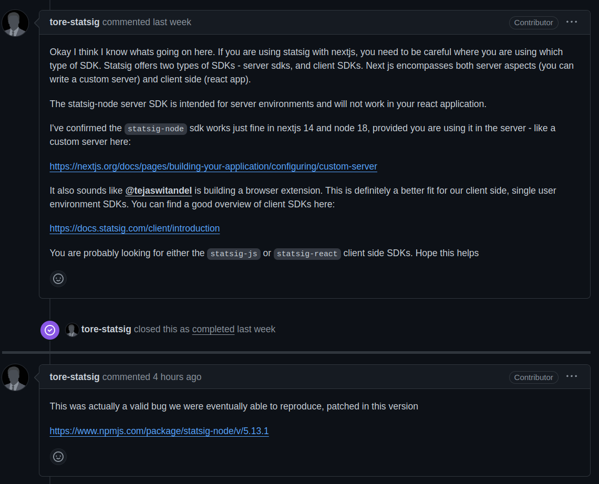

https://github.com/statsig-io/node-js-server-sdk/issues/38


```ts
Statsig.logEvent({ userID: data.userId }, data.name, data.value ?? null, data.metadata ?? null);
```


```ts
try {
    const response = await fetch('https://events.statsigapi.net/v1/log_event', {
        method: 'POST',
        body: JSON.stringify({
            events: [
                {
                    user: { userID: data.userId },
                    eventName: data.name,
                    time: new Date().getTime(),
                },
            ],
        }),
        headers: {
            'Content-Type': 'application/json',
            'statsig-api-key': process.env.STATSIG_SERVER_API_KEY!,
        },
    });
    if (response.ok) {
        console.log('--- Event - Response successful ---');
        console.log(response.status);
    }
} catch (e) {
    console.log(e);
    throw e;
}
```