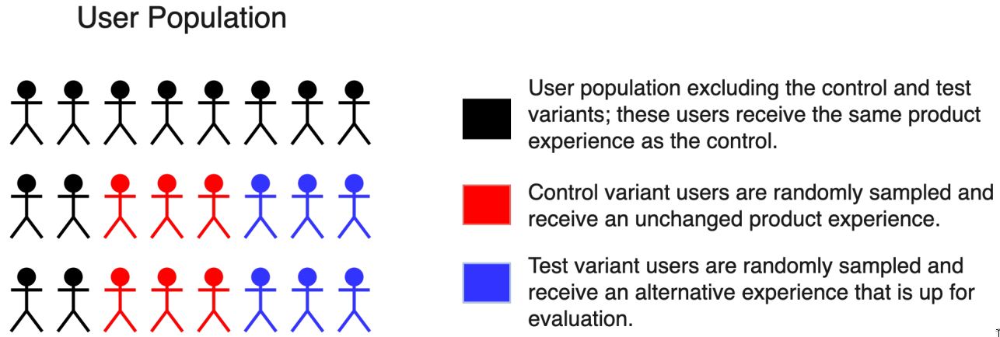
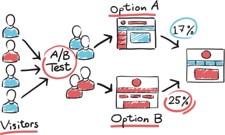
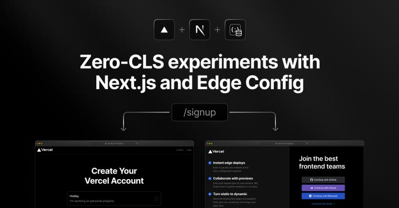
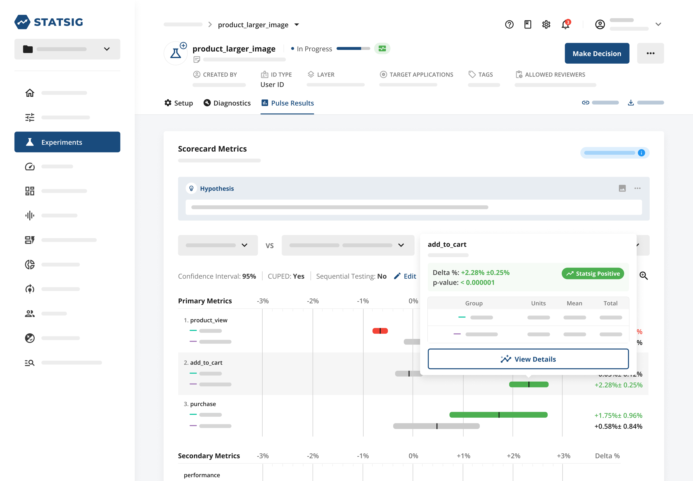
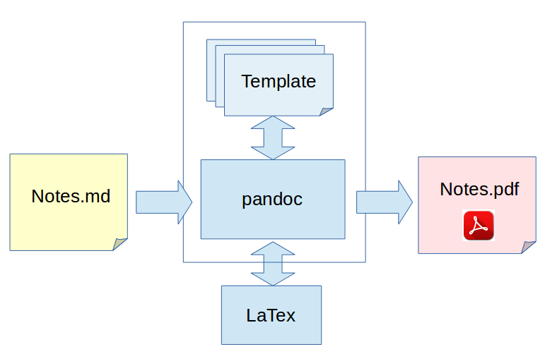
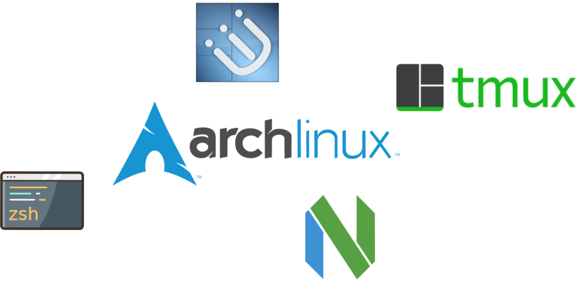

# Voorwoord

- Welkom & introductie
- Open voor vragen gedurende de presentatie

# Overzicht Presentatie

- Persoonlijke ontwikkelingen
- Professionele doelstellingen
- Uitgevoerde werkzaamheden
- Beknopt overzicht van het onderzoek, analyse en ontwerp

# Persoonlijke ontwikkelingen

- ***Groeien in A/B-testen***
- Verbeteren van technische vaardigheden
- Doorontwikkelen van communicatieve vaardigheden
- Development Environment

---

---

---

# Persoonlijke ontwikkelingen
- \checkmark{} Groeien in A/B-testen
- ***Verbeteren van technische vaardigheden***
- Doorontwikkelen van communicatieve vaardigheden
- Development Environment

---

---

---

# Persoonlijke ontwikkelingen
- \checkmark{} Groeien in A/B-testen
- \checkmark{} Verbeteren van technische vaardigheden
- ***Doorontwikkelen van communicatieve vaardigheden***
- Development Environment

---

Communicatie momenten met het team

  - Dailies, refinements
  - Overleg requirements

---

Verslaglegging & Automatisering

  - Markdown
  - Pandoc
  - LaTeX

---

---

# Persoonlijke ontwikkelingen
- \checkmark{} Groeien in A/B-testen
- \checkmark{} Verbeteren van technische vaardigheden
- \checkmark{} Doorontwikkelen van communicatieve vaardigheden
- ***Development Environment***

---

---

# Persoonlijke ontwikkelingen
- \checkmark{} Groeien in A/B-testen
- \checkmark{} Verbeteren van technische vaardigheden
- \checkmark{} Doorontwikkelen van communicatieve vaardigheden
- \checkmark{} Development Environment

---

# Professionele Doelstellingen

Bijdrage aan PLNTS

- Proof of concept voor A/B testingsysteem
- Analyse huidige systeem
- Ontwerp A/B test systeem

---

# Professionele Doelstellingen

Bijdrage aan PLNTS

- \checkmark{} Proof of concept voor A/B testingsysteem
- Analyse huidige systeem
- Ontwerp A/B test systeem

---

# Professionele Doelstellingen

Bijdrage aan PLNTS

- \checkmark{} Proof of concept voor A/B testingsysteem
- \checkmark{} Analyse huidige systeem
- Ontwerp A/B test systeem

---

# Professionele Doelstellingen

Bijdrage aan PLNTS

- \checkmark{} Proof of concept voor A/B testingsysteem
- \checkmark{} Analyse huidige systeem
- \checkmark{} Ontwerp A/B test systeem

---

# Uitgevoerde Werkzaamheden

- **A/B-testingsysteem**: 
  - Overleggen over de requirements
  - Enquete Metrics
  - Analyse A/B testen en het huidige systeem
  - Ontwerp A/B testen op de website

--- 

# Overige uitgevoerde werkzaamheden

- Migratie strapi v3 naar v4
- Redesign van de PLNTS website

---

# Onderzoeksmethoden

- Literatuuronderzoek
- Enquête
- Gesprekken met de experts

# Onderzoeksvraag

_Hoe kan PLNTS een intern A/B-testing systeem implementeren dat naadloos integreert met de bestaande infrastructuur?_

---

# Deelvragen

\scriptsize _Welke bestaande A/B-testing tools zijn beschikbaar en hoe vergelijken zij zich in termen van functies, prijsstelling en compatibiliteit met de PLNTS tech stack?_

_Welke data en metrics zijn relevant voor PLNTS om te verzamelen en analyseren tijdens A/B-tests?_

_Hoe kan de A/B-test data het best worden weergegeven voor effectieve interpretatie en besluitvorming door verschillende stakeholders zoals marketeers en ontwikkelaars?_

_Wat zijn de technische vereisten voor het integreren van een A/B-testplatform met PLNTS's bestaande infrastructuur, zodat de website prestaties minimaal beïnvloed worden?_

_Wat zijn de mogelijke cookie beleid implicaties bij het implementeren van externe A/B-testing tools?_

_Wat is er nodig bij de implementatie van A/B-testen zodat deze geen negatieve impact heeft op de SEO van de website?_

---

# Analyse
- Integratie bestaande infrastructuur
- Basisprincipes
- Hypotheses
- Metrics
- Data gedreven besluitvorming
- Data gedreven
- Geen negatieve impact

# Essentie van A/B testen
- Split-testen
- Bucket-testen
- Versies
- Willekeurige toewijzing
- Gebruikersgroepen

# Methodologie
- Experiment
- Hypothese opstellen
- Steekproeftechnieken
- Data-analyse

# Belang van A/B testen
- Wetenschap ipv gokken
- Risico management
- Innovatie
- Productontwikkeling
- Experimentele design

# Metrics
- Succesmetrics
- Guardrail-metrics
- Analyse
- Interpretatie
- Besluitvorming

# Evaluatie van een Experiment
- Continu proces
- Vraagstellingen
- Stappenplan
- Betrouwbaarheid

# Ontwerp

\noindent\colorbox{white}{%
  \parbox{\textwidth}{%
    \includegraphics[width=\textwidth]{./images/diagram.png}%
  }%
}

---

# Bestaande A/B-Testsystemen
- Functionaliteiten
- Prijsstelling
- Compatibiliteit

# Prestatieoptimalisatie
- Geen negatieve impact op SEO
- Geen negatieve impact op website performance

# Cookie beleid
- Cookie beleid lijkt in orde
- Voor de zekerheid na laten kijken door een juridisch expert

# Quick Code Overview

# Afronding
- Demo
- Q&A
