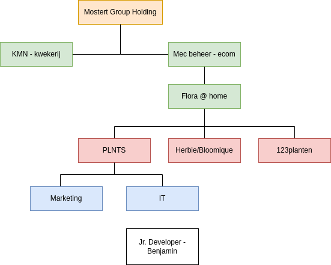
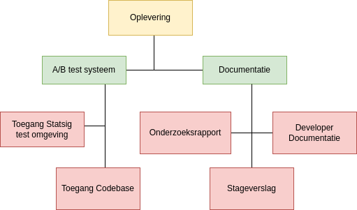

\begin{center}
\LARGE Stageverslag
\end{center}

{#fig:plnts-logo width=100%}

\newpage

\thispagestyle{empty}
\begin{center}
\LARGE Samenvatting \\

\large Achtergrond en Context \\
\end{center}

\normalsize
PLNTS is een dynamische e-commerce onderneming gespecialiseerd in planten en verzorgingsproducten. Met een groeiende complexiteit van de website is er een behoefte aan een data gestuurde aanpak om de gebruikers ervaring en conversie ratio te verbeteren. Er is momenteel geen geïntegreerd systeem voor A/B-testen om deze kansen te benutten.

Dit is mijn stageverslag in de periode van september 2023 tot februari 2024 bij PLNTS.com, waarbij de focus ligt op een proof of concept maken voor een intern A/B testingsysteem.
Om deze eerste integratie stap te maken moet er een grondige analyse plaats vinden over A/B testen en over hoe deze op de juiste manier toegepast wordt op de eisen van PLNTS, welke vervolgens is toegepast binnen het ontwerp. 
Dit heeft geleid tot een systeem dat geschikt is voor de bestaande infrastructuur van PLNTS en heeft een goede opzet gemaakt voor het verzamelen en analyseren van data binnen A/B testen.
Het onderzoek richtte zich op het schetsen van een duidelijk beeld bij A/B testen, het evalueren van bestaande A/B testtools, het bepalen van relevante data en metrics, en het vinden van de juiste manieren van integratie.
Dit systeem stelt PLNTS in staat om datagedreven beslissingen te nemen met als doel de gebruikerservaring te optimaliseren en de conversie te verhogen.

Het project heeft niet alleen PLNTS voorzien van een waardevol hulpmiddel, maar heeft ook bijgedragen aan mijn professionele groei op het gebied van A/B-testen en data-analyse.

\newpage
\begin{center}
\LARGE Versiebeheer
\end{center}

| Versie    | Datum    | Notitie    |
|---------------- | --------------- | --------------- |
| 0.1    | 2024-01-23    | Eerste concept versie    |
| 0.2    | 2024-01-27    | Verwerken feedback van Remco    |
| 0.3    | 2024-01-28    | Wijziginen inhoud    |
| 0.4    | 2024-01-29    | Verweken feedback van Jordi |
| 0.5   | 2024-01-29    | Gramatica en spelling's controle    |
| 1.0    | 2024-01-29    | Definitieve versie    |

\normalsize
\newpage
\tableofcontents
\newpage

# Inleiding {#sec:inleiding}
Dit stageverslag beschrijft mijn reis en ervaringen tijdens mijn stage bij PLNTS.com, een grote speler in de e-commerce van planten en verzorgingsproducten. Hieronder volgt een beknopte beschrijving van de hoofdstukken.

[Context](#sec:context)
: &nbsp;
: De context beschrijft het bedrijf PLNTS.com, de e-commerce omgeving, en de noodzaak voor innovatie binnen hun digitale aanbod. Het illustreert mijn positie binnen het bedrijf en de manier waarop mijn stageproject aansluit bij de bedrijfsdoelstellingen. \newline

[De Opdracht](#sec:opdracht)
: &nbsp;
: Dit deel gaat over de kern en de doelstellingen van mijn stageopdracht: de implementatie van een intern A/B testsysteem. \newline

[Resultaten](#sec:resultaten)
: &nbsp;
: Dit deel beschrijft de resultaten van mijn onderzoek en de proof of concept. Het bevat een overzicht van de oplossingen die ik heb ontwikkeld voor de toekomstige implementatie van het A/B-testingsysteem. \newline

[Reflectie](#sec:reflectie)
: &nbsp;
: In de reflectie geef ik mijn overwegingen weer over het leerproces, mijn professionele ontwikkeling gedurende de stage en de bijdrage van het project aan mijn carrière. 

\newpage
# Context {#sec:context}
## De organisatie
Naam stage organisatie: 
: PLNTS.com

Adres stage organisatie: 
: Tweede Tochtweg 98, Nieuwerkerk aan den IJssel

Sector: 
: E-commerce, Plant Retail

Stagebegeleider: 
: Jordi Heilbron | jordi@plnts.com 

Technisch begeleider:
: Remco van der Kleijn | remco@plnts.com

Website stage organisatie:
: <https://plnts.com/>

Stage docent: 
: Ron Arts | arts.r@hsleiden.nl 

### Rol als Stagiair
In mijn rol als stagiair bij PLNTS zal ik me richten op het onderzoeken, ontwerpen en implementeren van A/B-testen boven op het bestaand systeem. Hiermee beogen we de gebruikers ervaring te optimaliseren en de conversie te verhogen. Verder wordt er verwacht te werken aan het verbeteren van bestaande elementen. Ik rapporteer direct naar de bedrijfs begeleider, die ook de Product Owner en IT Manager is.

### Beschrijving van de Stage organisatie
PLNTS is één van de zusterbedrijven van de Kwekerij Mostert, een een dynamische e-commerce onderneming dat een breed assortiment aan planten en bijbehorende verzorgingsproducten aanbiedt. Het bedrijf beschrijft zich als dé go-to plek voor zowel beginnende als ervaren planten liefhebbers.

PLNTS streeft ernaar om het kweken en verzorgen van planten voor iedereen toegankelijk te maken. Ze willen een gemeenschap opbouwen waar planten liefhebbers kennis en ervaringen kunnen delen.

Met een familiegeschiedenis in de kwekerij sector die meer dan 150 jaar beslaat, combineert PLNTS vakmanschap met innovatie.

{#fig:organogram width=60%}

## Belanghebbenden

De belanghebbenden die te maken hebben met mijn opdracht zal voornamelijk binnen het IT-team blijven, waarbij Jordi de voornaamste schakel is tussen de ontwikkelaars en Marketing. Wel is de input en dus het belang van het Marketing team belangrijk om zo een beter beeld te krijgen over wat voor soorten A/B testen ze voornamelijk willen gebruiken. In [@fig:organogram] is te zien wat mijn positie is binnen de organisatie.

Jordi
: Als Product Owner en IT Manager is hij het meest geïnvesteerd in het slagen van dit A/B-testproject.

Remco
: Web Developer, werkt aan algemene web ontwikkeling en kan input leveren voor het test systeem.

Jogchum
: Frontend Specialist, heeft belang bij hoe de A/B-tests de gebruikersinterface zullen beïnvloeden en kan input leveren.

Marketing Team
: Heeft belang bij het verbeteren van de conversie ratio en de gebruikerservaring.

## Achtergrond en aanleiding van de opdracht
Met een steeds complexere website en door constante nieuwe eisen, is de noodzaak ontstaan voor gestroomlijnde, data gestuurde beslissingen om de gebruikers ervaring te verbeteren en om conversie te verhogen.

PLNTS heeft al een solide digitale infrastructuur. De organisatie maakt gebruik van een scala aan moderne technologieën om de website en aanverwante diensten draaiende te houden. Enkele kern onderdelen van de huidige tech stack zijn:

Versiebeheer:
: Git

CI/CD:
: GitLab, Vercel

Front-End:
: React, Next.js met TailwindCSS

CMS:
: Strapi

Query Language: 
: GraphQL

Back-End:
: Magento

Er is geen geïntegreerd systeem om website elementen te testen op hun effectiviteit, wat resulteert in gemiste kansen om de klant ervaring te optimaliseren. A/B-testen wordt gezien als een mogelijke oplossing om dit gat te dichten. Door verschillende versies van de website aan diverse gebruikersgroepen te tonen, kunnen we data verzamelen en analyseren. Dit helpt ons om een beter inzicht te krijgen in de effectiviteit van diverse elementen met betrekking tot conversie en om de betrokkenheid te stimuleren.

\newpage
# De Opdracht {#sec:opdracht}
In dit hoofdstuk zal ik de opdracht beschrijven en de doelstellingen van het project. Verder zal ik de deelopdrachten bespreken die nodig zijn om de doelstellingen te bereiken.

## Doel 
_Hoe kan PLNTS een intern A/B testing systeem implementeren dat naadloos integreert met de bestaande infrastructuur?_

PLNTS moet voorzien worden van een robuust en schaalbaar A/B-testing systeem dat werkt met hun huidige technologie stack. Het idee is niet simpelweg het toevoegen van een nieuwe feature; het is eerder realiseren van een cultuur van data gedreven besluitvorming binnen de organisatie.
Er dient een opzet gemaakt te worden voor het verrijken van het bestaande systeem welke PLNTS in staat stelt om data gedreven besluiten te kunnen vormen. Dit om sneller en effectiever te kunnen innoveren, wat uiteindelijk leidt tot een hogere conversie ratio en een verbeterde klanttevredenheid.

Dit doel kan worden gerealiseerd door onderzoek te doen naar bestaande A/B-testing tools en het ontwikkelen van een op maat gemaakt systeem dat voldoet aan de behoeften van PLNTS. Het systeem moet in staat zijn om de volgende taken uit te voeren:

- Het opzetten van A/B-testen voor verschillende elementen van de website.
- Het verzamelen van data en het uitvoeren van statistische analyses.
- Het visualiseren van de resultaten in een dashboard.

Dit doel kan bereikt worden door het uitwerken van de deelopdrachten. 

## Deelopdrachten
Het project bestaat uit een aantal deelopdrachten die nodig zijn om het doel te bereiken. Deze deelopdrachten zijn:

### Onderzoek naar bestaande A/B Testing Tools
_Welke bestaande A/B-testing tools zijn beschikbaar en hoe vergelijken zij zich in termen van functies, prijsstelling en compatibiliteit met de PLNTS tech stack?_

Er dient een vergelijking gemaakt te woorden van bestaande tools voor het A/B-testen om te zien welke eigenschappen het beste passen bij de behoeftes en de huidige tech stack van PLNTS.

### Onderzoek naar Data-analyse en Rapportage
_Welke data en metrics zijn relevant voor PLNTS om te verzamelen en analyseren tijdens A/B-tests?_

Er dient onderzoek gedaan te worden naar de verschillende soorten data die verzameld kunnen worden tijdens A/B-testen en hoe deze data geanalyseerd kan worden. 

_Hoe kan de A/B-test data het best worden weergegeven voor effectieve interpretatie en besluitvorming door verschillende stakeholders zoals marketeers en ontwikkelaars?_

Er moet onderzocht worden hoe de data gevisualiseerd kan worden, en het is belangrijk om een helder overzicht te maken van de definities en werkingen binnen dit visualisatiesysteem.

### Onderzoek naar de correcte integratie met de huidige systemen
_Wat zijn de technische vereisten voor het integreren van een A/B-testplatform met PLNTS's bestaande infrastructuur, zodat de website prestaties minimaal beïnvloed worden?_

Er dient onderzocht te worden hoe het A/B-test platform geïntegreerd kan worden met de bestaande infrastructuur van PLNTS. Hierbij moet rekening gehouden worden met de technische vereisten en de impact op de website prestaties.

_Wat zijn de mogelijke cookie beleid implicaties bij het implementeren van externe A/B-testing tools?_

Er moet rekening gehouden worden met de mogelijke implicaties op het gebied van cookie beleid.

_Wat is er nodig bij de implementatie van A/B-testen zodat deze geen negatieve impact heeft op de SEO van de website?_

Er moet onderzocht worden met de mogelijke implicaties op het gebied van SEO en cookie beleid.

## Oplevering  {#sec:oplevering}
De oplevering van dit project zal bestaan uit een aantal producten. 
Deze producten zullen per mail worden opgeleverd aan de belanghebbende van de organisatie, ten minste voor de eind datum van het stage contract.

### Product beschrijving
Toegang Statsig Testomgeving
: &nbsp;
: De toegang zal verleend worden van het statsig test systeem.

Stageverslag:
: &nbsp;
: Het stageverslag is dit document.

Onderzoeksrapport
: &nbsp;
: Dit rapport bevat de uitgebreide analyse over A/B testen en maakt een opzet voor het ontwerp van het systemen. Het licht de compatibiliteit van verschillende platformen met onze technologische stack toe en biedt inzicht in de functionele mogelijkheden en technische vereisten voor een succesvolle implementatie bij PLNTS."

Developer Documentatie
: &nbsp;
: De Developer Documentatie is aan de codebase toegevoegd en beschrijft de werking van het systeem in meer detail.

Toegang Codebase
: &nbsp;
: Toegang tot deze codebase zal verleend worden aan de belanghebbende van de organisatie.

### Product Breakdown Structure

{#fig:pbs width=60%}

## Aanpak
Ik heb gebruik gemaakt van de volgende onderzoeksmethoden: 

Literatuuronderzoek en Marktanalyse
: &nbsp;
: Verzamelen van gegevens over bestaande A/B-test tools, met inbegrip van hun functionaliteiten, gebruiksgemak en prijsstelling.

Expert Interviews
: &nbsp;
: Advies en meningen verzamelen van interne ontwikkelaars die ervaring hebben met A/B-testing en bestaande platforms.

Enquête
: &nbsp;
: Het ontwikkelen en uitvoeren van vragenlijsten voor de marketing- en technische teams, gericht op het identificeren van hun specifieke behoeften en verwachtingen van het A/B-testplatform.

Technische Analyse
: &nbsp;
: Diepgaande evaluatie van de technische vereisten voor het integreren van het A/B-test platform met de bestaande infrastructuur van PLNTS.

## Scope
Voor de scopebepaling zijn er een aantal belangrijke punten die in acht genomen moeten worden.

1. Dit project zal zich niet bezighouden met het optimaliseren van backend-systemen; het is puur gefocust op de gebruikerservaring aan de frontend.

1. Machine learning technieken voor het analyseren van gebruikers gedrag vallen buiten de scope van dit project.

1. Het opgeleverde systeem is een proof of concept en zal (nog) niet in productie worden genomen.

1. A/B-testen is een breed fenomeen en zal binnen dit project in de context van web development worden behandeld.

\newpage
# Resultaten {#sec:resultaten}
De implementatie van een intern A/B-testingsysteem dat goed integreert met de huidige technische infrastructuur van PLNTS is met succes voltooid. De resultaten van dit systeem zijn niet alleen toepasbaar op PLNTS, maar ook op andere organisaties met vergelijkbare technologische infrastructuren.
De uitwerking van het onderzoek en de resultaten van de stageopdracht zijn terug te vinden in het onderzoek document. 

## Beroepsproducten & Taken
Tijdens mijn stage bij PLNTS heb ik een aantal taken uitgevoerd die essentieel waren voor de succesvolle oplevering van de proof of concept.

### Software Analyse
Ik heb een diepgaande markt- en literatuuranalyse uitgevoerd om de optimale A/B-testing tools en methodiek voor PLNTS te identificeren.

Onderzoek
: &nbsp;
: Ik heb onderzoek verricht naar diverse aspecten van de A/B-testing, waaronder vereisten, ontwikkelprocessen, omgevingen en frameworks. Dit heeft geresulteerd in een grondig inzicht in hoe A/B-tests het beste geïntegreerd kunnen worden binnen PLNTS.

Methoden en Technieken
: &nbsp;
: De gebruikte methoden en technieken zijn zorgvuldig geëvalueerd en onderbouwd door middel van uitgebreid literatuuronderzoek, waarbij de nadruk lag op het identificeren van de meest effectieve praktijken binnen de industrie.

Requirements Opstellen
: &nbsp;
: Ik heb een gedetailleerde lijst met requirements opgesteld, inclusief de implicaties voor de bestaande systemen of componenten van PLNTS. Dit heeft de basis gevormd voor de ontwikkeling van het A/B-testingsysteem.

Acceptatiecriteria
: &nbsp;
: Functionele en technische acceptatiecriteria zijn methodisch in kaart gebracht.

Integratie en Migratie
: &nbsp;
: De integratie met de bestaande omgeving van PLNTS is uitvoerig geanalyseerd, waardoor het A/B-testingsysteem goed zal aansluiten bij de huidige architectuur.

### Software Ontwerp
Het technische ontwerp voor het A/B-testingsysteem is uitgewerkt, waarbij ik een logische opbouw in het ontwerpproces heb gevolgd en verschillende alternatieven heb overwogen.

Ontwerpverantwoording
: &nbsp;
: Mijn ontwerp is gebaseerd op grondige analyse, bestaande richtlijnen en specificaties, en ik heb rekening gehouden met de eisen van de stakeholders.

Kritische Ontwerphouding
: &nbsp;
: Ik heb actief feedback gezocht, deze verwerkt in mijn ontwerpen en hierop gereflecteerd, wat heeft bijgedragen aan een systeem dat voldoet aan de eisen van PLNTS.

Teststrategie
: &nbsp;
: Er zijn testen opgesteld voor de kritieke systeemcomponenten, wat de kwaliteit van het eindproduct heeft verzekerd.

Proof of Concept
: &nbsp;
: Het systeem is opgelverd als een proof of concept, wat de basis vormt voor een toekomstige implementatie. 

Architectuur 
: &nbsp;
: In het onderzoek wordt een gedetailleerde architectuur beschreven, en mijn keuzes worden beargumenteerd. 

## Oplossingen
De oplossingen die ik heb ontwikkeld zijn gebaseerd op de resultaten van mijn onderzoek en de eisen van de stakeholders. Ik heb een proof of concept opgeleverd dat voldoet aan de functionele en technische eisen van PLNTS.

## Aanbevelingen
Ik heb een aantal aanbevelingen gedaan voor de toekomstige implementatie van het A/B-testingsysteem. Deze aanbevelingen zijn gebaseerd op mijn onderzoek en de resultaten van de proof of concept.

## Gebruikscondities
Het A/B-testingsysteem is ontworpen om te werken met de bestaande technische infrastructuur van PLNTS. Het is ontwikkeld in TypeScript met de volgende technologieën:

- React
- Next.js
- TailwindCSS
- Statsig

De volledige lijst met versies is te vinden in de package.json van de codebase.

## Overdracht
De overdracht van het A/B-testingsysteem zal gedaan worden door het aanleveren van de producten beschreven in [@sec:oplevering] [Oplevering](#sec:oplevering). Verder zal er een presentatie plaatsvinden die het systeem demonstreert. De presentatie zal de belangrijkste bevindingen van het onderzoek en de resultaten van de proof of concept samenvatten. De demo zal de functionaliteit van het systeem demonstreren en de technische aspecten toelichten.

Het A/B test systeem zal worden overgedragen aan de organisatie, en deze zal komend jaar worden opgenomen in de codebase van PLNTS.

\newpage
# Reflectie {#sec:reflectie}
In dit hoofdstuk kijk ik terug op mijn stageperiode en reflecteer ik op het leerproces en de behaalde resultaten van mijn opdracht.
Ik zal mijn aanpak en planning, de behaalde persoonlijke en professionele doelstellingen, en de uitdagingen en risico's die ik ben tegengekomen bespreken.
Ook deel ik mijn ervaringen over de opgedane kennis, de ontwikkelde vaardigheden en de beroepstaken die ik heb uitgevoerd.
Tot slot zal ik ingaan op de begeleiding en ondersteuning die ik vanuit de organisatie heb ontvangen tijdens deze leerzame periode.

## Aanpak, planning en resultaat
Terugkijken op mijn manier van aanpak ben ik in het algemeen tevreden met hoe ik de taken heb uitgevoerd. 
Wat ik wel heb opgemerkt is dat het erg lastig is een correct plan te maken waarbij veel variabelen vooraf onzeker en onduidelijk zijn.
Ik ga in de toekomst deze onzekerheden eerder proberen te identificeren om ze vervolgens eerder te verwerken in een oplossing mogelijkheid of ze te benoemen n het project plan.

Betreffend het reflecteren over de planning, merkte ik op dat ik eerder had moeten beginnen aan het schrijven van het einddocumenten. Alhoewel de planning soepel verliep vond ik dat ik deze erg breed heb getrokken. Dit heeft ervoor gezorgd dat ik erg flexibel kon zijn met mijn tijdsindeling, echter verloor ik hierdoor soms het overzicht over wanneer ik welke taken wou afronden. Ik heb mijn taken goed bijgehouden met een levend TODO document maar hier zat geen directe tijdschema aan vast waardoor ik soms teveel tijd heb besteed aan kleine details.
Al met al ben ik tevreden met de resultaten en de manier waarop ik mijn taken heb uitgevoerd.

Ik ben erg tevreden met de resultaten van mijn onderzoek en de proof of concept. Ik heb een aantal uitdagingen overwonnen en ik heb veel geleerd over A/B-testen en data-analyse. 
Wat ik wel minder fijn vond is dat mijn oplevering niet 1 op 1 aansluit bij mijn vermelding in de planning.
Zoals mijn vermelding van de gebruikers documentatie. Dit document heb ik laten vervallen omdat dit een analyse en een proof of concept is.
De noodzaak voor de gebruikers documentatie is er niet, dit omdat het systeem nog niet in productie is opgenomen.

## Persoonlijke Leerdoelen
Ik heb veel geleerd over A/B-testen en data-analyse, maar ik heb ook een aantal onverwachte persoonlijke ontwikkelingen doorgemaakt.

### Documentatie & Pandoc {#sec:documentatie}
Gedurende dit project heb ik een onverwachte maar waardevolle persoonlijke ontwikkeling doorgemaakt op het gebied van documentatie. Ik heb lang geworsteld met diverse programma's en documentatiestijlen. Ik merkte dat ik steeds vaker in Markdown begon te schrijven, wat me leidde naar Pandoc en LaTeX, technologieën die nieuw voor me waren.
Deze tools hebben me in staat gesteld om mijn documentatie te automatiseren en aan te passen naar mijn voorkeur door inzicht te krijgen in de configuratiebestanden.
Dit verslag is dan ook volledig geschreven in Markdown en omgezet naar een PDF met behulp van Pandoc. 
Deze ervaring heeft mijn vaardigheden in technische documentatie aanzienlijk verbeterd, een onverwachte maar zeer welkome ontwikkeling in mijn leerproces.

### Logica
In het project plan schreef ik over mijn kennis te bevorderen omtrent formele logica en deze te gebruiken in het A/B test project. Dit bleek uitdagender dan ik aanvankelijk had verwacht. Hoewel ik begon met een sterke interesse en de intentie om me erin te verdiepen, werd het al snel duidelijk dat mijn huidige kennisbasis en de projecttijdlijn het moeilijk maakten om diepgaande vooruitgang te boeken. Het vereiste niveau van logisch redeneren en de complexiteit van de concepten, vooral in relatie tot statistieken en data-analyse, waren uitgebreider dan ik had ingeschat. Dit leidde ertoe dat ik me meer moest concentreren op de directe projectdoelen, waardoor mijn verkenning van logica op een lager pitje kwam te staan. Deze ervaring heeft echter mijn besef vergroot van het belang van een sterke wiskundige en logische basis voor geavanceerde data-analyse, en heeft mij gemotiveerd om deze gebieden in de toekomst verder te verkennen.

### A/B Testing
Wat betreft mijn A/B-testervaring, heb ik veel geleerd over het opzetten van effectieve tests en het identificeren van relevante metrics voor PLNTS. Deze kennis heeft mijn strategisch denkvermogen versterkt, vooral op het gebied van testontwerp en data-analyse.

### Communicatie
Op het vlak van communicatie heb ik stappen gezet, maar er is ruimte voor verbetering. Mijn interacties waren succesvol, maar ik realiseer me dat ik buiten de "standaard" communicatie momenten actiever kan zijn in het initiëren van dialogen en het leiden van discussies. 

## Zakelijke Doelstellingen
Het doel van dit project was om PLNTS te voorzien van een eerste opzet voor een A/B testsysteem dat werkt met hun huidige technologie stack.
Dit doel is bereikt door het uitvoeren van een grondige analyse en het ontwikkelen van een proof of concept dat voldoet aan de functionele en technische eisen van PLNTS.

## Risico's
Tijdens mijn stage bij PLNTS heb ik een aantal risico's geïdentificeerd die potentieel de voortgang en effectiviteit van het A/B-testproject zouden kunnen beïnvloeden. Ik heb geleerd om niet alleen proactief te zijn in het identificeren van deze risico's, maar ook om flexibel en adaptief te zijn wanneer onverwachte problemen zich voordoen.

Het onderzoeken van de juiste manier van implementatie bleek een uitdaging, wegens de nadruk op performance was het vinden van een juiste oplossing mogelijkheid beperkt.
Voor A/B testen systemen zijn er genoeg oplossingen, maar het plaatje omtrent routing, middleware en het pre builden van pagina is een complex systeem en ik ben blij dat ik tot een oplossing ben gekomen waarover ik tevreden ben.

Een uitdaging die ik niet volledig had voorzien, was de complexiteit met betrekking tot de interpretatie van de data. Hier komt veel wiskunde, logica en data science bij kijken wat ervoor zorgde dat de optie om zelf een A/B testsyteem te ontwikkelen snel af viel.
Ik wil in de toekomst meer tijd besteden aan het onderzoeken van de wiskundige en logische concepten die nodig zijn voor een diepgaande analyse van de data en statistieken.

Verder heb ik zelf geen langdurige A/B testen kunnen uitvoeren. Dit omdat de periode van dit project daarvoor te beperkt is, en omdat dit een proof of concept is waarbij ik het systeem dus niet kon testen met een groep van gebruikers.
Wel heb ik gekeken naar manieren om gebruikersgroepen te simuleren, maar dit bleek geen eenvoudige klus en heb ik dus buiten de scope gelaten.

Een onvoorziene uitdaging was de impact van een technische fout binnen de A/B-testsoftware, hierover is in de laatste paragraaf van [@sec:beroepstaken] [Beroepstaken](#sec:beroepstaken) meer te lezen.

Verder was er nog een uitdaging met het vinden van geschikte voorbeelden voor de documentatie specifiek tot de implementatie van A/B testen en de Next.js App router. Dit is een nieuwe manier van werken en zelfs bij de oudere Pages router van Next.js waren de voorbeelden beperkt. Ik vermoed omdat veel organisaties die in aanmerking komen voor A/B testen vaak zoeken naar een systeem dat specifiek past bij hun eigen omgeving, en hun code niet publiekelijk beschikbaar maken.

## De opgedane kennis en vaardigheden
Om een beter beeld te krijgen bij mijn leerervaringen tijdens dit stage traject zal ik de context uitleggen van mijn huidige ontwikkel omgeving.
Naast mijn opgedane kennis uit dit traject ben ik mij gaan verdiepen naar in een nieuwe omgeving geïnspireerd door onder anderen het boek https://themouseless.dev/, waarin een omgeving wordt gebouwd welke met tools zoals Arch Linux, Zsh, i3, tmux, neovim, een dotfiles repository, en heb veel extra kennis opgedaan over scripting. Veel van het automatiserings en configuratie proces heeft direct bijgedragen in mijn ontwikkeling als informaticus.
Alhoewel dit niet direct gerelateerd is aan mijn stage opdracht, had dit wel directe impact op mijn werkwijze, en inzicht wat vervolgens wel heeft bijgedragen aan mijn professionele ontwikkeling.
Ik verwijs u naar mijn dotfiles[^dotfiles] repository voor een overzicht van mijn huidige ontwikkel omgeving. 

[^dotfiles]: Dotfiles repository: https://github.com/benjaminshawki/dotfiles

Zoals in[@sec:documentatie] [Documentatie & Pandoc](#sec:documentatie) beschreven heb ik veel geleerd over het automatiseren van documentatie en het gebruik van Pandoc en LaTeX. Dit heeft mijn vaardigheden in technische documentatie aanzienlijk verbeterd, een onverwachte maar zeer welkome ontwikkeling in mijn leerproces.

Dan reflecterend op mijn opgedane kennis en vaardigheden tijdens dit stage traject, heb ik veel geleerd over het opzetten van effectieve A/B testen en het identificeren van relevante metrics en de theorie voor A/B testen.

## Uitgevoerde beroepstaken {#sec:beroepstaken}
Tijdens het project heb op verschillende momenten met de developers gesprekken gevoerd over de eisen van het A/B test systeem.
We hebben samen gebrainstormd over de verschillende mogelijkheden en de technische implicaties van het systeem.

Gaandeweg hebben we besproken wat de optimalisaties zijn voor de huidige infrastructuur en hoe we het systeem het beste kunnen integreren.

Verder heb ik de verschillende onderdelen van de website onderzocht om zo tot een uitgebreid document te komen dat de verschillende processen uiteenzet, en aangeeft hoe A/B testen voor dit proces relevant zijn en welke metrics hier bij komen kijken. Dit document is te vinden in de bijlagen van het onderzoek en staat ook op de wiki van PLNTS.

Naast de taken die ik heb uitgevoerd voor de oplevering van het A/B-testingsysteem, heb ik ook een aantal andere taken uitgevoerd voor PLNTS, zo ben ik bezig geweest met de voorbereiding voor een nieuw design en de afronding van de migratie van Strapi V3 naar V4.

Ik vond het leuk om te zien dat mijn werk werd gewaardeerd en dat ik een positieve bijdrage kan leveren aan de organisatie. Ik heb veel geleerd over de werking van van het A/B test systeem en de uitdagingen die daarbij komen kijken. Ik heb ook een beter begrip gekregen van de rol van een ontwikkelaar binnen een commerciële organisatie.

Ook was er nog een bizarre situatie bij het registreren van events richting statsig. De dag dat ik deze werkend wou krijgen bleek dit niet naar behoren te werken, er was een bug in de statsig-node[^bug-statsig] package waardoor ik dit niet werkend kon krijgen. Op de volgende dag was dit toevallig gefikst in een nieuwe versie en kon ik verder gaan met het project.

[^bug-statsig]: Statsig-node issue: https://github.com/statsig-io/node-js-server-sdk/issues/38

## Begeleiding en ondersteuning van de organisatie
Ik ben zeer tevreden over de begeleiding die ik heb gekregen van de organisatie.
De ruimte die ik kreeg voor het ontwikkelen en implementeren van mijn eigen ideeën was enorm stimulerend. Ook kon rekenen op solide ondersteuning wanneer ik dit nodig had en de brainstormsessies waren bijzonder leerzaam, waarbij de expertise en ervaring van collega's mij verrijkte. Deze interacties boden waardevolle inzichten in hun aanpak en methodologie, waarvoor ik erg dankbaar ben. De geleerde lessen van deze ervaringen neem ik mee in mijn verdere professionele ontwikkeling.

## Begeleiding en ondersteuning van de opleiding
Over de begeleiding en ondersteuning vanuit de opleiden ben ik in het algemeen tevreden.
Alhoewel dit minimaal was, heb ik wel de nodige ondersteuning gekregen wanneer ik daarom vroeg.
Verder vond ik het intervisiemoment met de andere studenten erg fijn, omdat dit mij een beter beeld gaf over de voortgang en oplevering. 
Ik had wel behoefte aan een samenkomst moment met de mede studenten aan het begin van het traject, om zo een beter beeld te krijgen over de verwachtingen omtrent de oplevering en de stappen die ik moest ondernemen om dit te bereiken. Het intervisiemoment was hier erg fijn voor maar ik denk dat ik deze ook graag aan het begin had gezien.

Verder was ik ook aanwezig op de stage markt en heb ik daar een aantal interessante gesprekken gevoerd met andere studenten en bedrijven. Dit was een leuke ervaring en ik ben blij dat ik hieraan heb deelgenomen.

\newpage
# Nabeschouwing
Ik wil graag mijn oprechte dank uitspreken aan iedereen bij PLNTS die mij tijdens mijn stage heeft ondersteund. De begeleiding en kennisoverdracht van mijn collega's waren van onschatbare waarde voor mijn professionele ontwikkeling. Deze ervaringen zal ik koesteren en meenemen in mijn verdere carrière.

Terugkijkend op een zeer leerzame en productieve stage, ben ik trots op de behaalde resultaten, vooral op het gebied van A/B-testen en systeemoptimalisatie.

Ik ben dankbaar voor de geboden kansen en zie met veel enthousiasme uit naar de toekomst.

Tot slot wil ik u, als lezer, bedanken voor uw interesse in mijn stageverslag en onderzoek.

