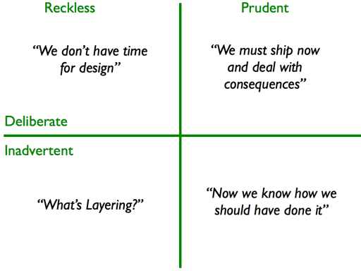

Technical debt

code debt / design debt

The result of prioritizing speedy delivery over perfect code

Technical debt is bewust, niet onbewust.

"A mess is not technical debt" - Uncle Bob

Alles kost geld

<h2>Soorten Technical debt</h2>

-Architecture debt

-build debt

-code debt

-design debt

-documentation debt

-infrastructure debt

-process debt

-test debt

Behaviour driven development
ADR Architecture driven 

