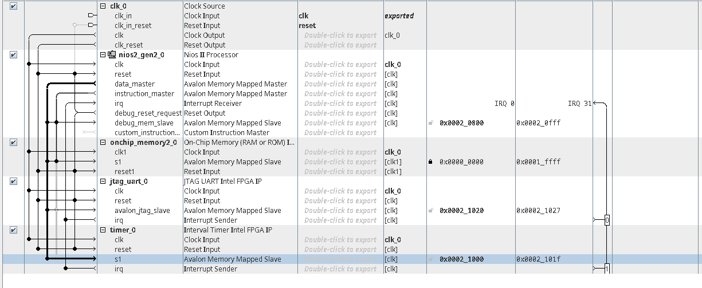

# Summary: Introduction to Platform Designer

## Platform Designer Overview
Platform Designer is a tool used to create systems for FPGA boards, like Intel DE-series boards, by combining pre-made or custom components. These systems typically include processors, memory interfaces, I/O ports, and other hardware. It generates Verilog or VHDL code for the system's components and interconnects, enabling synthesis and implementation on an FPGA.

## Example System
An example system is depicted in Figure 1, featuring:
- Nios II processor
- On-chip memory
- SDRAM
- Interfaces such as sliders, LEDs, and 7-segment displays

Components communicate via the **Avalon Interconnect**, enabling data exchange between hardware modules.

## Platform Designer Components
A Platform Designer component includes:
1. **Internal Modules:** Implements functionality.
2. **Avalon Interfaces:** Facilitates communication.

### Avalon Interface Types
1. **Avalon Clock Interface** - Drives or receives clocks.
2. **Avalon Reset Interface** - Provides reset capabilities.
3. **Avalon Memory-Mapped Interface (Avalon-MM)** - Address-based read/write for master-slave connections.
4. **Avalon Streaming Interface (Avalon-ST)** - Supports unidirectional data flow.
5. **Avalon Conduit Interface** - Connects signals not fitting other interface types, useful for external connections.

Components can use multiple interfaces, but all must include Clock and Reset Interfaces.

## Tutorial Scope
The tutorial demonstrates how to develop a Platform Designer component with:
- **Avalon-MM Interface**: For memory-mapped read/write operations.
- **Avalon Conduit Interface**: For external connections like LEDs or displays.

### Example Component
The example component is a **32-bit register**:
- Acts as a memory-mapped slave device.
- Connects externally via a conduit signal.
- Displays its contents on external components (e.g., LEDs or 7-segment displays).
- Resembles output parallel ports from the example system.


# Initieel gegeven code
```vhdl
-- altera vhdl_input_version vhdl_2008
library IEEE;
use IEEE.std_logic_1164.all;

entity reg32_avalon_interface is
	port (
		clock, resetn : in std_logic;
		read, write, chipselect : in std_logic;
		readdata : out std_logic_vector(31 downto 0);
		writedata : in std_logic_vector(31 downto 0);
		byteenable : in std_logic_vector(3 downto 0);
		Q_export : out std_logic_vector(31 downto 0)
	);
end reg32_avalon_interface;

architecture rtl of reg32_avalon_interface is
	type registers is array (0 to 0) of std_logic_vector(31 downto 0);
	signal regs: registers;
begin
	process(clock, resetn)
	begin
		if not resetn then
			for i in 0 to 0 loop
				regs(i) <= (others => '0');
			end loop;
		elsif rising_edge(clock) then
			if chipselect then
				if read then
					readdata <= regs(0);
				elsif write then
					if byteenable(0) then
						regs(0)(7 downto 0) <= writedata(7 downto 0);
					end if;
					if byteenable(1) then
						regs(0)(15 downto 8) <= writedata(15 downto 8);
					end if;
					if byteenable(2) then
						regs(0)(23 downto 16) <= writedata(23 downto 16);
					end if;
					if byteenable(3) then
						regs(0)(31 downto 24) <= writedata(31 downto 24);
					end if;
				end if;
			end if;
		end if;
	end process;
	Q_export <= regs(0);
end architecture rtl;
```


