# Installatiehandleiding 

Op deze pagina vind je een beknopte handleiding om de voor HWP01 benodigde software te installeren op je eigen pc.

De volgende software moet geïnstalleerd worden.

- Quartus Prime Lite Edition **versie 18.1**.
- ModelSim - Intel FPGA Edition **versies 18.1**.
- Intel University Program Design Suite.

## Quartus Prime Lite Edition
Deze *Integrated Development Environment* (IDE) ga je gebruiken hardware te configureren op de FPGA van het DE1-SoC board.
Je kunt deze IDE gebruiken onder Windows en Linux.
Deze handleiding beschrijft hoe je Quartus installeert op Windows.

1. Download de installatiebestanden *cyclonev-18.1.0.625.qdz* en *QuartusLiteSetup-18.1.0.625-windows.exe* vanuit de map *Lesmateriaal* van het MS-Team voor HWP01.

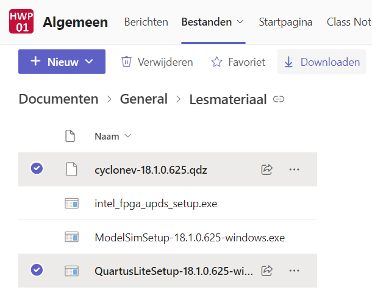

2. Als je deze bestanden selecteert en op Downloaden klikt, dan worden deze bestanden ingepakt in een zip-file en gedownload. Pak de zip-file uit in een willekeurige directory.

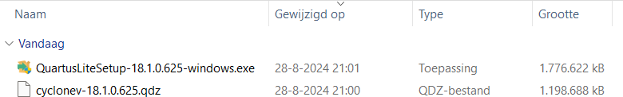

3. Voer het bestand *QuartusLiteSetup-18.1.0.625-windows.exe* uit.

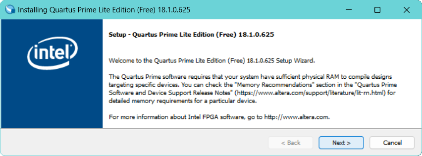

4. Klik op *Next*.

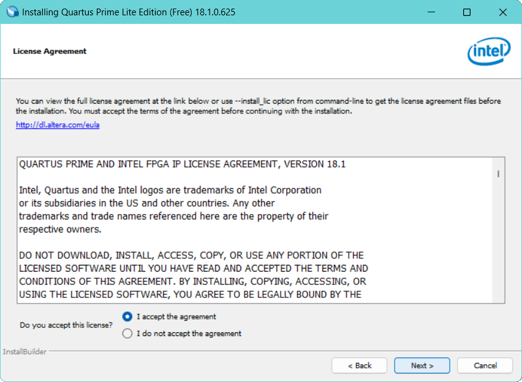

5. Accepteer de licentieovereenkomst en klik op *Next*.

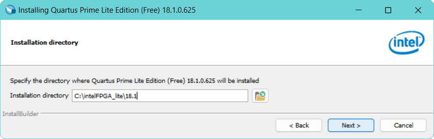

6. Accepteer het voorgestelde installatiedirectory door op *Next* te klikken.
   Wij adviseren je om het default gekozen directory te gebruiken.
   Let er, als je zelf een installatiedirectory opgeeft, op dat er **geen spaties** in de padnaam mogen voorkomen!

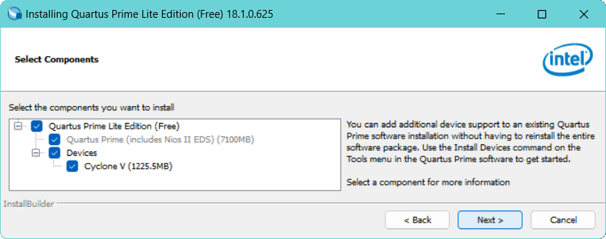

7. Klik op *Next*.

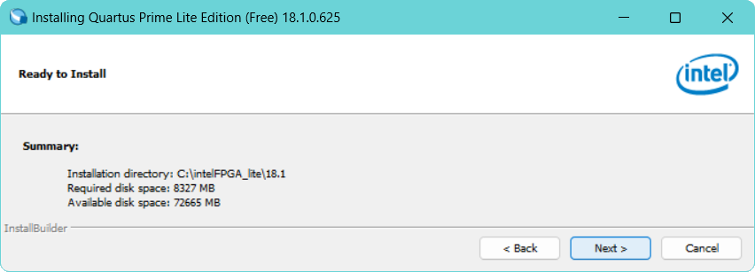

8. Klik op *Next*. Tijd voor koffie!

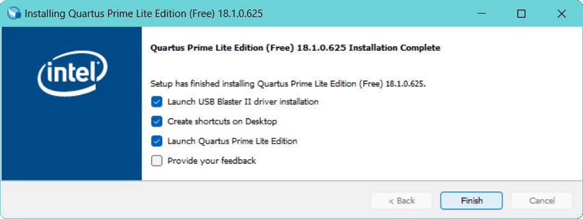

9. Klik op *Finish* om de installatie af te ronden. De USB-Blaster driver wordt nu geïnstalleerd.

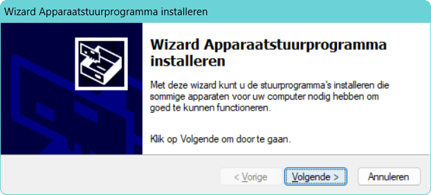

10. Klik op *Volgende*.

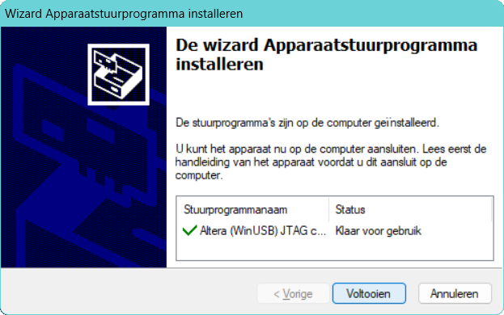

11. Klik op Voltooien.

Als Quartus correct opstart, dan kun je het programma afsluiten. Vraag bij installatieproblemen om hulp van je docent.

## ModelSim - Intel FPGA Edition

Deze *Simulatie tool* ga je gebruiken om de VHDL-code, waarmee je de hardware op de FPGA van het DE1-SoC board gaat configureren, te ontwikkelen en te testen.

1. Download het installatiebestand *ModelSimSetup-18.1.0.625-windows.exe* vanuit de map *Lesmateriaal* van het MS-Team voor HWP01.

2. Voer het bestand *ModelSimSetup-18.1.0.625-windows.exe* uit.

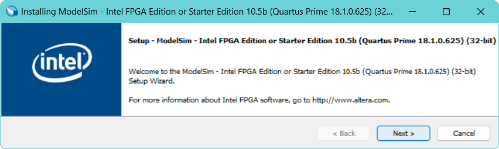

3. Klik op *Next*.

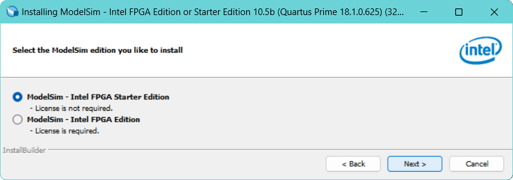

4. Selecteer *ModelSim - Intel FPGA Starter Edition* en klik op *Next*.

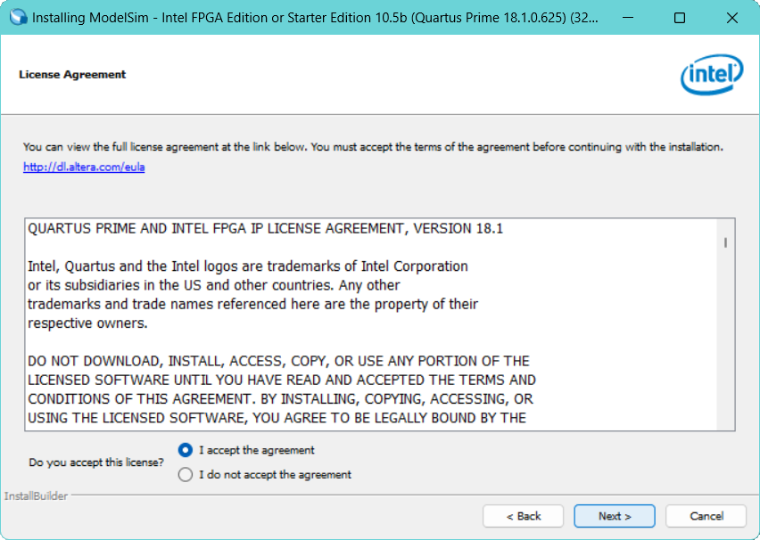

5. Accepteer de licentieovereenkomst en klik op *Next*.

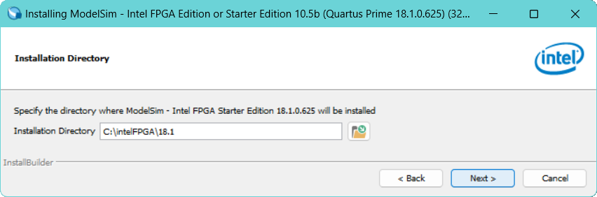

6. Accepteer het voorgestelde installatiedirectory door op *Next* te klikken.
   Wij adviseren je om het default gekozen directory te gebruiken.
   Let er, als je zelf een installatiedirectory opgeeft, op dat er **geen spaties** in de padnaam mogen voorkomen!

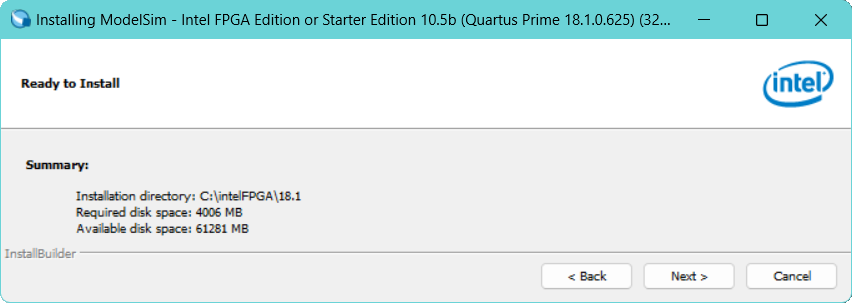

7. Klik op *Next* om de installatie te starten.

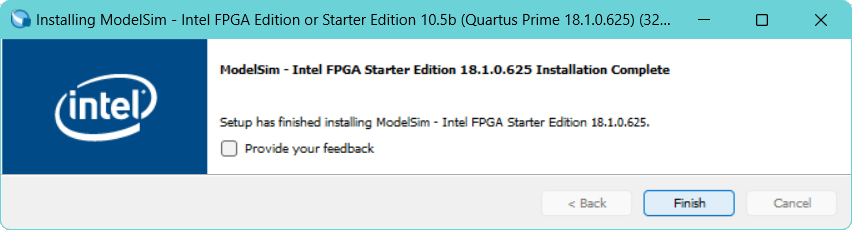

Klik op *Finish* om de installatie af te ronden.

## Intel University Program Design Suite

In deze design suite zijn componenten te vinden die je pas bij het vervolgvak van HWP01 genaamd [CSC10](https://bitbucket.org/HR_ELEKTRO/csc10/wiki/Home) nodig hebt. Het is handig om deze software nu alvast te installeren.

1. Download het installatiebestand *intel_fpga_upds_setup.exe* vanuit de map *Lesmateriaal* van het MS-Team voor HWP01.
   
2. Voer het bestand *intel_fpga_upds_setup.exe* uit.

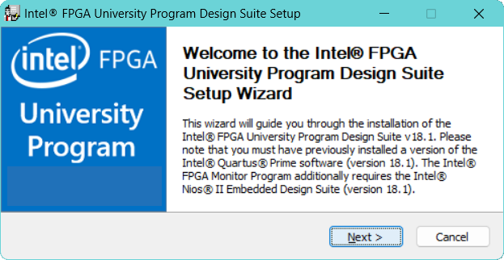

3. Klik op *Next*.

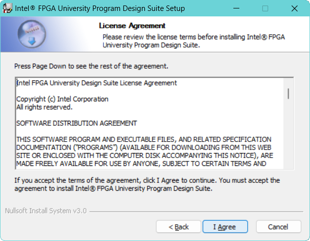

4. Accepteer de licentieovereenkomst en klik op *Next*.

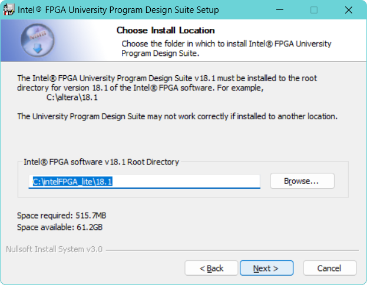

5. Accepteer het voorgestelde installatiedirectory door op *Next* te klikken.
   Als je Quartus in een ander directory hebt geïnstalleerd, dan moet je hier dat directory opgeven!

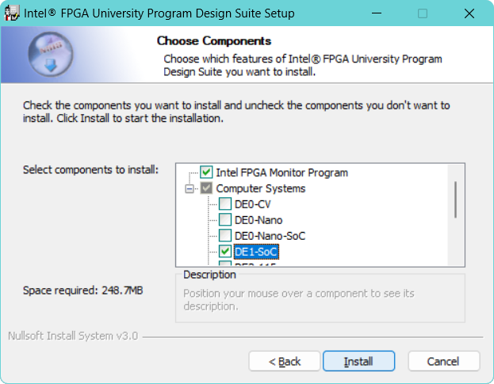

Selecteer onder *Computer Systems* **alleen** de *DE1-SoC* en klik op *Install* om de installatie te starten.

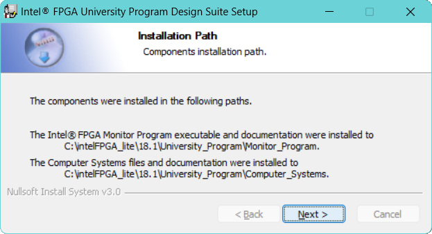

Klik op *Next*.

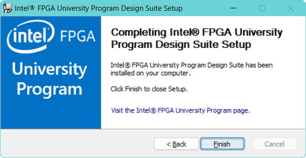

Klik op *Finish* om de installatie af te ronden.

