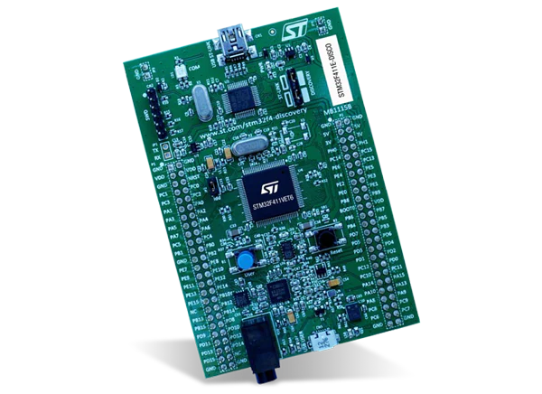
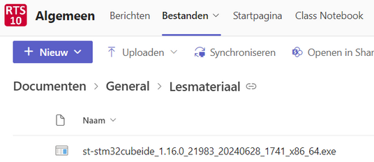

<!-- LTeX: language=nl -->

# Real-Time Systems

In dit repository zijn de cursushandleiding, de opdrachten en de PowerPoint presentaties opgenomen die bij de cursus RTS10 (Real-Time Systems) van de minor Embedded Systems van de Hogeschool Rotterdam gebruikt worden.

De informatie in dit repository is zoals alle mensenwerk niet foutloos, verbeteringen en suggesties zijn altijd welkom! Maak als je ons feedback wilt geven een [issue](https://bitbucket.org/HR_ELEKTRO/rts10/issues) aan.

## Cursushandleiding

- [Cursushandleiding_RTS10_ebook.pdf](Cursushandleiding/Cursushandleiding_RTS10_ebook.pdf) om online te bekijken.
- [Cursushandleiding_RTS10.pdf](Cursushandleiding/Cursushandleiding_RTS10.pdf) om dubbelzijdig af te drukken.

## Voor je begint: pas je browserinstellingen aan!

In de pdf-bestanden die je op deze wiki vindt, wordt veel gebruik gemaakt van links naar specifieke locaties in andere pdf-bestanden. Om dit te laten werken is het nodig om je browserinstellingen aan te passen.

- Microsoft Edge: Installeer deze extensie: [https://microsoftedge.microsoft.com/addons/detail/pdf-reader/nhppiemcomgngbgdeffdgkhnkjlgpcdi](https://microsoftedge.microsoft.com/addons/detail/pdf-reader/nhppiemcomgngbgdeffdgkhnkjlgpcdi).

- Google Chrome: Installeer deze extensie: [https://chrome.google.com/webstore/detail/pdf-reader/ieepebpjnkhaiioojkepfniodjmjjihl](https://chrome.google.com/webstore/detail/pdf-reader/ieepebpjnkhaiioojkepfniodjmjjihl).

- Firefox: Type `about:config` in de adresbalk, zoek naar `browser.download.open_pdf_attachments_inline` en zet deze optie op `true`.

## Weekplanning

| Week      | PowerPoint                                    | Pdf                                         | Opdrachten                                                              | Opmerkingen en verwijzingen                                                                                                                                                                                 |
| --------- | --------------------------------------------- | ------------------------------------------- | ----------------------------------------------------------------------- | ----------------------------------------------------------------------------------------------------------------------------------------------------------------------------------------------------------- |
| 1 (Intro) | [Intro.pptx](Presentaties/RTS10_Intro.pptx)   | [Intro.pdf](Presentaties/RTS10_Intro.pdf)   |                                                                         |                                                                                                                                                                                                             |
| 1         | [Week_1.pptx](Presentaties/RTS10_Week_1.pptx) | [Week_1.pdf](Presentaties/RTS10_Week_1.pdf) | [Opdrachten Week 1.pdf](Opdrachten/Opdrachten_Week_1.pdf)               | [LEGv7 Pinky instructieset](LEGv7.md)                                                                                                                                                                       |
| 2         | [Week_2.pptx](Presentaties/RTS10_Week_2.pptx) | [Week_2.pdf](Presentaties/RTS10_Week_2.pdf) | [Opdrachten Week 2.pdf](Opdrachten/Opdrachten_Week_2.pdf)               | [Assembly_assignment_ebook.pdf](Assembly_opdracht/Assembly_assignment_ebook.pdf) om online te bekijken. [Assembly_assignment.pdf](Assembly_opdracht/Assembly_assignment.pdf) om dubbelzijdig af te drukken. |
| 3         | [Week_3.pptx](Presentaties/RTS10_Week_3.pptx) | [Week_3.pdf](Presentaties/RTS10_Week_3.pdf) | [Opdrachten Week 3.pdf](Opdrachten/Opdrachten_Week_3.pdf)               |                                                                                                                                                                                                             |
| 4         | [Week_4.pptx](Presentaties/RTS10_Week_4.pptx) | [Week_4.pdf](Presentaties/RTS10_Week_4.pdf) | [Opdrachten Week 4.pdf](Opdrachten/Opdrachten_Week_4.pdf)               |                                                                                                                                                                                                             |
| 5         | [Week_5.pptx](Presentaties/RTS10_Week_5.pptx) | [Week_5.pdf](Presentaties/RTS10_Week_5.pdf) | [Opdrachten Week 5.pdf](Opdrachten/Opdrachten_Week_5.pdf)               | [Kennisclips pthreads](https://hrelektrotechniek.bitbucket.io/pthread/), [Using pthreads in STM32CubeIDE](https://bitbucket.org/HR_ELEKTRO/rts10/wiki/pthreads.md)                                          |
| 6         | [Week_6.pptx](Presentaties/RTS10_Week_6.pptx) | [Week_6.pdf](Presentaties/RTS10_Week_6.pdf) | [Opdrachten Week 6.pdf](Opdrachten/Opdrachten_Week_6.pdf) en zie email! | [Handouts_Week_6.pdf](Presentaties/Handouts_Week_6.pdf), [Antwoorden_opdrachten_week_6.pdf](Opdrachten/Opdrachten_Week_6_Antwoorden.pdf)                                                                    |
| 7         | [Week_7.pptx](Presentaties/RTS10_Week_7.pptx) | [Week_7.pdf](Presentaties/RTS10_Week_7.pdf) | [Opdrachten Week 7.pdf](Opdrachten/Opdrachten_Week_7.pdf)               |                                                                                                                                                                                                             |
| 8         | [Week_8.pptx](Presentaties/RTS10_Week_8.pptx) | [Week_8.pdf](Presentaties/RTS10_Week_8.pdf) | [Opdrachten Week 8.pdf](Opdrachten/Opdrachten_Week_8.pdf)               |                                                                                                                                                                                                             |

## Verslagen

RTS10 wordt getoetst op basis van verschillende praktische opdrachten. De resultaten van deze opdrachten worden vastgelegd in 3 verslagen die afzonderlijk worden beoordeeld. Meer informatie vind je in de [cursushandleiding](Cursushandleiding/Cursushandleiding_RTS10_ebook.pdf#section.5).
De nakijkmodellen voor de verschillende verslagen vind je hier:

- [Nakijkmodel verslag 1](Nakijkmodellen/Nakijkmodel_verslag_1.pdf)
- [Nakijkmodel verslag 2](Nakijkmodellen/Nakijkmodel_verslag_2.pdf)
- [Nakijkmodel verslag 3](Nakijkmodellen/Nakijkmodel_verslag_3.pdf)

## Benodigde hardware

We maken bij RTS10 gebruik van het [STM32F411E-DISCO](https://www.st.com/resource/en/user_manual/dm00148985-discovery-kit-with-stm32f411ve-mcu-stmicroelectronics.pdf) ontwikkelbord. Dit kun je op de hogeschool lenen. 

Om de tijdsduur van digitale signalen nauwkeurig te meten raden wij je aan zelf een eenvoudige logic analyser aan te schaffen (er is een beperkt aantal logic analysers op school beschikbaar om uit te lenen).
Het is van belang dat de logic analyser te gebruiken is met de [software van *Saleae*](https://www.saleae.com/downloads/). Enkele opties zijn:

- [Logic Analyzer 8 kanaals USB - TinyTronics](https://www.tinytronics.nl/shop/nl/gereedschap-en-montage/meten/oscilloscopen-en-logic-analyzers/logic-analyzer-8-kanaals-usb);
- [Usb Logic Scm 24Mhz 8 Kanaals 24M/Seconden Logic Analyzer - AliExpress](https://nl.aliexpress.com/item/1005005357814678.html).

## Benodigde software

We maken bij RTS10 gebruik van:

- STM32CubeIDE, de IDE van STMicroelectronics. Deze is gratis te downloaden vanaf de [STM32CubeIDE download pagina](https://www.st.com/en/development-tools/stm32cubeide.html).
  Je moet dan wel een account aanmaken bij STMicroelectronics of je gegevens achterlaten. Als alternatief kun je het installatiebestand ook downloaden vanuit het RTS10 MS-Team.

  

- De software voor de logic analyser kun je vinden in Liquit en op [https://www.saleae.com/downloads/](https://www.saleae.com/downloads/).

## Literatuur

- Jens Gustedt. *Modern C.* 2de ed. Manning Publications, 2019. ISBN: 978-1-61729-581-2. URL: [https://hal.inria.fr/hal-02383654/document](https://hal.inria.fr/hal-02383654/document). In dit gratis boek kun je gedetailleerde informatie over C vinden.
- Edward Ashford Lee en Sanjit Arunkumar Seshia. *Introduction to Embedded Systems - A Cyber-Physical Systems Approach.* Second Edition, [version 2.2](https://ptolemy.berkeley.edu/books/leeseshia/releases/LeeSeshia_DigitalV2_2.pdf). MITPress, 2017. ISBN: 978-0-262-*53381*-2. URL: [Lee and Seshia, Introduction to Embedded Systems](http://leeseshia.org/)
- Ken Tindell en Hans Hansson. *Real-time Systems and Fixed Priority Scheduling.* 1995. URL: [https://www.it.uu.se/edu/course/homepage/realtid/ht06/Realtime_Compendium.pdf](Books/Realtime_Compendium.pdf)
- ...

## Extra informatie

- Een gedetailleerde (Engelstalige) FAQ over de programmeertaal C is beschikbaar op: [comp.lang.c Frequently Asked Questions](http://c-faq.com/).
- Veel gedetailleerde informatie over C kun je ook vinden op: [C reference - cppreference.com](http://en.cppreference.com/w/c).
- [POSIX API: The Open Group Base Specifications Issue 7, 2018 edition IEEE Std 1003.1™-2017 (Revision of IEEE Std 1003.1-2008)](https://pubs.opengroup.org/onlinepubs/9699919799/).
- [Using bit-banding in Cortex-M4 microcontrollers; CMSIS style](Blinky_CMSIS_BB.md).
- [Using pthreads in STM32CubeIDE](pthreads.md).
- ...

