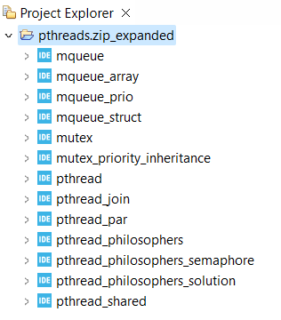

<!-- LTeX: language=en-US -->

# Using pthreads in STM32CubeIDE

The Portable Operating System Interface ([POSIX](https://pubs.opengroup.org/onlinepubs/9699919799/)) is a family of standards specified by the [IEEE](https://standards.ieee.org/ieee/1003.1/7700/) Computer Society for maintaining compatibility between operating systems.
POSIX threads ([pthreads](https://en.wikipedia.org/wiki/POSIX_Threads)) are a standard for creating threads in C. 
STM32CubeIDE comes with a built-in support for [FreeRTOS](https://www.freertos.org/). 
However, it does not support pthreads out of the box. 
There is a standard [POSIX API](https://www.freertos.org/FreeRTOS-Plus/FreeRTOS_Plus_POSIX/index.html) available for FreeRTOS which can be used to define tasks and inter task communication.
The source code for the POSIX API is available on [GitHub](https://github.com/FreeRTOS/Lab-Project-FreeRTOS-POSIX) and can be included in a STM32CubeIDE project.

## Example projects for pthreads in STM32CubeIDE
A number of example projects are provided in the zip-file [pthreads.zip](https://bitbucket.org/HR_ELEKTRO/rts10/raw/master/Opdrachten/buffer.zip) these projects are mend for the STM32F411E-DISCO development board, but can easily be ported to other STM32 boards.

Import this project into STM32CubeIDE with the menu-option File>Import..., General>Projects from Folder or Archive, Next, Archive, select the file pthread.zip, Open and Finish.

This zip file contains the following projects:

- **pthread**: This [program](https://bitbucket.org/HR_ELEKTRO/rts10/src/master/progs/pthread.c) shows how two threads can run concurrent.
- **pthread_join**: This [program](https://bitbucket.org/HR_ELEKTRO/rts10/src/master/progs/pthread_join.c) shows how to wait for a thread to finish.
- **pthread_par**: This [program](https://bitbucket.org/HR_ELEKTRO/rts10/src/master/progs/pthread_par.c) shows how to pass parameters to a thread.
- **pthread_shared**: This [program](https://bitbucket.org/HR_ELEKTRO/rts10/src/master/progs/pthread_shared.c) shows a synchronization problem which occurs when two alternating threads share a variable.
- **mutex**: This [program](https://bitbucket.org/HR_ELEKTRO/rts10/src/master/progs/mutex.c) shows how two threads can run concurrent and share a resource without a synchronization problem, by using a mutex.
- **mutex_priority_inheritance**: This [program](https://bitbucket.org/HR_ELEKTRO/rts10/src/master/progs/mutex_priority_inheritance.c) shows that FreeRTOS uses priority inheritance.
- **pthread_philosophers**: This [program](https://bitbucket.org/HR_ELEKTRO/rts10/src/master/progs/pthread_philosophers.c) shows a classic deadlock problem, the [dining philosophers](https://en.wikipedia.org/wiki/Dining_philosophers_problem), that can arise if threads lock two mutexes in the same order.
- **pthread_philosophers_solution**: This [program](https://bitbucket.org/HR_ELEKTRO/rts10/src/master/progs/pthread_philosophers_solution.c) shows how to solve the dining philosophers problem by locking the mutexes in a different order.
- **pthread_philosophers_semaphore**: This [program](https://bitbucket.org/HR_ELEKTRO/rts10/src/master/progs/pthread_philosophers_emaphore.c) shows how to solve the dining philosophers problem by allowing no more than four philosophers to eat at the same time. This is done by using a semaphore.
- **mqueue**: This [program](https://bitbucket.org/HR_ELEKTRO/rts10/src/master/progs/mqueue.c) shows how to use a message queue to communicate between threads.
- **mqueue_array**: This [program](https://bitbucket.org/HR_ELEKTRO/rts10/src/master/progs/mqueue_array.c) shows how to use a message queue to transfer an array of integers from one thread to another.
- **mqueue_struct**: This [program](https://bitbucket.org/HR_ELEKTRO/rts10/src/master/progs/mqueue_struct.c) shows how to use a message queue to transfer a structure from one thread to another.
- **mqueue_prio**: This [program](https://bitbucket.org/HR_ELEKTRO/rts10/src/master/progs/mqueue_prio.c) shows that the implementation of mqueue in FreeRTOS doesn't support priority. The msg_prio argument is iggnored, see [https://docs.aws.amazon.com/freertos/latest/lib-ref/html2/posix/mqueue_8h.html#a753177f77f6eec2a80b57e8a68b36bed](https://aws.github.io/amazon-freertos/202107.00/html2/posix/mqueue_8h.html#a753177f77f6eec2a80b57e8a68b36bed).

## Copying and modifying the example projects

To copy a project, right-click on the project name in the Project Explorer, e.g. `pthread`, and select Copy. 
Press Ctrl+V and choose an appropriate name, e.g. `pthread_copy`. 
Remove the Debug folder from the `pthread_copy` project, rename `pthread.cfg` to `pthread_copy.cfg`, and rename `pthread.launch` to `pthread_copy.launch`.
Open `pthread_copy.launch` and replace all occurrences of `pthread` by `pthread_copy`.
Build and debug the project `pthread_copy` to verify that it is a
correct copy of project `pthread`.

## Adding the POSIX API to a STM32CubeIDE project
When you start with a new STM32CubeIDE FreeRTOS project, you have to add the POSIX API to the project. This can be copied from [GitHub](https://github.com/FreeRTOS/Lab-Project-FreeRTOS-POSIX) or from an example project. In the example projects the POSIX API is located in the folder `Middlewares/Third_Party/Lab-Project-FreeRTOS-POSIX-master`.

The STM32F411E-DISCO development board doesn't have support for `printf` and `scanf` which are used in the example projects. To enable `printf` and `scanf` semihosting is used, see [https://www.st.com/resource/en/application_note/dm00354244-stm32-microcontroller-debug-toolbox-stmicroelectronics.pdf](https://www.st.com/resource/en/application_note/dm00354244-stm32-microcontroller-debug-toolbox-stmicroelectronics.pdf#%5B%7B%22num%22%3A122%2C%22gen%22%3A0%7D%2C%7B%22name%22%3A%22XYZ%22%7D%2C67%2C348%2Cnull%5D).
The project must be debugged by using [openOCD](https://openocd.org/).
More information can be found at [http://fastbitlab.com/freertos-lecture-32-understanding-arm-semi-hosting-feature/](http://fastbitlab.com/freertos-lecture-32-understanding-arm-semi-hosting-feature/).

