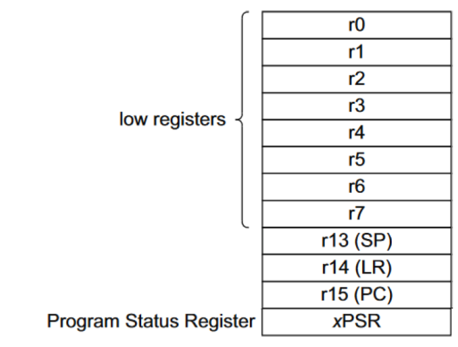
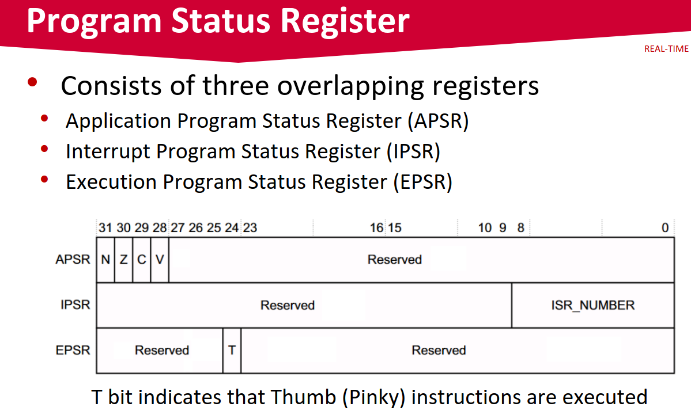
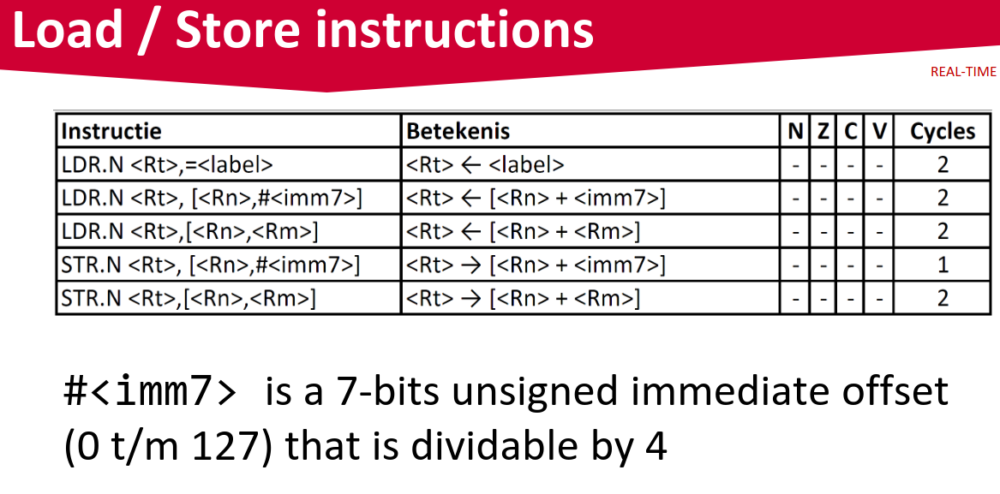
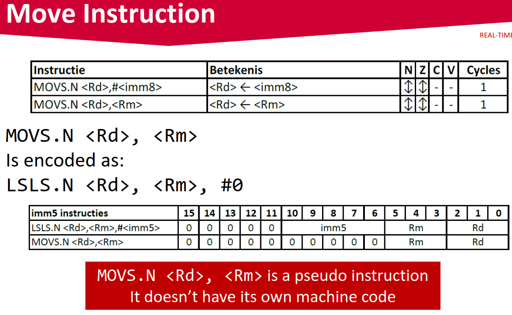
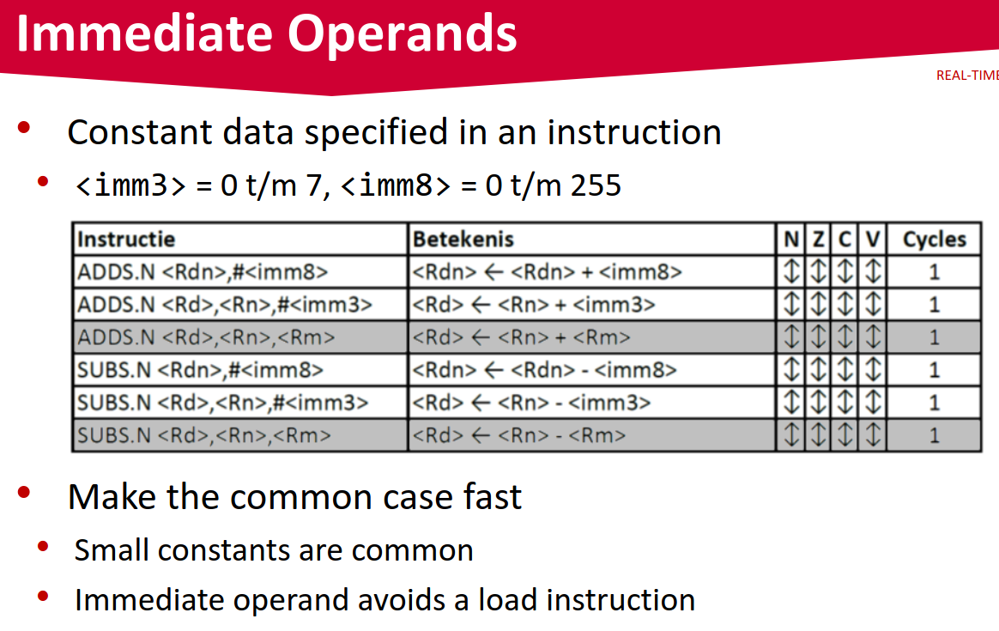

# Hardware
DE1-SoC

# Wat is een Realtimesysteem?

# VHDL
VHDL is een hardware description language

# FPGA

# Les 1
## Boek 
Computer organization and design (Arm edition) - David A. Patterson & John L. Hennessy

## Instruction set
Tijdens de lessen gaan we 16-bit instructies gebruiken

## Arithmic Operations
```asm
ADDS.N a, b, c  // a gets b + c
SUBS.N a, b, c  // a gets b - c
```

S means that th einstuction is updaitin the conditionset (N `negative`, Z `zero`, C `carry`, V `overflow`)

_Hoe werken de vlaggen? Welke worden bijgewerkt (zie instructieset manual) Waarom worden de flaggen bijgewerkt?_

N means Narrow (16-bit)

Use the flags in the thump en pinky code?

### Opdracht
In C

```c
f = (g + h) - (i - j);
```

In assembly

```asm
ADDS.N t0, g, h
SUBS.N t1, i, j
SUBS.N f, t0, t1
```

### Memory Hierarchy
The ALU can only operate on values that are inside the registers
Not directly from main memory
Need to load stuff from main memory

(Specifically for RISC, with SISC you can directly access memory)

### Register Operands


### Program status Register


### Opdracht 2
REAL-TIME SYSTEMS
Arithmetic Example
• C code:
```c
f = (g + h) - (i - h);
```
• f, g, h, i in R4, R5, R6, R7
• Compiled LEGv7 Pinky code

```asm
ADDS.N R0, R5, R6
SUBS.N R1, R7, R6
SUBS.N R4, R0, R1
```

Without tmp registers

```asm
ADDS.N R4, R5, R6
SUBS.N R4, R4, R7
ADD.N R4, R4, R6
```

## Memory Operands
Hoeft hiet alligned te zijn, maar is wel sneller take 2 (halfword, not word aligned) of 3
(not halfword aligned) 
Compiler optie kan alignen (`#pragma`) 

### Load and Store


1, Laad een address in een register

LDR is load register (load from memory to register)

STR is store register (store from register to memory)

### Opdracht 3
```c
int a[] = {1,2,3,4,5,6,7,8,9};
a[8] = h + a[3];
```

h in R4, base address of a in R5

```asm
LDR.N R0, [R5, #12]
ADDS.N R1, R4, R0
STR.N R1, [R5, #32]
```

### Opdracht 4
```c
f = g + 2 * h -i
```
f, g, h, i in R4, R5, R6, R7

```asm
LSLS.N R0, R6, #1
...
```

### Move Instruction


## Instuctions for making desicions

### Conditional Operations

`CBZ.N` (Conditional Branch on Zero) - Branch to a label if the register is zero

```asm
CBZ.N R0, label
```

Vervelende is dat je alleen naar voren kan branchen, niet naar achteren

`CBNZ.N` (Conditional Branch on Non-Zero) - Branch to a label if the register is not zero

```asm
CBNZ.N R0, label
```

`B.N L1` - Unconditional branch to label L1

### Opdracht 5
```c
if (h == i) f = g + 3;
else f = f - 17;
```

f, g, h, i in R4, R5, R6, R7

```asm
SUBS.N R0, R6, R7
CBNZ.N R0, else
ADDS.N R4, R5, #3
B.N endif
else: SUBS.N R4, #17
endif:
```

### Compiling loop statments
```c
int i = 0;
while (save[i] == k) i += 1;
```
• i in R4, k in R5, address of save in R6

```asm
???
```

### Opdracht 6 Conditional Example
(Niks aangeven bij int in C is Signed

```c
int a, b;
if (a > b ) a += 1;
```
a,b in R4, R5

```asm
???
```

### Immediate operands


## Arm Cortex

Application Processor (Coretex-A), we gebruiken de A9

Realtime Processor (Coretex-R)

Microcontroller Processor (Coretex-M), we gebruiken de M4

## Function calls
TODO: Kijk de sheets !!!

### ARM calling convention

### functie in en functie
Link register moet een op de stack gezet worden


## Armv7-M

## LEGv7-M

### 32-bit literals?
How to laod a 32bits constant in Rd with a 16-bits insttrictoin
Literal addressing mode

```asm
LDR.N R6, =0x1234567
```

Is encoded as:
```asm
LDR.N R6, [PC, #offset]
//...
.word 0x1234567 // literal section
```

## Thumb

## Pinky
