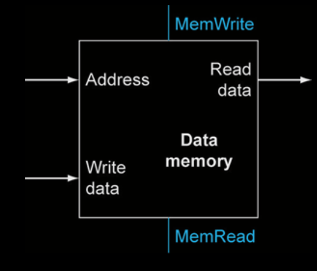

# CPU perfomance factors
- instruction count (detemined by instruction set achitecture(ISA)) and compiler
Clock per instruction (CPI) determined by hardware

# Instruction execution
- M-type (memory)
- R-type (register)
- CB-type (control branch)

## Instruction cycle
- PC →instruction memory, fetch instruction

- Register numbers →register file, read registers
- Depending on instruction type:
- Use Arithmetic and Logic Unit (ALU) to calculate
- Arithmetic or logic result for Register-type (ADDS, SUBS, EORS, ANDS, ORRS)
- Memory address for Memory-type instructions (LDU, STU)
- Register equals zero for CB-type (CBZ)
- For CB-type (CBZ) calculate branch target address
- Access data memory for M-type (LDU, STU)
- Write to register file for R-type (ADDS, SUBS, EORS, ANDS, ORRS) and load (LDR)
- PC ←PC + 2 or PC ←Branch target address

# Control
## Multiplexors
A multiplexor is a combinational circuit that selects one of the inputs and directs it to the output. The selection of the input is controlled by a set of selection lines. (Can be more than 2 inputs) noted by a dash to the arrow with a number of inputs.

## Clocking  Methodology
- Maximal clock frequency is determined by the time the combinational logic needs to settle plus the setup time of the flip-flops (state element). And the slowest instruciton i nside the combinational logic determines the clock frequency.

## Optimizing the clock frequency
This is done by optimizing the critical path. The critical path is the longest path in the circuit.

## R-type instructions
- Read two register operands
- Perform arithmetic/logical operation
- Write register result

## M-type Instructions LDR, STR
- Read register operands
- Calculate address using 5-bit offset
- Shift left 2 places (word displacement)
- Use ALU
- LDR: Read memory and update register
- STR: Write register value to memory

## CB-type Instructions
- Read register operand
- Compare operand to zero
    - Use ALU pass input and check Zero output
- Calculate target address
    - 6-bit displacement field
    - Shift left 1 place (half word displacement)
    - Add to PC

# Composing the elements
Multiple cache memories are used to store the data and instructions. The data memory is used to store the data that is being processed. The instruction memory is used to store the instructions that are being executed. The register file is used to store the data that is being processed. The ALU is used to perform the operations on the data.
- The datapath is the part of the processor that performs the operations on the data. It consists of the ALU, the register file, and the data memory.

- First-cut data path does an instruction in one clock cycle
- Each datapath element can only do one function at a time Hence, we need separate instruction and data memories
- Use multiplexers where alternate data sources are used for different instructions

# A one cycle implementation of LEGv7-m
# A pipelined implementation of LEGv7-m

## Pipeline
Allows for multiple instructions to be executed at the same time. This is done by splitting the instruction execution into multiple stages. Each stage is executed by a different part of the processor.

## branch prediction

## cache geheugen

# TODO 
    - lees h4
    - wat is two's complement
    - carry adder?
