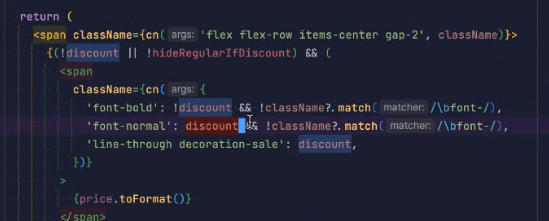

new project ts yes eslint yes

`npm run dev`

`npm install @apollo/client graphql`

https://www.apollographql.com/blog/apollo-client/next-js/next-js-getting-started/

https://typegraphql.com/docs/installation.html 

npm i graphql class-validator type-graphql

change graphql version 15.3

npm install -D @graphql-codegen/typescript @graphql-codegen/cli

npm install @graphql-codegen/typescript-operations -D

npm install tailwindcss@latest

https://tailwindcss.com/docs/guides/nextjs

