https://www.youtube.com/watch?v=9sLHoEyRq8w&list=WL&index=1&ab_channel=AntonPutra

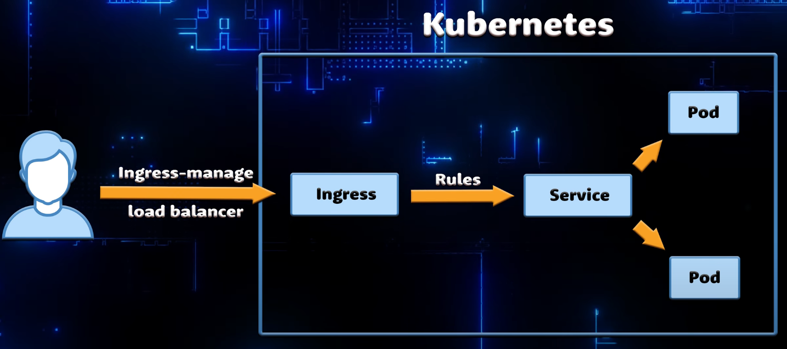
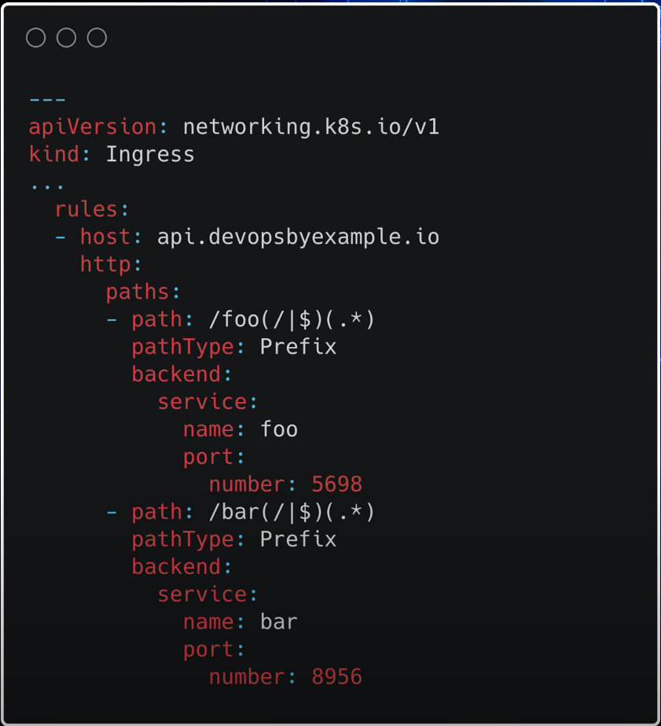
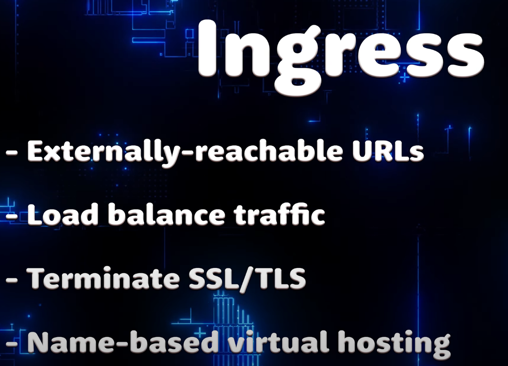
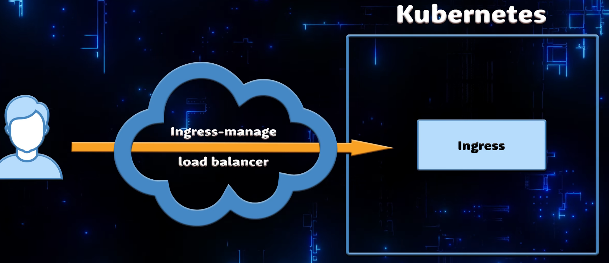

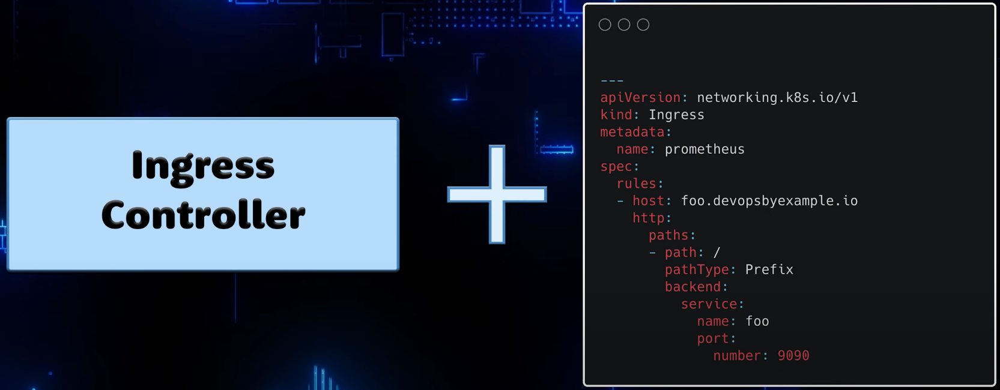
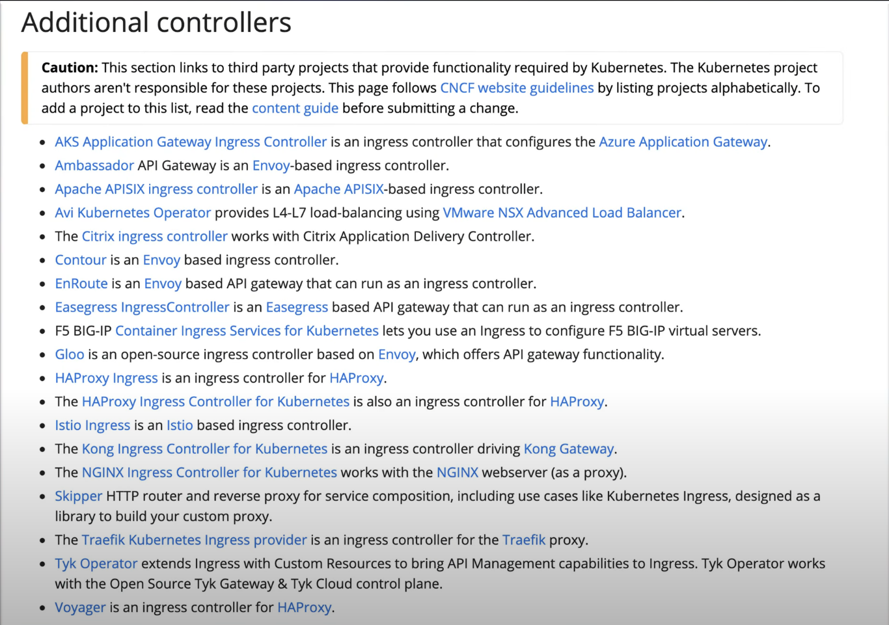
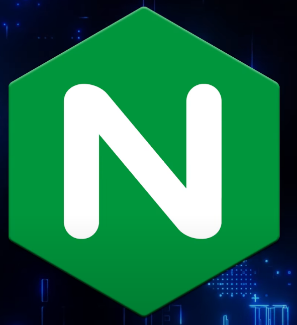
2 implentations from 2 communities
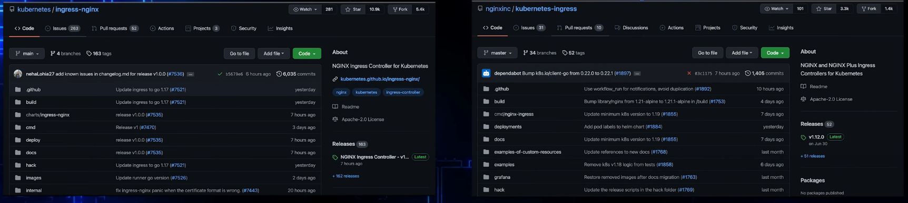

Promethios and Grafana

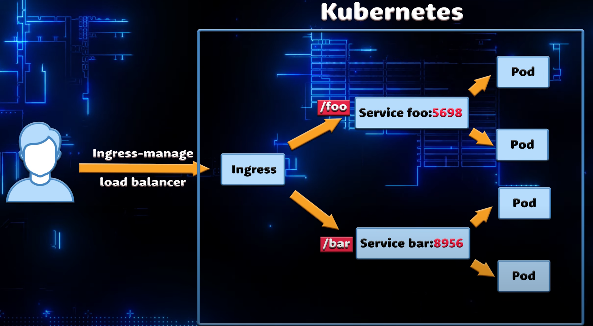

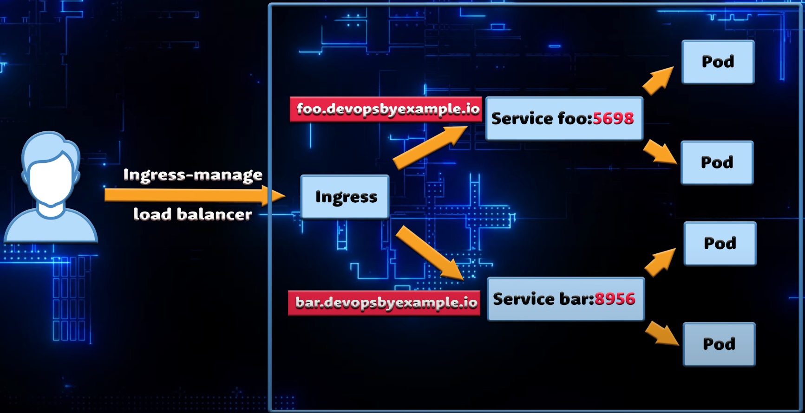

<h1>Commuication between server and the client</h1>

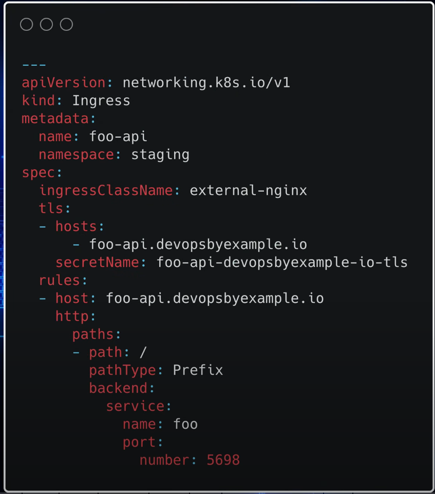
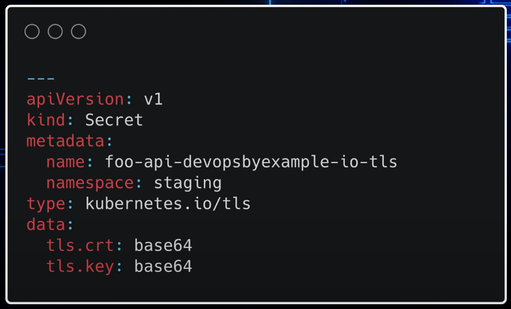

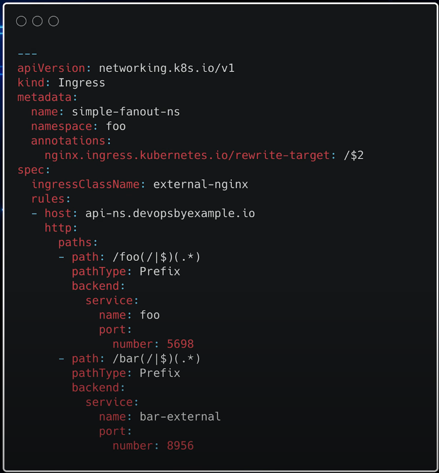

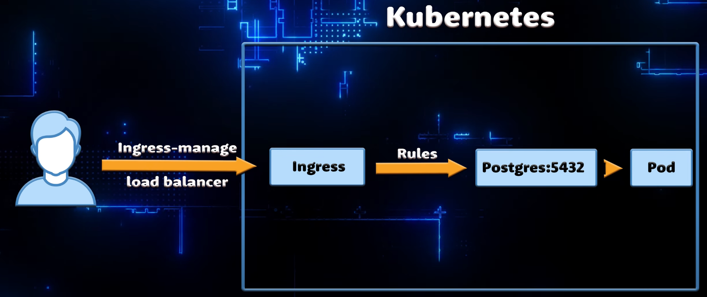
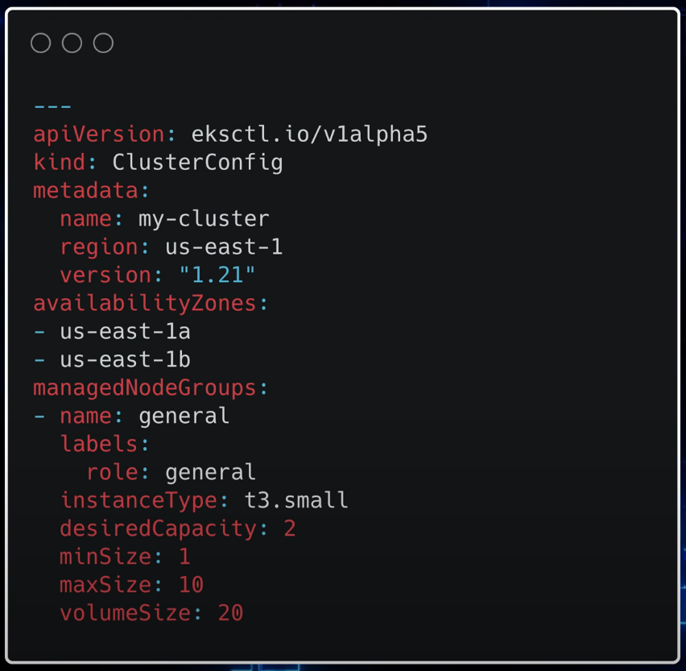

Extra links
- https://kubernetes.github.io/ingress-nginx/user-guide/ingress-path-matching/
- https://www.ibm.com/docs/en/networkmanager/4.2.0?topic=oql-use-regular-expressions
- 