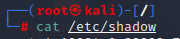
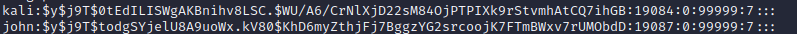

# Linux
sudo cat /etc/shadow  
  
  
sudo su -  
  
     switch into root  
       
su - Switch User
pwd - location
cd - change directory
cd .. - backwards
ls - lists evrything in folder
~ key is root/
mkdir Make directory , make folder
rmdir Remove directory
ls -la shows hidden files    
-la hidden files
updatedb 
locate  search function
passwd
man + command  (man ls man cd) Man stand for manual
cat form of reader
chmod changemode change 
  
adduser
/etc/passwrd/ 
/etc/shadow/  password file where the pass is hashed
  
cat /etc/shadow/  
  

apt update && apt upgrade
apt install python-pip
 git clone
 
nano text editor