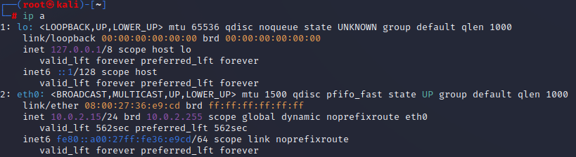
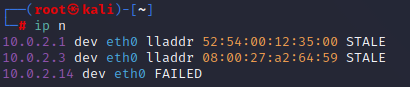
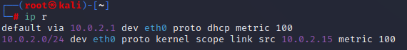

# 1
  
  
NAT = Network Adress Translation

Private IP Adress   Layer 3
    not used anywhere on public internet, reserved for private LAN's
    
Mac Adress    Layer 2/Switching
    use swithes, have Identifiers <mark>00:0c:29</mark>:0a:42:05, Macadress Lookup 

Network Interface Card has a Mac Adress
      
  
TCP vs UDP  
    Transmissian Control Protocol
        Connection oriented protocol  
        High realibility  
            ie Website, filetransfer, ssh, ftp
    User Datagram Protocol
        Connectionless Protocol
            steaming service, DNS, VoiceoverIP
            
Scanning as a Penetration tester.
    Ethical hackers mostly scan TCP
    
**iwconfig** (ifconfig for wireless networkds)

**ping** + adress(ip)

**icmp** traffic might be blocked if you see no response from ping

**arp -a** a way to assosiate ip adresses with mac adresses

**netstat -ano** information about ports

**route** routing table, tells you where your traffic exits
**ip a**
                
         
**ip n**
    
   
**ip r**
    